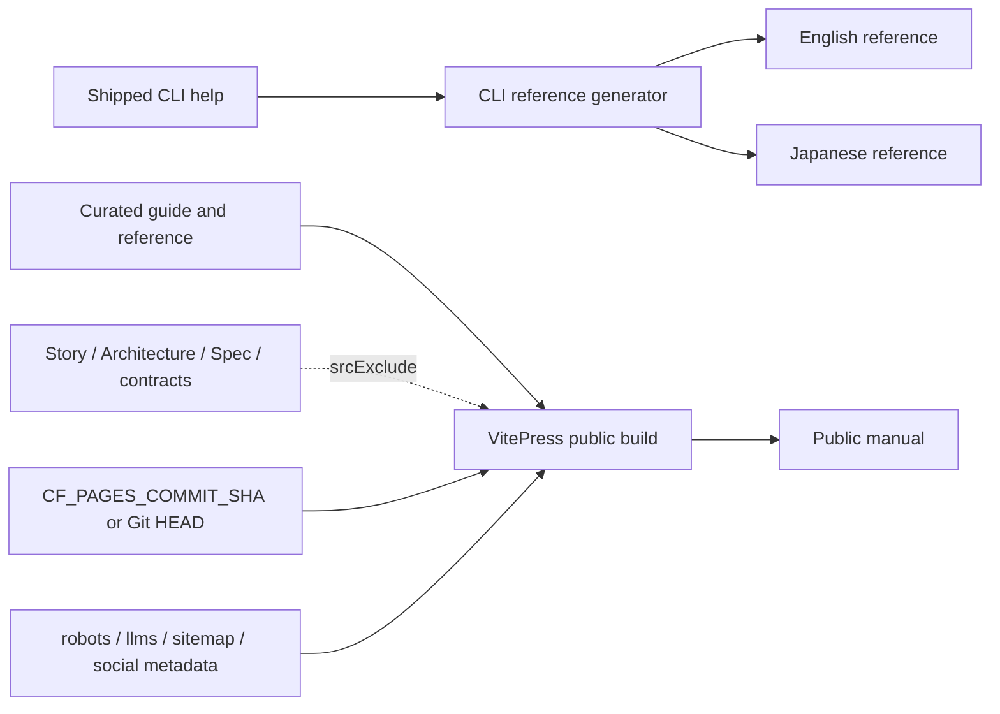

# Architecture

## Decision

The public manual is a curated product surface, not a projection of every
repository document. It will present one complete guarded delivery model in
English and Japanese, generate its CLI contract from the shipped help output,
identify the source commit at build time, and exclude internal engineering
corpora from public route generation.

## Boundaries

- `src/cli.js` and `bin/vibepro.js` remain the command-contract authority.
- `scripts/generate-cli-reference.mjs` projects each language's current Usage
  section into public reference pages; `--check` is a fail-closed drift gate.
- `docs/guide`, `docs/ja/guide`, and `docs/reference` are curated public source.
- Story, Architecture, Spec, contract, playbook, marketing, frame, and runtime
  corpora remain repository-local and are excluded by VitePress `srcExclude`.
- `docs/.vitepress/config.mjs` owns public navigation, discovery metadata,
  sitemap generation, and build-source provenance.
- `package.json`, npm registry state, Git commit, deployed manual commit, and
  local `.vibepro/` artifacts are distinct release/evidence authorities.

## Flow

## Compatibility and Rollback

No CLI or artifact schema changes are introduced. Existing public guide URLs
remain available, while new routes are additive. Internal routes intentionally
stop building; rollback is a focused revert of the documentation/config commit.
If build provenance is unavailable, the footer reports `unknown` rather than
claiming a commit.

## Release Operations

- Release note: `CHANGELOG.md` records this public-manual contract refresh.
- Rollout plan: deploy only from a clean merged commit with
  `npm run docs:deploy`; the script builds, validates, and passes the exact
  commit hash to Cloudflare Pages.
- Observability evidence: verify the English and Japanese roots, a
  representative guide route, required discovery files, social metadata, and
  `vibepro-source-commit` after deployment.
- Rollback instruction: restore the last known-good commit, rerun the guarded
  deploy, repeat the live checks, and record both failed and restored releases.
