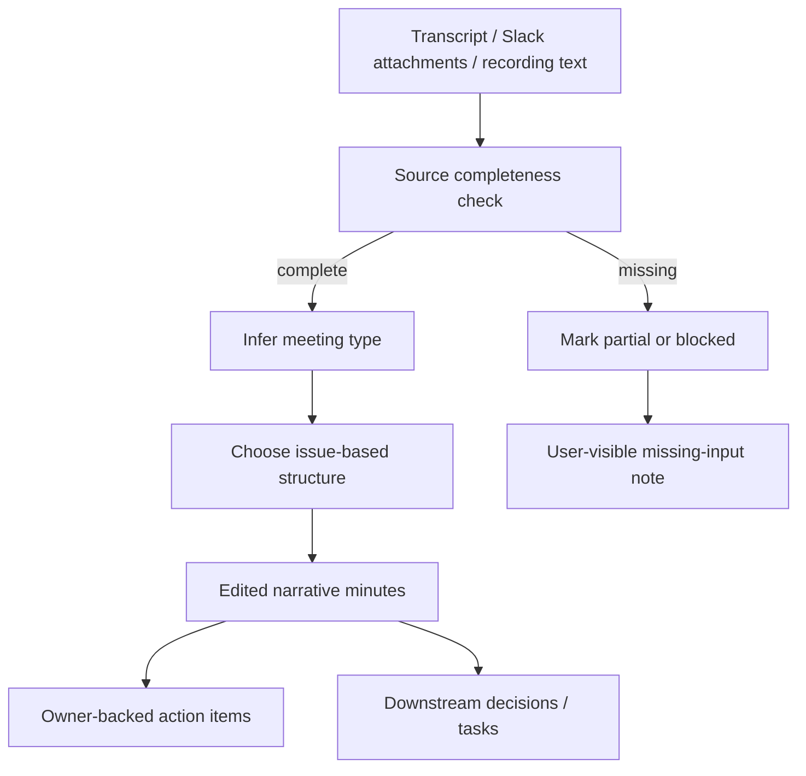

# Architecture

## Decision

VibePro adds a bundled skill, `vibepro-meeting-minutes-editor`, that captures the prompt contract for high-quality Japanese business meeting minutes.

The skill is intentionally delivered as agent-facing instruction, not as a runtime generator in VibePro core. VibePro already discovers bundled skills dynamically through `src/skills-manager.js`, and Meeting Pack or Mac Companion workflows can install and read the skill without coupling their source ingestion code to VibePro internals.

## Architecture Quality

- Alternatives considered: hard-code a Meeting Pack template in VibePro core; update only downstream Meeting Pack prompts; add a reusable bundled skill.
- Decision rationale: a hard-coded template would conflict with the user's exemplar-driven requirement. Downstream-only prompts would not create a reusable VibePro distribution point. A bundled skill keeps the standard reusable while preserving source-ingestion responsibility in the consuming system.
- Compatibility impact: `vibepro skills list/install/verify/lint` already discovers `skills/*/SKILL.md`, so no skills-manager change is required. Existing tests need only assert the new bundled skill count and installed content.
- Rollback plan: remove `skills/vibepro-meeting-minutes-editor/` and the docs/test references. No runtime command behavior changes are involved.
- Boundary: this skill does not retrieve Slack attachments or transcripts. It requires agents to verify those inputs before generating or approving minutes.

## Model

## Responsibilities

- `vibepro-meeting-minutes-editor` defines the writing standard, workflow, red flags, and verification checklist.
- `src/skills-manager.js` remains unchanged because bundled skills are directory-discovered.
- README describes the skill as part of the AI Agent Setup surface.
- Consuming systems remain responsible for fetching Slack attachments, transcripts, recordings, and referenced documents.
