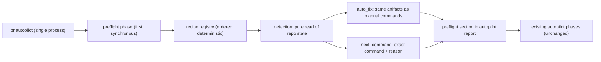

# Architecture

## Decision

Non-obvious pipeline recipes learned through dogfooding are encoded as a
deterministic **recipe registry** — a module exporting an ordered list of
`{ id, detection, action }` entries — executed as a new preflight phase at
the start of `pr autopilot`, before gate evaluation. Each recipe's `action`
is either `auto_fix` (allowed only when the side effect is schema-identical
to an artifact operators already produce by hand, e.g. generating a status
JSON from a recorded exit code) or `next_command` (an exact command string
plus a one-line reason, for anything involving judgment).

The registry is data-plus-functions, not prompt text: detection reads
existing artifacts (`verification-evidence.json`, story frontmatter, spec
catalog, `.vibepro/config.json`) and returns a typed result. This keeps the
learned knowledge in the product where every agent benefits on first run,
instead of in operator memos — the measured gap this closes is PR #292
(first run: 4 review rounds, ~40 commands) versus PR #293 (recipe-informed:
1 round, first-pass) for comparable changes.

Preflight is strictly upstream of gates and must never touch verdicts: it
repairs or flags *evidence shape*, never evidence *truth*. It cannot create
waivers, close reviews, or mark anything verified that was not.

## Public Contract

- `pr autopilot` output gains a `preflight` section:

```json
{
  "preflight": {
    "schema_version": "0.1.0",
    "results": [
      {
        "recipe_id": "verify-status-artifact",
        "detected": true,
        "action": "auto_fix",
        "action_taken": "generated status artifact from recorded exit code",
        "artifacts": [".vibepro/verification-artifacts/..."],
        "next_command": null
      }
    ]
  }
}
```

- Initial registry (six recipes): `verify-status-artifact` (auto_fix),
  `generic-token-clause-binding` (next_command),
  `architecture-reason-frontmatter` (next_command),
  `followup-decision-artifact` (next_command),
  `design-diagrams-final-spec` (next_command),
  `story-catalog-registration` (auto_fix, appended entry echoed in report).
- Adding a recipe requires only appending a registry entry; no existing
  recipe or autopilot phase changes.

## Execution Topology

Preflight adds no process, worker, retry loop, or network surface. It runs
synchronously as the first phase inside the existing `pr autopilot` process;
each recipe detection is a pure function of on-disk state, and auto-fixes
write only the artifacts operators previously wrote by hand.



## Flow

```text
pr autopilot
  -> preflight phase (new, first)
       for each recipe in registry order:
         detection(repo state, story id) -> detected?
           auto_fix     => apply, record artifacts written
           next_command => record exact command + reason
       write preflight section into autopilot report
  -> existing autopilot phases (unchanged)
```

## Boundaries

- Preflight reads and writes only what the equivalent manual commands write
  (verify artifacts, config catalog entries); it never writes gate results,
  review lifecycles, decision records, or waivers.
- Detections are pure functions of on-disk state; no network, no LLM calls.
- A recipe failure (detection throw or auto_fix error) is recorded as
  `action_taken: "failed"` and autopilot continues; preflight can never abort
  the run.
- False-positive detections are bounded to harmless `next_command`
  suggestions; `auto_fix` recipes must have exact, non-heuristic detections.

## Invariants

- Preflight on a story with none of the six conditions is a no-op: zero
  writes, `detected: false` for all recipes, downstream autopilot behavior
  byte-identical.
- Every `auto_fix` artifact validates against the same schema/strength checks
  as its hand-made counterpart (e.g. spine strength becomes `strong` with the
  generated status artifact).
- Gate verdicts, waivers, and review records are never created or mutated by
  preflight.
- Registry order is deterministic and the report lists every recipe exactly
  once per run.

## Rollback

Revert the registry module and its single wiring point in the autopilot
entry function in one commit. Artifacts already written by `auto_fix` recipes
are ordinary evidence artifacts and remain valid without the feature.
