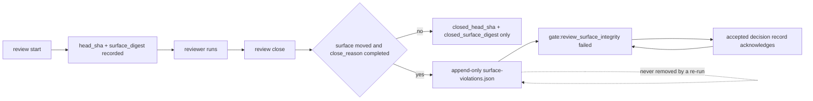
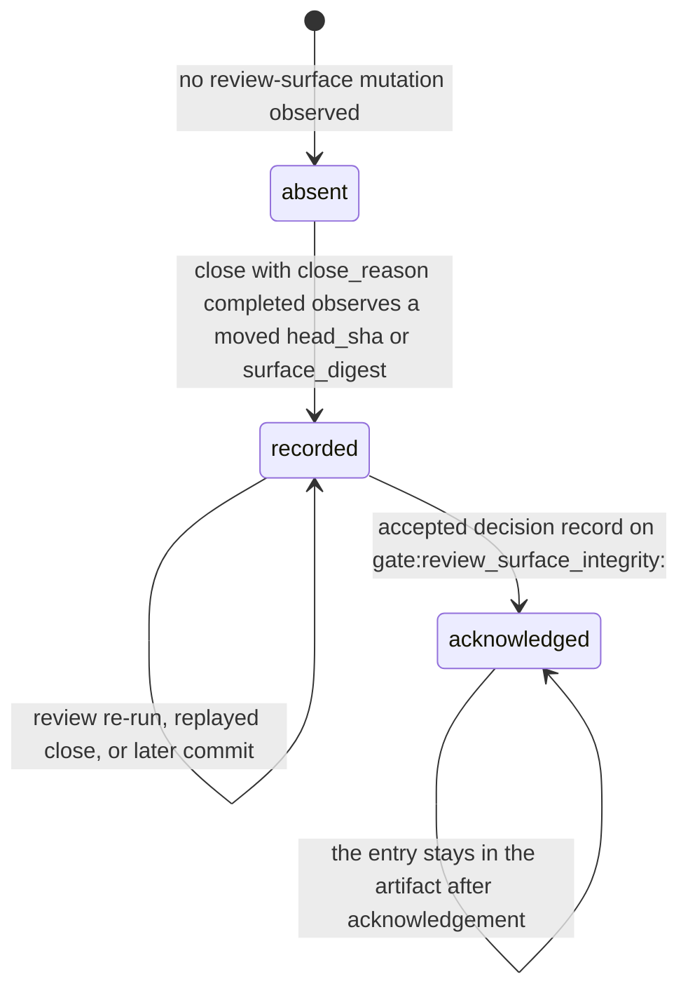

# Review Surface Violation Ledger

## Problem

`vibepro review start` records the head sha and the surface digest a review began
on. `vibepro review close` did not record either at close time. Nothing in any
artifact therefore answered the question "did the review surface move while this
review was running", and the one time it happened it was found by a reviewer who
happened to run `git status`.

Worse, the finding had nowhere durable to live. It was written as free text into
`review-result-<role>.json`, which `vibepro review record` overwrites per role. A
later passing round replaced the file and the record of the violation with it.
The display made this invisible: a contaminated review and a stale review both
showed as `failed`.

## Decision

Separate the two by storage location, schema, and gate. A mid-review surface
change is a **violation**, not staleness, and violations are append-only.

| | stale | violation |
|---|---|---|
| meaning | the review no longer covers the current head | the review surface moved *while the review ran*, so what was inspected is unknown |
| correct resolution | re-run the review at the current head | re-running answers nothing; a human judges the recorded fact |
| storage | `.vibepro/reviews/<story>/<stage>/review-result-<role>.json` (overwritten) | `.vibepro/reviews/<story>/surface-violations.json` (append-only) |
| delete path | overwrite | none — the module exposes no delete or update operation |
| gate | `gate:agent_review` | `gate:review_surface_integrity` |

## Public contract

Everything added is additive. No existing field is removed, renamed, or
repurposed.

| Surface | Addition | Compatibility |
|---|---|---|
| CLI | `vibepro review violations [repo] --id <story-id> [--json]`, read-only; exit 2 when unacknowledged violations exist | new subcommand; no existing command changes |
| Gate DAG | `gate:review_surface_integrity`, required, between `gate:agent_review` and `gate:review_inspection_required` | additive node plus two edges; cannot change any existing gate's status |
| `lifecycle.json` entries | `closed_head_sha`, `closed_surface_digest`, `surface_violation_id` | entries without them read as zero violations |
| `pr-prepare.json` | `pr_context.agent_reviews.surface_violations` | absent ledger reports zero violations, gate passes |
| New artifact | `.vibepro/reviews/<story-id>/surface-violations.json` | absent for every story that predates this change |

## Topology

Detection runs inside `closeAgentReviewLifecycle` and is computed from the two
recorded snapshots. The implementing agent's self-report is not an input, which
is the point: the parent Story's measurement was that only judgments the
implementing agent did not compute survived six review rounds.

The ledger write happens **before** the lifecycle write. If the close then fails,
an observed mutation has still been recorded; the inverse ordering could lose it.

## Violation lifecycle

The state is monotonic. Acknowledgement resolves the gate; it never removes the
entry.

## Bounded scope, and the erase paths

Each of these was raised as a way to make a recorded violation go away. What the
design does to each one is stated precisely — including where it only makes the
attempt visible rather than impossible.

- **Only `close_reason: completed` records a violation.** `replaced`, `timeout`,
  and `manual_shutdown` mean the review did not complete, and `vibepro review
  record` already refuses to attach a result to such a lifecycle. Closing as
  `replaced` to dodge the record therefore discards the review result it was
  protecting. An unrecognized `--close-reason` is rejected rather than coerced to
  `completed`, so a typo can neither mint nor suppress a record.
- **Re-running the review cannot reach the ledger.** A new lifecycle appends a
  new entry at most; `violation_id` is derived deterministically from
  story/stage/role/lifecycle/kind and both snapshots, so a replayed close
  resolves to the entry already on disk.
- **Concurrent closes cannot drop a record.** The append is a read-modify-write,
  so it runs under a story-level directory lock. Without it two closes racing on
  the same story would each write only their own entry and the loser's record
  would vanish.
- **A corrupt ledger fails closed.** Malformed JSON, or an `entries[]` that is
  not an array, is rejected with `VIBEPRO_REVIEW_SURFACE_LEDGER_UNREADABLE`
  rather than read as empty, and appending over it throws. An *absent* ledger is
  different and reads clean — nothing was ever recorded there.
- **A well-formed rewrite is detected, not prevented.** Nothing stops an
  out-of-band `{"entries": []}`, and `surface_digest` excludes `.vibepro/`, so
  editing the ledger is not itself a review-surface change. What catches it is
  the second copy of the same fact: `review close` stamps `surface_violation_id`
  onto the lifecycle entry, and reconciliation reports every pointer with no
  matching ledger entry as a `review_surface_violation_entry_missing` violation.
  Erasing an entry therefore exchanges one recorded violation for another, and
  the erasure is visible in the gate.

## Residual, stated plainly

Two things this does **not** close:

1. **Endpoint sampling.** Detection compares the snapshot at start with the
   snapshot at close. A change made and reverted entirely inside the review
   window leaves both snapshots equal and is not detected.
2. **Coordinated tampering.** Someone who edits both the ledger and every
   matching `lifecycle.json` pointer leaves no inconsistency to find. The design
   raises the cost and makes the single-file edit visible; it does not make the
   record cryptographically tamper-evident.

Neither is claimed as covered anywhere in this Story's acceptance criteria.

## Deliberate boundary

`surface_digest` is the user fingerprint, which excludes `.vibepro/` except
`.vibepro/config.json`. Artifacts the review itself writes therefore do not
count as review-surface changes. Source, test, documentation, and config changes
all do.

Detection covers the window between `review start` and `review close` only.
Changes after the close are staleness and stay with the existing machinery.

## Recovery

An unreadable ledger blocks the PR, and `.vibepro/` artifacts are normally
untracked, so "restore it from git history" is not a recovery most repositories
have. The exit is the same one every violation uses: state what was lost and
record an accepted decision against
`gate:review_surface_integrity:ledger_unreadable`. A block with no exit is not a
gate, it is a dead end.

## Related

- Parent: `docs/management/stories/active/story-vibepro-computed-evidence-architecture.md` (CEA-S-3)
- Story: `docs/management/stories/active/story-vibepro-review-surface-violation-ledger.md`
- Spec: `.vibepro/spec/story-vibepro-review-surface-violation-ledger/spec.json`
