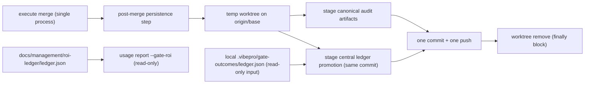

# Architecture

## Decision

Gate-outcome ROI ledger entries are promoted from the worktree-local,
gitignored `.vibepro/gate-outcomes/ledger.json` into a tracked central ledger
at `docs/management/roi-ledger/ledger.json` during the existing post-merge
persistence step of `execute merge` — the same step that already persists
canonical audit artifacts to the base branch. No new daemon, database, or
sync command is introduced: the merge event is the only moment when a story's
gate outcomes are final and the base branch is already being written to.

The local ledger stays gitignored and keeps its recording semantics; the
central ledger is an append-with-dedupe projection of it. `entry_key` (already
unique per resolution event in the `vibepro-gate-outcome-ledger-v3` schema) is
the identity for dedupe, which makes promotion idempotent across retries and
across multiple worktrees that observed the same resolution.

## Public Contract

No new CLI command. Two additive surfaces:

- `execute merge` result gains `roi_ledger_promotion` in its summary:
  `{ status: "promoted" | "no_entries" | "failed", promoted_count,
  duplicate_count, central_ledger_path }`.
- `usage report --gate-roi [--json]` reads the central ledger and reports
  per-gate resolution counts, classification distribution, and the explicit
  `unclassified_count`.

Central ledger shape: same `vibepro-gate-outcome-ledger-v3` entry schema,
wrapped with `{ schema_version, model, updated_at, entries: [] }`, entries
sorted by `entry_key` so regeneration from identical input is byte-identical.

## Execution Topology

The promotion path adds no new process, worker, or retry loop. It runs
synchronously inside the existing `execute merge` post-merge persistence
step, in the same temp worktree and the same commit as canonical audit
persistence, so there is no new deadlock or evidence-loss surface.



## Flow

```text
execute merge (post-merge persistence step)
  -> read local .vibepro/gate-outcomes/ledger.json (absent => no_entries)
  -> filter entries for the merged story_id
  -> read central docs/management/roi-ledger/ledger.json from base worktree
  -> merge by entry_key (existing entry wins), sort by entry_key
  -> write central ledger in the same temp worktree commit that persists audit artifacts
  -> report roi_ledger_promotion summary

usage report --gate-roi
  -> read central ledger (read-only)
  -> aggregate by gate_id: count, classification histogram, unclassified_count
  -> emit text/JSON report
```

## Boundaries

- Promotion happens only inside the `execute merge` post-merge persistence
  step; `pr prepare` and gate evaluation never write the central ledger.
- Recording into the local ledger is untouched; its authority stays in
  `pr-manager.js`.
- Classification of `unclassified` entries remains a human/monthly-ritual
  responsibility; this story only makes the data reachable.
- The central ledger write rides the existing audit-persistence temp worktree
  and commit; it must not introduce a second commit or push.

## Invariants

- Every story that completes `execute merge` after this change has its local
  ledger entries present in the central ledger (or an explicit `no_entries` /
  `failed` promotion summary).
- `entry_key` is unique in the central ledger; re-running promotion adds zero
  duplicates.
- Central ledger serialization is deterministic: identical logical content
  yields identical bytes.
- A missing or empty local ledger never fails the merge; a corrupt central
  ledger fails the promotion summary loudly instead of silently overwriting.

## Rollback

Revert the promotion block in `src/merge-manager.js`, the `--gate-roi` read
path in `src/usage-report.js`, delete `docs/management/roi-ledger/`, and
restore the gate-tuning ritual doc reference in one commit. Local ledger
recording is independent and unaffected.
