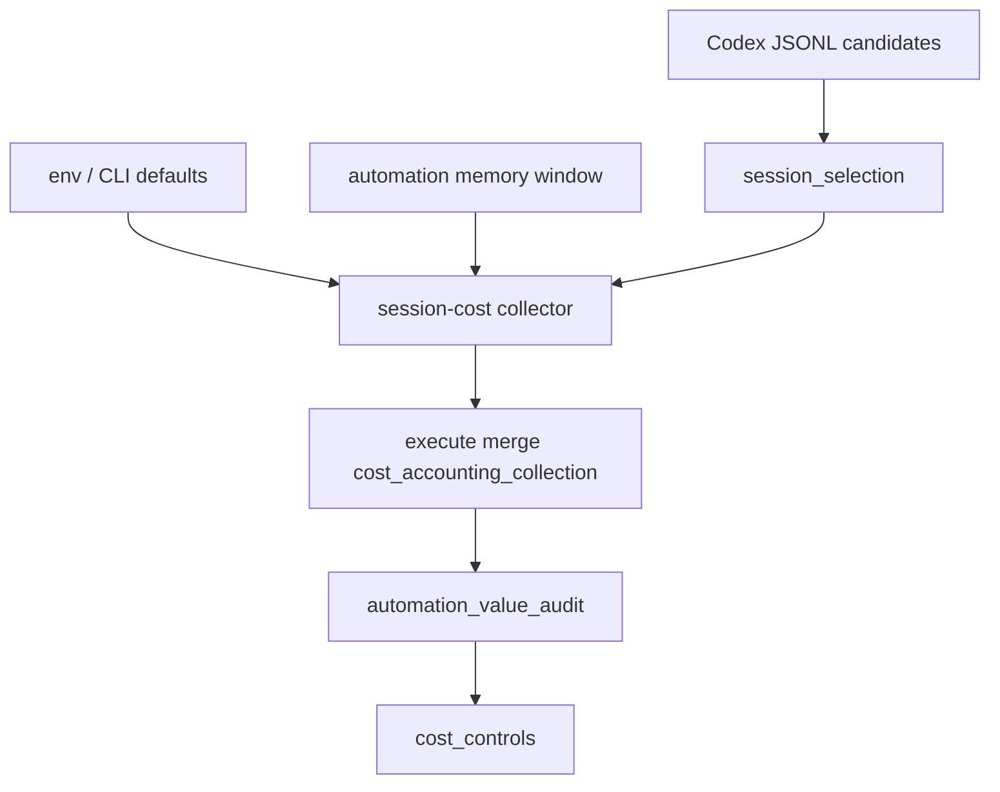

# Architecture

## Decision

Treat runtime-cost closure as an adapter and evidence-contract problem:

- automation defaults connect daily jobs to VibePro commands;
- session inference bridges story/window to Codex JSONL when evidence is strong;
- budget controls make audit overhead actionable in canonical artifacts.

## Flow

## Boundaries

- `execute merge` records evidence and provenance.
- Daily automation remains responsible for cross-repository value judgment.
- Ambiguous attribution and missing runtime data stay explicit.

