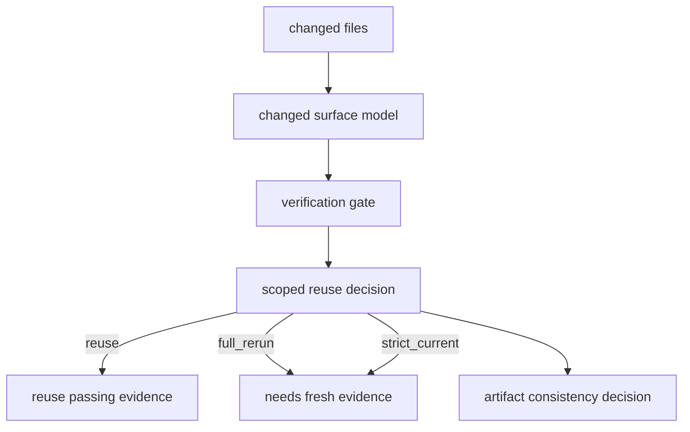

# Architecture

## Decision

Evidence reuse is decided from the changed surface plus the target verification gate, not from the
dirty fingerprint alone. The dirty/head binding still detects staleness, but scoped invalidation decides
whether that staleness actually affects the evidence item.

## Flow

## Invariants

- Failed evidence is never reused as passing evidence.
- Legacy evidence is never promoted by scoped invalidation.
- Test changes invalidate test-bound verification.
- Source, repo-control, and unknown changes stay conservative.
- Every reuse or invalidation decision carries changed file evidence.

## Tradeoff

The first dependency model is path-surface scoped. It can be conservative for source changes, but it
prevents the known false-stale case: docs/spec/metadata changes forcing a full E2E rerun even when the
runtime and tests have not changed.
