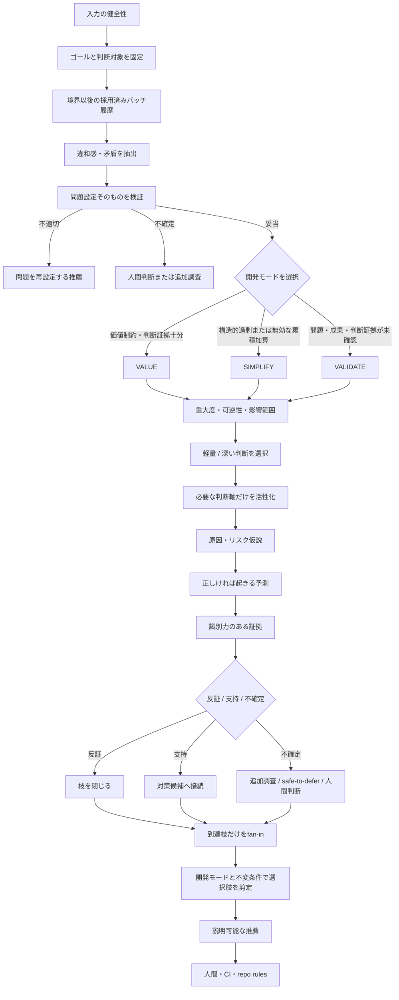

# Senior Engineering Judgment DAG Architecture

## 判断

シニア判断を、判断軸の一覧ではなく、共通スパインと動的な仮説枝からなる意思決定DAGとして扱う。
共通スパインは、入力の健全性、ゴール、採用済みバッチ履歴、違和感、問題設定、開発モード、判断コストの
順で必ず進む。履歴は、最後に外部成果を確認した時点または簡素化した時点を因果的な境界とし、それ以後の
採用済みバッチだけを対象にする。問題設定が妥当な場合は `VALUE`、`SIMPLIFY`、`VALIDATE` の一つへ
分岐した後、必要な判断軸を展開し、仮説・予測・証拠・反証を枝単位で評価する。到達した枝だけをfan-inし、
モードと不変条件による選択肢の剪定を経て、人間とCIへ推薦を渡す。

旧来のGate DAGと異なり、このDAGはPR readinessの権威を持たない。VibeProが所有するのは、判断の順序、
系譜、到達可能性、証拠と主張の結合、推薦理由である。実際の承認権限は既存の人間レビュー、CI、
リポジトリ規則に残す。

## 全体フロー

## 境界と責務

### 判断コンテキスト

ゴール、観測、矛盾、問題設定、変更の重大度・可逆性・影響範囲を保持する。自然言語から真実を推定する
責務は持たず、利用者または判断エージェントが明示した主張を入力として受ける。

### 開発サイクルコンテキスト

因果的な履歴境界、その境界以後に採用されたバッチ、現在の制約、次に検討するバッチの識別情報を保持する。
一つの履歴項目は一つのPRではなく、同時に判断・投入された並列バッチを表す。Story文面から成果を推測せず、
外部成果と構造増減には参照可能な証拠を要求する。検討中バッチの種別や「制約を直接扱う」という自己申告は、
開発モードの因果入力にしない。現在制約は、問題の存在確度、問題種別、解決方向を選べる証拠の十分性を分けて
保持する。問題が存在することと、どの介入を選ぶべきかが分かることを同一視しない。

### 開発モードルーター

問題設定が妥当な場合だけ、採用済み履歴、観測済みの外部成果、現在制約の確度・種別、判断証拠の十分性から
一つの開発モードを選ぶ。外部成果が不変または悪化した構造加算が境界以後にあれば `SIMPLIFY` を優先する。
問題、成果、または解決方向を選ぶ証拠が未確認なら `VALIDATE` とする。確認済み問題と十分な判断証拠が揃った
場合は、構造的過剰なら `SIMPLIFY`、価値制約なら `VALUE` とする。固定回数、Story数、検討中バッチのラベルでは
分岐しない。

### DAGコンパイラ

共通スパインと、活性化された判断軸・仮説・予測・証拠の枝を非循環グラフへ変換する。未活性の軸は
可視性のため残せるが、到達不能として扱う。暗黙の全軸ANDは作らない。

### 判断評価器

到達可能なノードを依存順に評価する。証拠を仮説全体へ雑に結び付けず、どの予測を支持または反証するかを
使う。反証は枝の正常終了であり、未知は独立した状態である。

### 選択肢剪定器

まず開発モードと選択肢の行為を突き合わせ、`SIMPLIFY` では削除・統合・再設計・廃止、`VALIDATE` では
計測・実験だけを候補に残す。その後、確認されたリスクと不変条件を突き合わせ、制約違反の選択肢を除外する。
好みやコストは比較材料にするが、不変条件と同じ強さでは扱わない。

### 推薦投影

DAG、到達経路、分岐理由、未確定事項、残存リスク、次の調査または人間判断を、機械可読成果物と
レビュー用成果物へ投影する。投影は権威あるPR Gateではない。

### 改訂系譜

一回の判断グラフを後から書き換えて循環させない。新しい証拠を得たときは、前の判断を親として参照する
新しい実行を作り、変わった主張と判断だけを差分として説明する。

## 判断軸

判断軸は共通スパインの後ろに置く。初期の標準軸は、公開契約、ロールバック感度、セキュリティ境界、
データ状態、実行トポロジー、UX表面、性能意味論、スコープとレビュー容易性、リリース運用とする。
ゴール整合性、履歴評価、問題設定、開発モードは軸ではなく、全軸より前の共通スパインである。

軸の追加・削除より、活性化理由と証拠の識別力を重視する。軸は単語一致で自動確定せず、観測または
制約との関係を明示する。

## 不変条件

1. 問題設定が不適切または不確定なら、下流軸は全体推薦に参加しない。
2. 未到達ノード、未活性軸、反証済みの枝はfan-inの必須条件にならない。
3. 古い証拠、出所不明の証拠、仮説を識別しない証拠は確証として使わない。
4. 未知を自動的にpassまたはblockへ変換しない。
5. fan-inの対象は実際に到達した枝だけである。
6. 一回の実行に循環を許さず、学習ループは親子実行として表す。
7. 推薦はPR・マージ・デプロイ権限を持たない。
8. 履歴の単位は採用済みバッチであり、同一バッチ内の並列PRを連続加算として数えない。
9. 開発モードは固定回数ではなく、履歴境界以後の成果、構造変化、現在の問題種別、判断証拠から選ぶ。
10. 同じ履歴、外部成果、現在制約、判断証拠からは、検討中バッチのメタデータに関係なく同じ開発モードを選ぶ。

## Failure containment

- 入力やグラフが構造的に不正なら成果物を確定せず、入力修正を要求する。
- 事実が足りない場合は処理失敗にせず、未確定の仮説と次の識別的調査を返す。
- 一つの軸の不確定を、無関係な別軸の失敗へ波及させない。
- 推薦投影の失敗は既存のStory、Spec、review、PR成果物を変更しない。

## 代替案と不採用理由

- **全軸チェックリスト**: 軸は維持できるが、順序・到達可能性・反証による枝閉鎖を表現できない。
- **自然言語分類器を最上流に置く**: 問題設定を疑う前に問いを固定し、否定文や古い差分で誤活性化しやすい。
- **単一スコア**: 相殺してはいけない不変条件と、比較可能な選好を混ぜるため採用しない。
- **cross-PR fan-in**: マージ経路を重くし、人間の手動マージで迂回できる一方、問題のあるStory生成を
  止められないため採用しない。
- **固定回数トリガー**: 並列PR数を累積加算と誤認し、根拠のない閾値になるため採用しない。
- **別のGate DAG**: 最小コアに廃止済みの承認機構を再導入するため採用しない。モード選択は同じ判断DAGの
  共通スパインに置く。
- **循環グラフ**: 学習ループは表せるが、どの時点の証拠で判断したかが曖昧になるため、実行間の系譜で表す。

## Rollback

この判断DAGを使わなくても、既存のStory、Spec、verification、review、PR flowは継続できる。判断成果物を
削除または無視してもPR権限や既存成果物の意味は変わらない。
