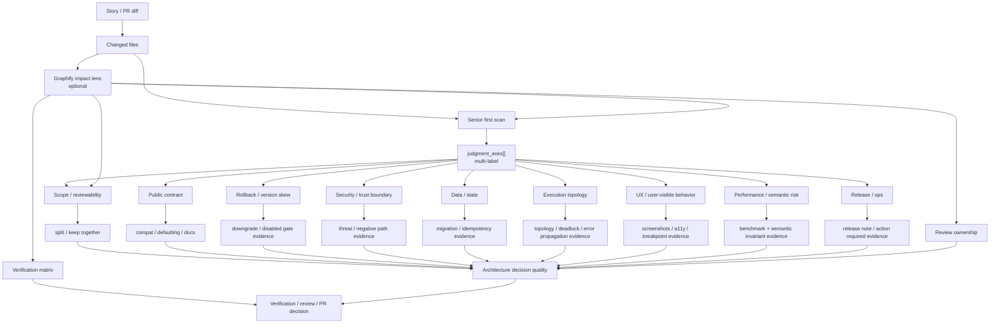

# Architecture

## Decision

Engineering Judgmentを、単一`route_type`選択ではなく、`Senior first scan`で複数の`judgment_axes[]`をactive化するmulti-axis DAGへ拡張する。

既存の`route_type`は互換性のため残してよいが、PR可否の判断はactive axesが持つdecision questionとrequired evidenceに基づいて行う。

## Architecture Quality

- Alternatives considered: 既存の単一`route_type`だけを強化する案、route-specific gateだけを増やす案、multi-axis DAGを追加する案を比較する。単一route案は複合PRの判断を落とし、route gate増殖案は分岐理由が再構成しにくいため、互換性を保ったmulti-axis追加を選ぶ。
- Compatibility impact: `route_type`、`route_dag`、既存Gate DAG nodeは残す。新規に`judgment_axes[]`と`gate:judgment_axis_*`を足し、既存PR body consumerは従来フィールドを読み続けられる。
- Rollback plan: 問題が出た場合は`judgment_axes[]`生成とaxis gate挿入を無効化しても、既存`route_type`ベースのDAGへ戻せる。Graphify不在時も従来通りPR prepareは継続する。
- Boundary: Graphifyはoptional impact lensであり、runtime/security/rollback/UX correctnessの証明境界には入れない。証明は各axisのrequired evidenceで行う。
- Accepted followups: 最初の実装では全axisを完璧にenforceせず、axis artifactとPR body再構成性を先に固定する。各axisの厳格化は、現在安全性を損なわない範囲で後続Storyに分ける。

## Model

## Judgment Axes

The first scan may activate any combination of these axes:

- `public_contract`: API, CLI, config, schema, PR body contract, output format, or user-visible semantics changed.
- `rollback_sensitive`: feature gate, stored object, version skew, partial rollout, downgrade, or release train behavior is involved.
- `security_boundary`: auth, permission, token, secret, sandbox, path access, namespace, or trust boundary changed.
- `data_state`: persisted state, migration, ORM/query behavior, cache, idempotency, replay, or backend-specific behavior changed.
- `execution_topology`: process, thread, worker, agent, subagent, queue, retry, artifact lifecycle, or orchestration topology changed.
- `ux_surface`: visual layout, interaction, accessibility, navigation, default-on/opt-out behavior, or user workflow changed.
- `performance_semantic`: optimization, latency, memory, concurrency, compiler/runtime semantics, or performance regression risk changed.
- `scope_reviewability`: PR combines multiple decisions, multiple public surfaces, or too many reviewer ownership areas.
- `release_ops`: operator/user action, release note, rollout/rollback instruction, observability, or support path is required.

## Graphify Placement

Graphify is an optional impact lens, not a correctness gate.

Use Graphify for:

- first scan axis hints,
- scope and split suggestions,
- related-file blast radius,
- reviewer/subagent ownership hints,
- focused verification candidate discovery.

Do not use Graphify as proof of:

- runtime correctness,
- security correctness,
- rollback safety,
- UX correctness,
- release readiness.

When `.vibepro/graphify/graph.json` is missing, the DAG records `graph_context.available=false` and continues.

## Evidence Flow

Each active axis produces:

- `decision_question`: the senior engineer question this axis represents.
- `required_evidence`: evidence kinds that can satisfy the question.
- `blocking_criteria`: conditions that must stop PR creation or merge.
- `acceptable_followup`: bounded, linked follow-up that is safe to defer.

This makes follow-up different from waiver. A follow-up is acceptable only when current behavior is safe without it.
If current safety depends on the missing work, the gate must block or require an explicit waiver.

## Non Goals

- Requiring Graphify installation.
- Removing existing `route_type` immediately.
- Making every PR run every axis.
- Treating a large evidence checklist as senior judgment.
- Treating ADR presence as architecture quality.
