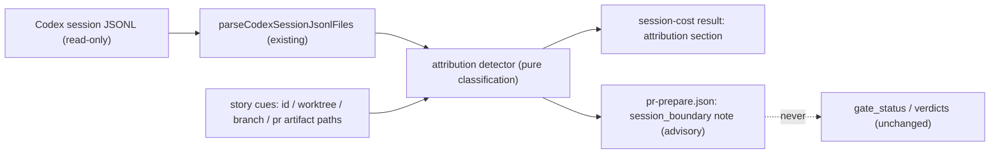

# Architecture

## Decision

Mixed-parent session detection becomes a first-class, deterministic
**attribution detector** inside `src/session-efficiency-audit.js`, surfaced
in two places: the `vibepro audit session-cost` result (new `attribution`
section) and the `pr-prepare.json` artifact (advisory `session_boundary`
note). Detection-and-surface was chosen over hard blocking: mixed sessions
are sometimes legitimate (cross-story triage), and two consecutive audits
show that habit-based separation does not hold — what is missing is a
machine-readable signal, not a prohibition.

The detector classifies each session exposure event (already parsed by
`parseCodexSessionJsonlFiles` / `summarizeSessionExposureEntry`) against
story cues: story id strings, story worktree paths (reusing the
`matchesRepo` + `gitCommonDir` worktree resolution that already exists for
repo binding), branch names, and `.vibepro/pr/<story-id>` artifact paths.
Events fall into exactly one of four bins — `strict_story`,
`worktree_associated`, `other_story`, `unclassified` — so the bins sum to
the event total and nothing is silently dropped. `mixed_parent` is true when
`other_story` cues are present; `attribution_risk: high` fires when strict
coverage falls below a declared threshold (initial: strict < 50% of
associated), replacing the judgment currently encoded only in the external
`session-time-efficiency.mjs` automation script.

## Public Contract

- `vibepro audit session-cost ... --json` gains:

```json
{
  "attribution": {
    "schema_version": "0.1.0",
    "status": "available",
    "target_story_id": "story-vibepro-uiux-docs-feature-map",
    "mixed_parent": true,
    "detected_story_ids": ["story-vibepro-uiux-style-preset-token-gate"],
    "events": { "strict_story": 120, "worktree_associated": 340, "other_story": 210, "unclassified": 12 },
    "estimated_tokens": { "strict_story": 310000, "worktree_associated": 910000, "other_story": 540000, "unclassified": 9000 },
    "strict_over_associated": 0.34,
    "attribution_risk": "high",
    "risk_threshold": 0.5
  }
}
```

  When no session can be resolved, `attribution.status: "unavailable"` with
  a reason — never omitted.

- `pr prepare --session-id <id>|auto` writes, when `mixed_parent` is
  detected, an advisory note into `pr-prepare.json`:
  `session_boundary: { mixed_parent, detected_story_ids, event_share }`.
  `gate_status`, verdicts, and `next_commands` are untouched.

- Existing `token_accounting` / `artifact_token_accounting` fields are
  byte-identical for single-story sessions.

## Execution Topology

No new process or network surface. The detector is a pure function over
already-parsed session events, invoked synchronously inside the existing
`collectSessionEfficiencyAudit` pass and, for `pr prepare`, inside
`preparePullRequest` after session inference resolves. Session JSONL files
are read-only inputs.



## Flow

```text
audit session-cost --session-id <id> --story-id <target>
  parse session events (existing)
  for each event: classify against cues -> exactly one bin
  compute mixed_parent, strict_over_associated, attribution_risk
  emit attribution section (or status=unavailable with reason)

pr prepare --session-id auto
  resolve session (existing inference)
  run same detector with target = current story
  mixed_parent -> write session_boundary note into pr-prepare.json
  gate evaluation proceeds unchanged
```

## Boundaries

- The detector reads session JSONL and repo state; it never writes to
  session logs and never reassigns tokens between stories — reallocation
  stays an audit-side judgment.
- It never blocks or delays any command; all outputs are advisory.
- Session inference (`--session-id auto` / `--infer-session`,
  `resolveSessionSelection`) is consumed as-is, not modified.
- The classification cue set is deterministic (string/path matching); no
  LLM calls, no heuristics that vary between runs on identical input.

## Invariants

- Bin counts always sum to the session's classified event total;
  unclassifiable events land in `unclassified`, never disappear.
- Single-story sessions: `mixed_parent=false` and all pre-existing output
  fields byte-identical.
- `attribution_risk: high` appears only when the declared threshold is
  crossed, and the threshold value itself is included in the output.
- `pr prepare` with a mixed parent produces the same gate_status,
  next_commands, and verdicts as without the detector.
- Unresolvable sessions yield an explicit `unavailable` status, never a
  missing section.

## Rollback

Revert the detector module and its two wiring points (session-cost result
assembly, pr prepare artifact assembly) in one commit. Existing
`pr-prepare.json` files containing a `session_boundary` note remain valid —
the field is additive and ignored by all gate readers.
