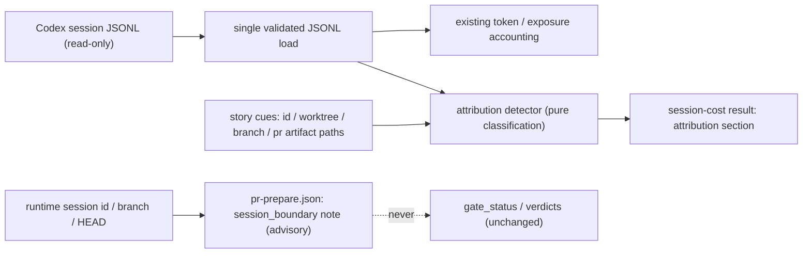

# Architecture

## Decision

Mixed-parent session detection becomes a first-class, deterministic
**attribution detector** inside `src/session-efficiency-audit.js`, surfaced
in two places: the `vibepro audit session-cost` result (new `attribution`
section) and the `pr-prepare.json` artifact (advisory `session_boundary`
note). Strict story cues are the primary cost boundary and worktree-associated
events are an upper bound. Detection-and-readiness-degradation was chosen over hard blocking: mixed sessions
are sometimes legitimate (cross-story triage), and two consecutive audits
show that habit-based separation does not hold — what is missing is a
machine-readable signal, not a prohibition.

The command loads and validates the selected JSONL files once, then both the
existing accounting parser and the pure attribution detector consume the same
validated in-window entry set. The detector classifies each entry against
story cues: story id strings and story-id-bearing branch, story worktree, and
`.vibepro/pr/<story-id>` artifact paths (reusing the
`matchesRepo` + `gitCommonDir` worktree resolution that already exists for
repo binding), branch names, and `.vibepro/pr/<story-id>` artifact paths.
Events fall into exactly one of four bins — `strict_story`,
`worktree_associated`, `other_story`, `unclassified` — so the bins sum to
the event total and nothing is silently dropped. `mixed_parent` is true when
`other_story` cues are present; `attribution_risk: high` fires when strict
coverage falls below a declared threshold (initial: strict < 50% of
associated), replacing the judgment currently encoded only in the external
`session-time-efficiency.mjs` automation script.

## Public Contract

- `vibepro audit session-cost ... --json` gains:

```json
{
  "attribution": {
    "schema_version": "0.1.0",
    "status": "available",
    "target_story_id": "story-vibepro-uiux-docs-feature-map",
    "mixed_parent": true,
    "detected_story_ids": ["story-vibepro-uiux-style-preset-token-gate"],
    "events": { "strict_story": 120, "worktree_associated": 340, "other_story": 210, "unclassified": 12 },
    "estimated_tokens": { "strict_story": 310000, "worktree_associated": 910000, "other_story": 540000, "unclassified": 9000 },
    "strict_over_associated": 0.34,
    "attribution_risk": "high",
    "risk_threshold": 0.5
  }
}
```

  When no session can be resolved, `attribution.status: "unavailable"` with
  a reason — never omitted.

- `pr prepare` writes the current runtime session id, branch, and HEAD into an
  advisory `session_boundary` note in `pr-prepare.json`. It does not classify
  mixed-parent sessions; the note explicitly delegates that determination to
  `vibepro audit session-cost --session-id <id> --story-id <story>`.
  `gate_status`, verdicts, and `next_commands` are untouched.

- Existing `token_accounting` values and `artifact_token_accounting` buckets
  remain semantically unchanged for the same token/tool events; attribution is
  an additive sibling and never reallocates accounting values. Source line
  provenance may still reflect additional non-token events in the JSONL.

## Execution Topology

No new process or network surface. JSONL loading and validation happen once in
the existing `collectSessionEfficiencyAudit` pass; the detector is a pure
function over that validated entry set. `preparePullRequest` only captures the
runtime boundary context through `buildSessionBoundaryAdvisory`; it does not
read or classify session JSONL. Session JSONL files are read-only inputs.



## Flow

```text
audit session-cost --session-id <id> --story-id <target>
  parse session events (existing)
  for each event: classify against cues -> exactly one bin
  compute mixed_parent, strict_over_associated, attribution_risk
  emit attribution section (or status=unavailable with reason)

pr prepare
  observe runtime session id when available
  write session_boundary note with explicit session-cost delegation
  gate evaluation proceeds unchanged
```

## Boundaries

- The detector reads session JSONL and repo state; it never writes to
  session logs and never reassigns tokens between stories — reallocation
  stays an audit-side judgment.
- It never changes or blocks `pr prepare` development gates. The audit-side
  output is fail-closed: mixed or incomplete attribution lowers
  `audit_readiness` to `partial`, and `audit session-cost` may return a nonzero
  exit status so automation cannot consume the result as a complete
  single-story cost.
- Session inference (`--session-id auto` / `--infer-session`,
  `resolveSessionSelection`) remains an `audit session-cost` concern and is
  not duplicated inside `pr prepare`.
- The classification cue set is deterministic (string/path matching); no
LLM calls, no heuristics that vary between runs on identical input. A mixed parent
adds `mixed_parent_session_attribution` to `audit_readiness.blockers`; it cannot be
reported as audit-ready evidence for one story.
- Story-like references are conservative observational cues, not authority. A false
  positive can lower audit readiness but cannot change gates, delivery state, or tokens.
- A read error makes attribution unavailable with a bounded reason. A malformed
  JSONL row remains visible as unclassified exposure; valid rows may be partitioned
  only with explicit partial parse coverage and an audit-readiness blocker, never as
  a complete session partition.

## Invariants

- Bin counts always sum to the session's classified event total;
  unclassifiable events land in `unclassified`, never disappear.
- Single-story sessions: `mixed_parent=false`, with pre-existing token values
  and artifact buckets unchanged.
- `attribution_risk: high` appears only when the declared threshold is
  crossed, and the threshold value itself is included in the output.
- `pr prepare` produces the same gate_status, next_commands, and verdicts
  whether runtime session context is observed or absent.
- Unresolvable sessions yield an explicit `unavailable` status, never a
  missing section.

## Rollback

Revert the detector output from session-cost and the independent advisory
field from pr prepare in one commit. Existing
`pr-prepare.json` files containing a `session_boundary` note remain valid —
the field is additive and ignored by all gate readers.
