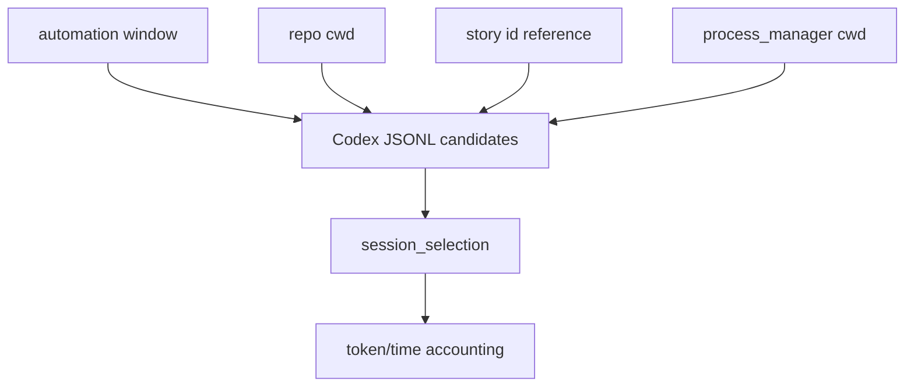

# Architecture

## Decision

Inference belongs in `session-cost`, not in the final value audit. The collector
can rank telemetry candidates, while automation still decides whether the
result is sufficient for value judgment.

## Flow

## Boundaries

- Inference is opt-in.
- Top-score ties are ambiguous.
- Low-confidence results remain unavailable rather than zero.

