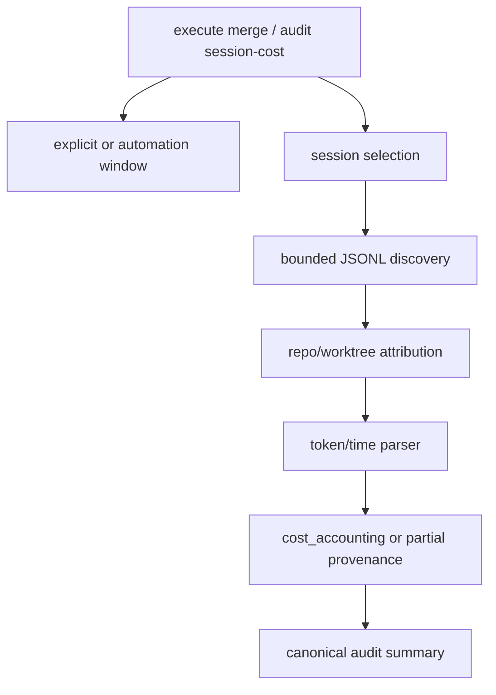

# Architecture

## Decision

Harden the existing `audit session-cost` collector instead of adding another
cost pipeline. Merge-time accounting remains optional and non-blocking, but when
requested it must be fast enough for the PR path and conservative enough to avoid
false attribution.

## Flow

## Boundaries

- Session inference may inspect Codex JSONL metadata, but must not follow
  symlink directory loops.
- Explicit session IDs are allowed, but a repo/cwd mismatch is a readiness
  blocker.
- Window bounds are accounting bounds, not proof that work happened. If the
  selected window has no events, elapsed time is unavailable.
- Daily automation windows and merge/story windows are different evidence
  scopes. VibePro must preserve which one was used.
