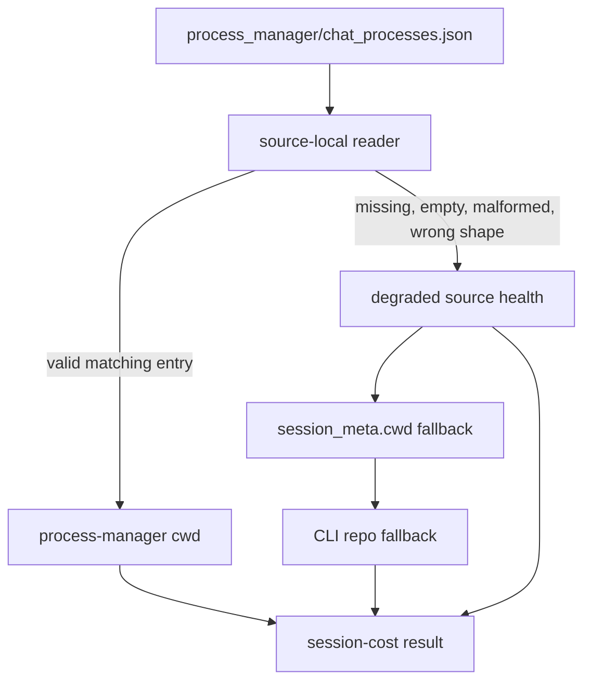

# Architecture

## Decision

Treat process-manager metadata as an independently fallible evidence source. Its reader returns an
entry plus structured health instead of throwing for expected local-state failures. Session JSONL
and repository evidence collection continue independently.

## Flow

## Invariants

- A valid matching process-manager entry remains the highest-priority cwd source.
- Corrupt optional metadata cannot suppress valid session token or attribution evidence.
- Diagnostics identify the failed source and category without embedding local file contents.
- The reader never repairs or rewrites Codex runtime state.
