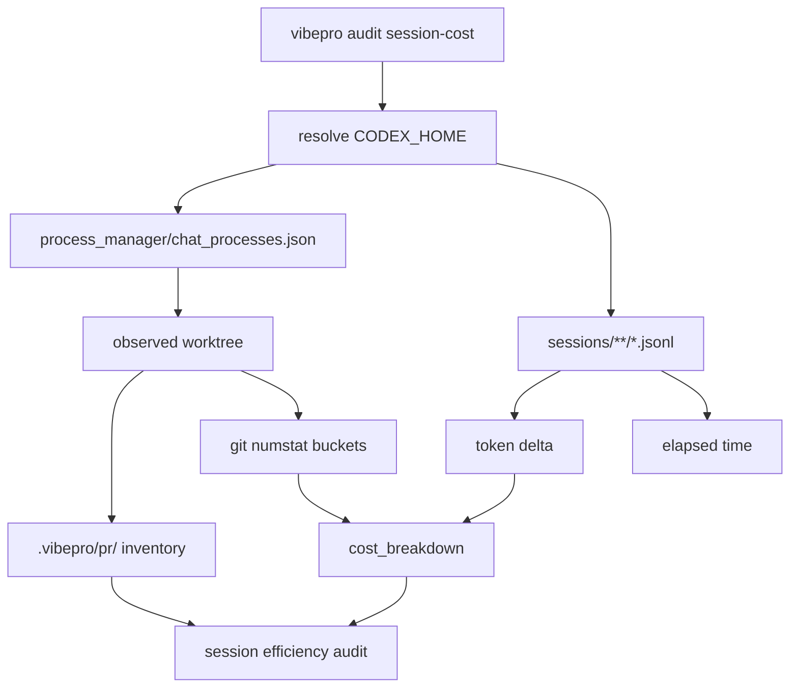

# Architecture

## Decision

Add a separate `audit session-cost` command instead of overloading canonical audit replay. Replay
answers whether persisted canonical artifacts can reconstruct a merged decision. Session-cost
answers a different question: what did the active VibePro-managed session spend, which worktree did
it actually modify, and how does that cost divide across product code, tests, docs, and audit
evidence?

## Boundaries

- `session-efficiency-audit` owns local Codex evidence discovery and active worktree cost
  accounting.
- `canonical-audit` remains the merge-time persistence and replay boundary.
- `evidence-cost-budget` remains the shared changed-path classifier and numstat parser.
- The command reads local evidence only; it does not create PRs, merge branches, or rewrite
  artifacts.

## Flow

## Invariants

- Active process manager cwd outranks session metadata cwd and CLI repo path.
- Unknown token/time values remain `unavailable`; they are never coerced to zero.
- Full-session accounting is labelled as full-session, not implied to be story-only.
- Bounded windows are caller-supplied and explicit.
- Staged and unstaged worktree diffs are included by default because active sessions may not have a
  merged PR yet.
