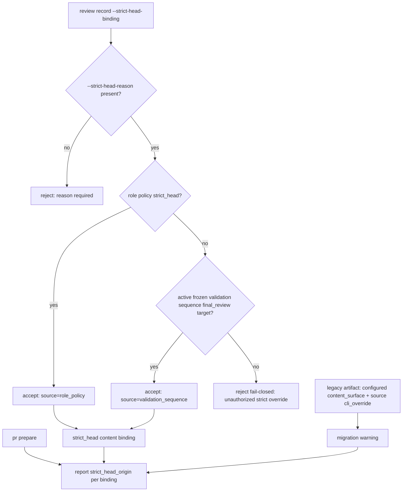

# Architecture

## Decision

`review record --strict-head-binding` is no longer an unconditional CLI
override. Strict HEAD binding must have a structurally verifiable origin:
either the frozen final_review target demanded by an active validation
sequence, or a role policy that explicitly declares `strict_head` with a
`freshness_reason`. A CLI override without such an origin is rejected
fail-closed at record time, so ordinary `content_surface` reviews cannot be
strict-ified by an agent's conservative judgment call.

## Flow

## Boundaries

- The frozen final_review target is defined once in
  `src/validation-sequencing.js` and exposed as a shared predicate; the
  authorization check in `src/agent-review.js` consumes it instead of
  duplicating the stage/role pair.
- Authorization requires the sequence state to be required (`plan.required`),
  frozen (`frozen_binding` set), and the recorded stage/role to equal the
  final_review target. The frozen final_review itself keeps strict HEAD
  semantics (TOCTOU protection) and is not weakened to content_surface.
- Role policy exceptions (`agent_reviews.roles.<role>.freshness_mode:
  strict_head` plus `freshness_reason`) remain supported and are the only
  configuration path to strict binding outside the validation sequence.
- Dispatch and remediation surfaces (`review prepare`, `parallel-dispatch.md`,
  recovery commands) never propagate `--strict-head-binding` to a role that is
  not currently authorized; a legacy unauthorized-strict review's recovery
  command re-records as `content_surface`.
- `pr prepare` explains each strict binding's origin
  (`validation_sequence` / `role_policy` / legacy `cli_override`) and emits a
  migration warning for persisted artifacts that are strict via `cli_override`
  on a `content_surface`-configured role. Existing artifacts are never
  rewritten.
- The content-surface freshness contract (PR #384) is unchanged: surface-bound
  reviews stay current across unrelated HEAD movement and go stale fail-closed
  when the reviewed surface changes or cannot be resolved.
