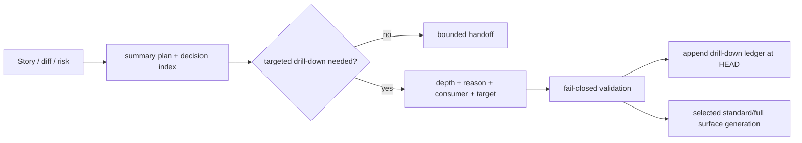

# Architecture

## Decision

`pr prepare` の generation policy は change profile にかかわらず summary-first とする。Engineering Judgment と risk surface 検出は常に実行し、深掘りの必要性を `evidence-plan.json` に残すが、full surface の生成は operator が target を指定した時だけ行う。

## Boundary

- `evidence-depth-planner`: summary-first policy と drill-down request validation。
- CLI: repeatable `--evidence-depth-target <path-or-gate>` を planner に渡す。
- `pr-manager`: current HEAD に結び付いた append-preserving ledger を workspace artifact として保存する。
- ledger は requested exposure を示す。実読込 telemetry や used-for-decision を推測しない。

## Flow

## Compatibility And Rollback

`--evidence-depth summary` と限定 view は互換である。standard/full callers は target の追加が必要になる意図的な fail-closed change。問題時は planner の default と validation を戻せるが、既存 ledger は監査履歴として保持する。
