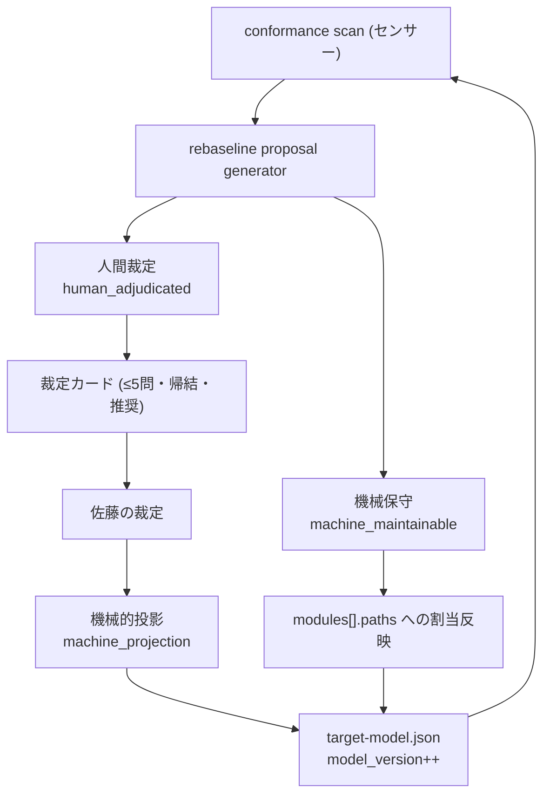

# Target Model Governance and Rebaseline Architecture

## Decision

target architecture model (`docs/architecture/target-model.json`) の改訂権限を三分法で機械可読に確定し、モデルに version を与え、現状ギャップの再baseline案を「根拠 + 帰結」付きで機械生成する。人間は少数の設計裁定にだけ答える。

前段（conformance delta ledger）が作ったのはセンサーだった。本storyが作るのは、そのセンサーが指す対象（モデル）自体を誰がどう変えてよいかの統治規則と、その規則に従って動く提案生成器である。

## 統治の三分法



| カテゴリ | 内容 | model_version |
|---|---|---|
| **machine_maintainable** | 既存モジュールへの孤児ファイル割当、stale パターンの除去、rules の範囲内での分割詳細の保守、proposal / 裁定カードの生成 | 増やさない |
| **human_adjudicated** | `rules[]` 本文の変更、新モジュールの新設・削除・責務変更、新規 `allowed_dependencies` の宣言、`budgets` の baseline 引き上げ、`scope_roots` の変更 | 裁定で増える |
| **machine_projection** | 人間が承認した裁定結果の target-model への反映、承認に伴う model_version のインクリメント、意味を変えない構造追加 | 裁定に従う |

判定規準は「その操作は、モデルが表す規範を緩めうるか」。緩めうるなら human_adjudicated。緩めないなら machine_maintainable。

target-model.json の `note` は上記の `governance` ブロックを参照するようになり、「自動改訂を禁止」と「機械保守の対象」の同居による解釈揺れを解消する。

## Model Versioning

- `model_version` は正の整数。**人間裁定による改訂でのみ増える**（machine_maintainable な割当追加では増えない）。
- 欠落は `null` に degrade する（本repo以外の利用リポジトリの後方互換）。0以下・非整数・非数値は理由付きエラー。
- conformance 出力は `model.version` を持つ。delta 出力は `base.model_version` / `head.model_version` / `model_version_changed` を持つ。
- **なぜ必要か**: モデル改訂を跨いだ delta は同一軸の改善/悪化ではない。孤児をモジュールへ割り当てると、それまで不可視だった import が module 間依存として顕在化し、new violation として現れる。version が付いていなければ、これは「コードが悪化した」と誤読される。

## Rebaseline Proposal のデータフロー

```text
docs/architecture/target-model.json (read)
  + import scan (architecture-conformance.js の共有関数)
  -> orphan assignment candidates
       候補モジュール = 孤児の import 先 / 被 import 元のモジュール分布から決定論的にスコアリング
       各候補に evidence（実 import edge）と induced_dependencies（割当時に顕在化する module 間依存 + allowed 判定）
  -> orphan clusters
       孤児同士の import による無向連結成分。新モジュール候補の母集団（命名は人間裁定）
  -> undeclared dependency triage
       rule_id 由来: R-001 / R-002 は resolve（規範違反であり宣言では消せない）
       R-004 は既存 allowed に逆向きが存在すれば resolve（循環化）、それ以外は declare_candidate
  -> .vibepro/architecture/rebaseline/proposal.{json,md}
  -> docs/architecture/target-model-rebaseline-proposal.md (committed snapshot)
  -> docs/architecture/adjudication/target-model-rebaseline-cards.md (人間裁定待ち)
```

## 設計原則

1. **提案と適用を分ける**。generator は target-model.json を書き換えない（read-only）。適用は machine_maintainable 範囲のみ人手/別コマンドで行う。
2. **帰結を先に見せる**。割当候補は必ず `induced_dependencies` を伴う。「割り当てたら新しい違反が3件増える」ことを裁定前に見せる。
3. **決定論**。候補順・クラスタ順・スコアは要素自身の値（モジュール名・ファイルパス・edge数）から導出し、走査順に依存させない。`generated_at` 以外は再実行で完全一致する。
4. **命名は機械がしない**。新モジュールの名前と存否は human_adjudicated。generator が出すのはクラスタとその根拠まで。

## Authority Boundary

- generator は derive-only。recorded evidence を新設せず、gate をblockしない。
- 裁定カードは未回答のまま artifact として残る。agent はカードに答えない。
- 本storyは ratchet gate・Story候補導出・post-merge reconciliation を含まない（後続story）。

## 計測所見（本storyでは修正しない）

`dependency_cycle` 次元は全単純閉路を列挙するため、実リポジトリで 27,551 件に膨張した（violation 合計 27,629 のうち 99.7%）。この次元は現状サマリーを支配しており、ratchet gate の対象にする前に「強連結成分単位に縮約する」等の再設計が必要である。本storyは proposal artifact に所見として記録するに留め、修正は後続storyへ分離する。
