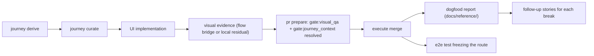

# Architecture

The code-side pipeline matured through self-dogfood round trips (PR #169–#181)
that surfaced and fixed real traps. The journey/UI-UX side has had zero such
round trips: every component exists, but no real UI story has ever traversed
journey → curation → design context → implementation → visual evidence → gate
resolution → merge. This story is a verification architecture, not a feature:
it exercises the full route once on a real UI change, records where it breaks,
and freezes the proven route as an e2e test.

## Decision

- Prerequisites are the three producer stories
  (journey-curate-command, flow-screenshot-visual-gate-bridge,
  visual-residual-local-runner); this story adds no product features itself.
- The subject must be a real UI change in a real project (e.g. brainbase-ui);
  synthetic changes cannot surface real friction.
- Success is judged against pre-declared numeric targets recorded before the
  run: manual command count measured and reported, zero raw-JSON hand-edits,
  and both `gate:visual_qa` and `gate:journey_context` resolved without
  waivers. The report reconciles outcomes against these declarations.
- The frozen route lives as an e2e test on a synthetic repository asserting
  each stage: curated journey present, visual evidence accepted, both gates
  resolved, merge preconditions met.
- Every break found during the run becomes an active follow-up story with its
  own acceptance criteria; an empty break list must be stated explicitly in
  the report.

## Boundary and Rollback

- Boundary: dogfood report under `docs/reference/`, one e2e test, follow-up
  story documents, and one maintained static VibePro review-cockpit preview
  used as the real UI-source dogfood subject. No product feature work belongs
  to this story.
- Rollback: the report and test are additive; reverting them removes only the
  frozen route coverage.
