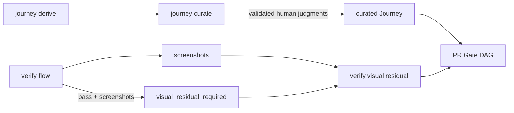

# Architecture

This implementation freezes the producer side of the UI Journey dogfood route.
The route depends on three additive public CLI contracts:

- `vibepro journey curate` turns a machine-derived Journey context pack into a
  curated Journey only after every conflict and open question is resolved or
  explicitly deferred.
- `vibepro verify visual` writes residual visual QA artifacts under
  `.vibepro/qa/<qa-id>/` from either fixture screenshots or screenshots
  captured by `verify flow`.
- Passing `vibepro verify flow` runs that captured screenshots report
  `not_recorded: visual_residual_required` and preserve screenshot provenance
  so `vibepro verify visual` or explicit artifact-backed verification can feed
  the PR Visual QA Gate.

## Decision

- The new commands are additive and do not invalidate existing hand-authored
  Journey JSON, existing residual QA artifacts, or manual `verify record`
  evidence.
- Public output compatibility is covered by CLI help tests and command-level
  JSON tests for `journey curate`, `verify visual`, and the `verify flow`
  screenshot bridge.
- The gate consumers remain conservative: missing baselines, partial curation,
  failed flow runs, and runtime contract failures surface as needs-review or
  rejection rather than silently passing.
- The dogfood report records the remaining limitation: this PR implements and
  freezes the route producers, while a later real-project UI PR must still
  prove the full route through `vibepro execute merge`.

## Boundary and Rollback

- Boundary: CLI producer commands, local artifacts, manifest links, and tests.
  No GitHub, CI, or merge behavior is changed by these producers.
- Rollback: remove `verify visual`, `journey curate`, and the flow
  not-recorded metadata hook; existing manual Journey and manual visual
  evidence workflows continue to work.
