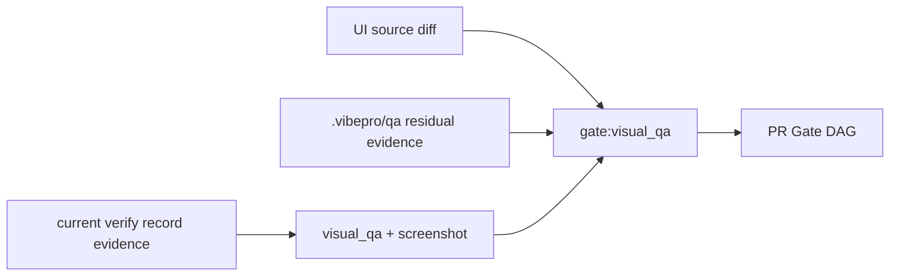

# Architecture

Visual QA evidence has two supported sources:

1. Residual analysis artifacts under `.vibepro/qa/<qa-id>/`.
2. Current-head passing verification evidence recorded by `vibepro verify record`.

Residual analysis remains the stronger, more specific source and is evaluated
first. Verification evidence is used only as a fallback when no residual run is
available. The fallback is intentionally narrow: it requires explicit visual
markers and a screenshot marker, and it must be bound to the current git head.

## Decision

- Keep residual evidence authoritative when it exists.
- Accept verification evidence only when it is current, passing, and explicit.
- Keep `accessibility_evidence` as supporting evidence, not as a substitute for
  screenshots.
- Emit concrete command guidance when the gate remains unresolved.
