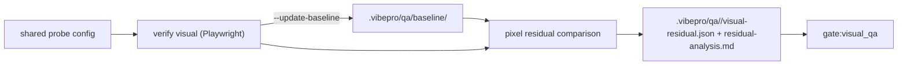

# Architecture

Residual analysis is the strongest evidence source for `gate:visual_qa`, but
today VibePro only validates residual artifacts — computing them requires an
external service (Percy, Chromatic) whose output the operator imports by hand
into `.vibepro/qa/<qa-id>/`. The local runner makes VibePro able to produce
that evidence itself.

`vibepro verify visual` reuses the probe configuration shared with
`verify flow`, captures current screenshots via Playwright, compares them
against baselines stored under `.vibepro/qa/baseline/` using Playwright's
built-in image comparison (pixelmatch family), and writes
`visual-residual.json` plus `residual-analysis.md` in the exact schema the
gate already validates. The gate consumer is unchanged: locally generated and
externally imported residual artifacts are indistinguishable to
`gate:visual_qa`.

## Decision

- Producer-side addition only; residual schema, threshold semantics, and gate
  evaluation are unchanged. External-tool import remains a supported path.
- Use Playwright's bundled image comparison; no new external service or heavy
  dependency is added.
- Missing baselines are reported as `baseline_missing` per probe — never a
  silent pass. First adoption on a repo is expected to start with
  `--update-baseline`.
- Baselines live in-repo under `.vibepro/qa/baseline/`; storage policy beyond
  that (LFS, external store) is explicitly out of scope for this story.
- Start with pixel residual (meanAbsResidualPct) only; semantic layout
  residual stays external until proven necessary.

## Boundary and Rollback

- Boundary: new CLI command plus baseline directory convention. Gate code and
  residual validation are untouched.
- Rollback: remove the command and baseline convention in one commit; imported
  residual artifacts keep working unchanged.
