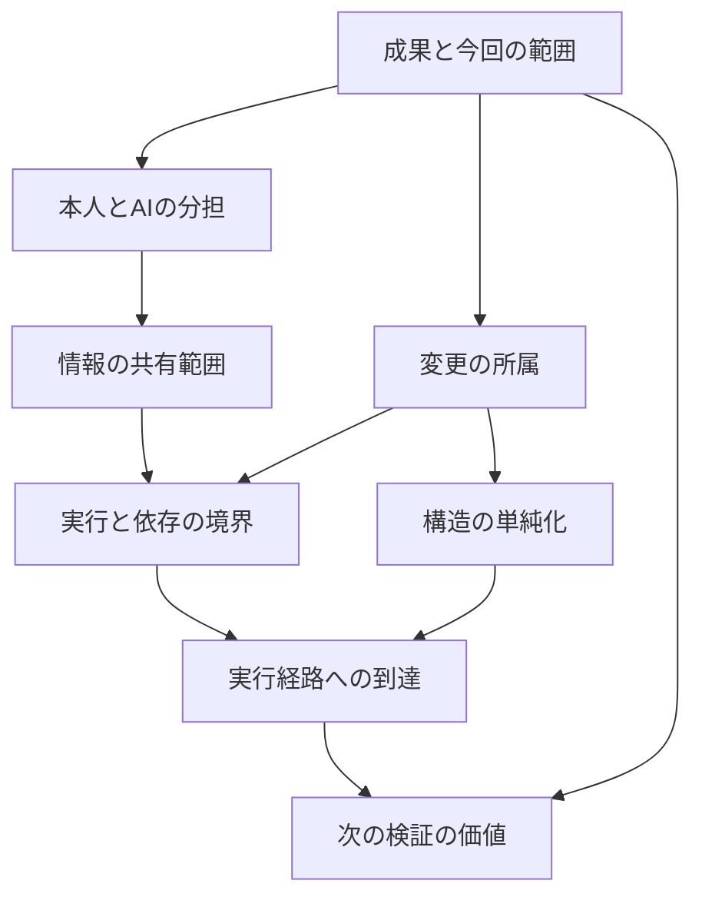

# 専門判断DAGの試作

このDAGは、届ける成果を定め、本人に戻す判断とAIが進める仕事を分けたうえで、変更・情報・実行環境の境界を検討します。その結果を、構造の見直し、実行経路の確認、追加検証の選択に引き継ぎます。

開発者の明示した上位原則と過去の本人の発言・個人知識をもとにした8ノードです。条件分岐と因果仮説は、まだ有用性を検証中の候補です。

| ノード | 判断する問い | 主な分岐 |
| --- | --- | --- |
| `outcome-scope` 成果と今回の範囲 | 今回約束した仕事の成立に必要か？ | 最小成果を定める／今回届ける／拡張を後へ回す。必要な権限管理・情報保護は残す |
| `decision-authority` 本人とAIの分担 | 本人の価値選択が必要か、既存の意思から導けるか？ | 目的・価値・責任・権限の未決事項を本人へ戻す／既存の権限内で進める |
| `change-ownership` 変更の所属 | この変更はどの利用者・契約に適用されるか？ | 所属を調べる／対象側に置く／共有契約への影響を比較する |
| `information-boundary` 情報の共有範囲 | この情報を、この相手へ渡してよいか？ | 所有範囲に留める／明示された相手へ必要な情報だけ共有する案を出す |
| `execution-boundary` 実行と依存の境界 | どこで動き、依存先がないとき何が成立するか？ | 実行構成を調べる／契約を保つ代替経路を比較する／本番データを分ける案を出す |
| `structural-simplification` 構造の単純化 | 局所修正を足し続ける構造自体を見直すべきか？ | 追加修正と削除・統合・再設計を比較する。緊急時は封じ込めを先にする |
| `runtime-reachability` 実行経路への到達 | 入れた実装が、意図した利用経路で動いているか？ | 実装・呼び出し元・設定・観測した効果を照合する |
| `evidence-decision-value` 次の検証の価値 | 次の確認は、どの未解決判断を変えるか？ | 判断に必要な確認をする／独立した必須確認を残す／反復を終える条件を示す |

## 判断のつながり



矢印は、後段の提案を採用する際に確認する前提です。各ノードの局所的な観測結果は独立して返し、前段の不足・未決事項を後段の `upstream_unknowns` に伝えます。本人の判断待ち、変更の所属が不明、共有権限がない、といった「不成立が分かっている前提」も引き継ぎます。

たとえば本人の価値選択が残る場合、情報共有と実行経路の提案は条件付きになります。一方、変更の所属を調べる作業は並行して進められます。前段の未決事項が残る間、末尾のノードは「確認を終えて全体を完了する」という提案を出しません。入力を更新して再実行すると、すべての後段が新しい前段の結果へ結び直されます。

これは助言用DAGです。権限の付与、コマンドの実行、外部共有、承認、マージの制御は行いません。

## 判断層が調査を起動する

専門判断の責任は判断DAGに置きます。調査手段の責任をGraphifyに移すわけではありません。判断DAGは、依頼から仮の目的・範囲を置き、現状との差から「何を決める必要があるか」「どの証拠なら案を分けられるか」「次に誰へ何を確認するか」を組み立てます。Graphify adapterは、ホストが明示した `graphPath` の既存Graphify成果物を読み取って構造上の候補を返す、読み取り専用の証拠プロバイダーです。今回のCLIはGraphifyの実行・生成・再生成を行いません。成果物を作る責任は、既存のGraphify実行経路またはホストに残ります。

同じGraphifyの結果を、判断の前後で使うことがあります。

```text
生の依頼・期待する成果
  ↓
判断DAGが仮の目的、範囲、最初の問いを置く
  ↓
Graphifyが対象ファイル・呼び出し関係・共有箇所の候補を返す
  ↓
判断DAGが問題設定、選択肢、成立条件、追加質問を更新する
  ↓
必要ならGraphifyで絞った経路をもう一度読む
  ↓
実行ログ・テスト・利用者確認などの独立した証拠と照合する
```

先に既存のGraphify成果物を読むと、依頼に書かれていない既存経路、共有実装、影響範囲が見つかり、判断すべき問い自体が変わることがあります。先に判断DAGを置くのは、読み取るファイル範囲と結果の意味を決めるためです。どちらかを固定の入口にはしません。判断DAGが調査を指示し、Graphify adapterの結果を受けて再評価します。

Graphifyのノードや辺は、構造上の候補です。そこから「同じ利用者の仕事を満たす」「契約が一致する」「実行時に到達する」「再発しない」とは判断しません。目的、認証、保存、実動作、失敗時の再開、利用者の仕事は、コード・設定・実行結果・業務確認など別の根拠で照合します。`graphPath` がない、成果物を読めない、対象ファイルがグラフに載っていない、静的な辺しか得られない場合は、`unavailable` / `partial` として根拠不足を保持します。成果物を生成できたことや、生成日時が新しいことをCLIは推測しません。

## 外部モデルを使う調査ラウンド

調査の問いや自由記述の意味整理を、VibePro内蔵のキーワード規則で決めません。`judgment investigate` は、ホストが実際に使っているモデルへ渡す `model_request` と、その応答を検証するためのスキーマを返します。ホストはその要求を読んで、現在取得できた証拠だけを使った応答を作り、VibeProへ `--response` で渡します。VibeProは応答を候補・質問・根拠として保持し、権限の付与や自律的なLLM呼び出しを行いません。

最初の入力は、真偽の観測を先に埋めたJSONではなく、依頼の事実を置くJSONです。少なくとも `case_id`、`goal`、`scope.files`、`constraints` を含めます。何が起きたかをまだ確認できていないときに `true` / `false` を作ってはいけません。モデルが確認すべき対象を、`questions`、`requests`、`options` の形で返した場合は、実際の調査結果を取得して次のラウンドへ渡します。質問の形式は、各ラウンドの `model_request` に含まれる応答スキーマを正本にします。

ホストは次の境界を守ります。

- `model_request` の要求を、現在の証拠を読むための指示として扱う。過去の仮説や前回の回答を、現在の事実へ昇格させない。
- Graphifyの要求は、明示された既存成果物を読む指示として扱う。Graphifyの実行・生成・再生成をCLIが代行したとは扱わない。
- Graphifyの辺を契約・因果・実行成功の証拠にしない。構造候補を、追加調査の範囲を決める材料として使う。
- Source adapterを使う場合も、リポジトリ内の相対パスを範囲内で読み取るだけであり、変更やコマンド実行はしない。抜粋・行数・バイト数の上限と静的解析の限界を保持する。
- グラフが欠けている、取得が失敗した、実行時の証拠がない、本人の選択が必要な場合は `unknown` / `partial` のまま返し、推測で埋めない。
- 応答は `candidate` / `advisory` として扱う。採択、マージ、デプロイ、コマンド実行、外部共有は別の人間・CI・リポジトリの責任である。
- 外部providerは、実装された認証済みホストまたはコネクタが実際に証拠を返す場合だけ使う。今回のCLIだけで外部取得をしたとは扱わず、未取得なら `unavailable` のまま返す。
- 必要な根拠が取得できないときは、質問を残して「次に何を確認すれば候補が変わるか」を明示する。根拠のない選択肢を一つに絞らない。

CLIが確認するのは、入力と調査contextの一致、参照の整合性、許可されたproviderか、providerの `available` / `partial` / `unavailable` 状態、派生statusの再計算です。JSON snapshotに含まれるreceiptが本物か、内容が業務上妥当か、ホストが見ていない案件で判断が正確かまでは保証しません。根拠の内容を読み、現在の案件へ適用できるかを判断する責任はホストに残ります。

## `judgment investigate` の使い方

CLIは、初回の生の目的または前回ラウンドの出力を `--input` で受け取ります。Graphifyのファイルは任意で `--graph` に渡せます。モデルの利用、リポジトリの読み取り、実行ログの取得はホストが担当します。

```sh
vibepro judgment investigate . \
  --input raw-goal.json \
  [--graph path/to/current-graphify-artifact.json] \
  --json

vibepro judgment investigate . \
  --input round-1.json \
  --response semantic-model-response.json \
  [--graph path/to/current-graphify-artifact.json] \
  --json
```

初回に `--response` を省略した結果には、ホストが実モデルへ渡す `model_request` が含まれます。ホストは要求内の応答スキーマに従って `semantic-model-response.json` を作ります。応答を渡したラウンドは、根拠に対応する候補、未解決の質問、調査すべき次の一手を返します。結果を次の `--input` に使うことで、GraphifyやCLIが実際に取得したsource証拠を加えた再解釈を新しいラウンドとして残せます。実行結果・本人の回答などの外部証拠は、許可されたホスト側の実装済みcollectorが取得して応答へ含めた場合に限り保持できます。CLIには外部取得経路を内蔵していません。

## 二巡の最小例

次の例では、依頼を受けた時点では「新しい画面を作る」のか「既存の経路を直す」のか決めません。まず目的と範囲を入力し、ホストが返された `model_request` を実モデルへ渡します。モデル応答のJSONは、初回結果に含まれる `response_schema` の実際の形に合わせて保存してください。自由に新しい項目を足して応答を作ってはいけません。

`raw-goal.json`:

```json
{
  "schema_version": "0.1.0",
  "case_id": "checkout-entry",
  "goal": "既存の購入導線から、利用者が選択内容を確認して購入結果を受け取れるようにする",
  "scope": { "files": ["src/checkout-entry.js", "src/checkout-api.js"] },
  "constraints": [
    "既存の認証・テナント境界を保つ",
    "業務状態の確定は業務APIに残す"
  ]
}
```

```sh
# 1. 目的から最初の問いとモデル要求を作る
vibepro judgment investigate . --input raw-goal.json --json > round-1.json

# round-1.json の model_request を実際のホストモデルに渡し、
# response_schema に適合した semantic-model-response.json を保存する。
# ここで「既存経路がある」「契約が一致する」と推測して埋めない。

# 2. Graphifyの構造候補とモデル応答を照合して再評価する
vibepro judgment investigate . \
  --input round-1.json \
  --response semantic-model-response.json \
  --graph path/to/current-graphify-artifact.json \
  --json > round-2.json
```

`round-2.json` が `candidate_ready` でも、Graphifyの構造候補だけで実行成立を証明したことにはなりません。未解決の `questions`、`requests`、`unknowns` が残る場合は、その質問に対応する実行ログ、設定、テスト、利用者確認を取得して、前回出力を入力にした次のラウンドへ進みます。`advisory: true` と `blocking: false` は、候補を既存の採択フローへ自動接続しないための境界です。

Storyへ下書きを接続する場合は、調査結果を `prepare --investigation` に渡せます。これは候補と未解決の質問を入力ドラフトへ添付するだけで、既存の `judgment input adopt` や評価結果を変更しません。調査結果の添付だけで採択や実行を行わず、既存の明示された採択権限を自動実行しません。`prepare` の結果だけで実行可能・マージ可能とは判断しません。

Storyの評価へ接続した場合も、専門判断は候補として扱います。既存の `VALUE` / `SIMPLIFY` / `VALIDATE`、seniorの推奨、`human_ci_repository_rules` の権限境界を置き換えず、条件分岐を自動採択しません。

## 実行する

単独で確認する場合は、従来どおり `vibepro judgment suggest --input <観測.json> --json` を使えます。ワークスペース初期化やStory登録は不要です。

Storyのsenior judgmentへ任意で接続する場合は、`observations.json` の `case_id` を対象Story ID（ここでは `story-example`）と一致させます。`prepare` は観測を `expert_input` として入力ドラフトへ埋め込み、`expert_judgment` のプレビューを返します。次の3コマンドは、既存の採択手順を通してから評価する例です。

```sh
vibepro judgment prepare . --id story-example --expert-input observations.json --json
vibepro judgment input adopt . --id story-example --input .vibepro/reviews/story-example/senior-judgment/input-draft.json --reviewed-by <actor> --authority <source> --summary "専門観測を確認した" --json
vibepro judgment evaluate . --id story-example --input .vibepro/reviews/story-example/senior-judgment/input-draft.json --json
```

上のパスは標準配置の例です。実際には `prepare` の `artifact` を使い、`evaluate` には `input adopt` が返す `adoption.adopted_input` を指定します。採択前に問題設定・選択肢と専門観測を確認してください。`prepare` だけでは問題設定は未確定のままで、専門観測を加えても自動で計画の実行可能状態にはなりません。

`input adopt` はドラフトに埋め込まれた観測のバイト列も含めて採択します。`evaluate` は採択済み入力の観測から専門判断を毎回再評価します。`case_id` が `--id` と異なる入力は受け付けません。

サンプルは、今回必要な情報提供を、指定された受信者へ届ける架空の変更です。実行依存先が使えず、同じ契約を保つ代替経路を比較する状況を表します。`structural-simplification.json` は、従来の4観測だけの例です。新しい前段の観測がないため、後段の提案も条件付きになります。

専門観測の入力スキーマは `0.1.0` のままです。以前の観測を受け付けます。出力スキーマは `schema_version: "0.3.0"` に更新し、`input_schema_version: "0.1.0"`、8ノード、`dag` を返します。出力を読む側は版とノードIDで扱い、旧3ノードの配列位置には依存しないでください。判断則は `rule_version: "3"` です。

```json
{
  "schema_version": "0.1.0",
  "case_id": "example-scope",
  "observations": [
    { "id": "outcome", "kind": "delivery_outcome_defined", "value": true, "source_refs": ["spec:recipient-job-outcome"] },
    { "id": "necessary", "kind": "necessary_for_committed_job", "value": false, "source_refs": ["review:scope-comparison"] },
    { "id": "protection", "kind": "required_protection", "value": true, "source_refs": ["contract:access-control"] }
  ]
}
```

この例を `prepare --expert-input` で使うときは、`case_id` を対象Story IDへ合わせます。

この例では、通常の範囲拡大は後へ回せても、必要な保護を削る提案は出しません。

## 判断を段階に分ける

8つの責任領域の中に、任意選択の5経路・16段階を追加しています。呼び出し元が今回必要な `decision_paths` を選び、観測を渡します。すべての案件へ16個の質問を追加する仕組みではありません。

| `decision_paths` の値 | 判断の順序 | 観測の種類（順序どおり） |
| --- | --- | --- |
| `target-alignment` | 製品・範囲 → 入口・状態 → 利用者の仕事 | `same_product_and_scope`, `same_entry_and_state`, `same_actor_and_job` |
| `existing-mechanism` | 既存方式の有無 → 契約の一致 → 管理する状態が減るか | `existing_mechanism_present`, `existing_mechanism_contract_compatible`, `reuse_reduces_independent_state` |
| `recurrence-prevention` | 現在の修復 → 状態を作った原因 → 再実行でも維持できるか | `current_state_restored`, `state_origin_identified`, `recurrence_path_controlled` |
| `responsibility-handoff` | 選択・呼出し・提案・確定の担当 → 呼出し層の契約 → 提案と業務確定の分離 | `decision_responsibilities_known`, `invocation_preserves_selected_operation`, `proposal_distinct_from_commit` |
| `interaction-contract` | 主な仕事 → 初期値 → 条件に応じた表示 → 変更・クリア後の整合 | `primary_user_job_known`, `defaults_match_primary_job`, `conditional_inputs_match_mode`, `reset_preserves_input_contract` |

選択した経路では、最初の未確認または修正が必要な段階を次の確認にします。後段は `deferred` とし、前段の観測を更新して再実行すると次の段階へ進みます。確認には `if_true` / `if_false` があり、結果によってどちらへ判断を変えるかを示します。詳細の前提が未解決なら、上位の実行候補もそのまま推奨せず、詳細確認を優先します。元の基本観測の評価は `base_assessment` に分けて残します。

たとえば現在値を直した証拠があっても、原因の設定や作成元を確認していなければ「再発しない」とは判断しません。初期値を決める際も、特定の値を一律に採用せず、今回の利用者の主な仕事と誤選択の影響を先に確認します。既存方式が存在しないことを確認できた場合や、契約が合わない場合は、強制的な再利用へ進めません。

```json
{
  "schema_version": "0.1.0",
  "case_id": "example-recurrence",
  "decision_paths": ["recurrence-prevention"],
  "observations": [
    { "id": "current", "kind": "current_state_restored", "value": true, "source_refs": ["readback:current-state"] }
  ]
}
```

この入力では、生成元・継承・変更履歴・自動処理の照合が次の確認になります。現在値のreadbackだけでは原因の観測を埋めません。

`priority_checks` は選択した経路の最初の未解決段階です。各ノードの `detail_paths` には段階ごとの根拠・分岐・依存関係を残します。未選択の経路は `not_assessed_paths` に残し、適用外または確認済みとは扱いません。`decision_paths` を省略した既存入力には、新しい観測不足を追加しません。

再利用の契約には、画面の外見だけでなく履歴・追加入力・用途固有の判定を含めます。継続操作では前の結果を次の入力に渡す必要があるかを確かめ、新規開始やクリアでは何を消すかを別に定めます。

処理の責任分担では、モデルや製品名だけから担当を推測しません。操作を選ぶ、呼び出す、提案を返す、業務状態を確定する責任を契約で区別します。同じ実装に複数の責任があっても、契約が明確なら物理的な分割を強制しません。

細分化は過去の直接発言をもとにした設計候補です。過去の訂正をそのまま未来の事実や固定的な好みへ変換せず、適用条件と反例を明示しています。

## 観測の意味

観測の分類は根拠を読める人またはAIが担当します。ノードは自由文のキーワードから事実を推測しません。`judgment suggest --input` で既存の観測を渡す場合、参照先の取得、真偽・対象範囲・鮮度の照合は呼び出し元が担います。`judgment investigate` では、明示したGraphify成果物とboundedなsource抜粋をCLIの読み取り専用adapterが取得しますが、証拠の意味・鮮度・業務妥当性は保証せず、external providerは未取得のままです。`source_refs` があること自体は、検証成功の証明ではありません。

`value` は `true` / `false` です。未確認は観測を省略するか、根拠なしとして渡します。欠落や根拠なしを `false` に置き換えません。観測IDと種類の重複は入力エラーです。

| ノード | 観測の種類 |
| --- | --- |
| 成果と今回の範囲 | `delivery_outcome_defined`, `necessary_for_committed_job`, `required_protection` |
| 本人とAIの分担 | `owner_value_choice_required`, `existing_authority_covers_action` |
| 変更の所属 | `change_scope_known`, `shared_contract_change` |
| 情報の共有範囲 | `information_boundary_crossed`, `recipient_scope_authorized` |
| 実行と依存の境界 | `execution_topology_known`, `dependency_available`, `fallback_preserves_contract`, `production_data_isolated` |
| 構造の単純化 | `repeated_local_fixes`, `complexity_growing`, `outcome_improving`, `urgent_containment` |
| 実行経路への到達 | `capability_claimed`, `implementation_present`, `intended_path_observed` |
| 次の検証の価値 | `verification_repeating`, `material_unknown_open`, `next_check_changes_decision`, `independently_required_check` |

- 成果の定義には、誰へ・いつ・どの仕事・最低限何を届けるかを含めます。記録があることと、新しい約束を本人が承認したことは区別します。
- 変更の所属は適用範囲と契約から調べます。共有契約への変更でも、必ず共通化すべきとは限りません。
- 情報の共有権限は、対象データと受信者の組み合わせについて確認します。組織をまたぐ共有を一律に禁止・許可する入力ではありません。
- 実行構成は、プロセス、通信、認証、保存、障害、再開地点を含みます。依存先がない場合の代替経路は、機能だけでなく保護と失敗時の契約も比較します。
- `production_data_isolated` は対象環境に必要な本番データの分離が確認できたかを表します。本番データを扱わないケースでは、対象範囲の根拠を付けて充足を明示します。案件の観測から一律のクラスタ分離を要求するものではありません。
- 実行経路の観測では、利用者の入口から期待した業務出力までを照合します。画面表示・HTTP成功・代替表示だけで本来の業務出力が成功したとは扱いません。実行経路が観測できても、受信者の継続利用や価値、説明・確認・修復負担の減少を証明しません。これらは実際の利用結果を別途観測します。
- 追加検証の効果が小さくても、独立した必須確認があれば残します。前段の観測不足や未決事項がある場合も、全体の検証済み宣言へ進めません。

## 結果の読み方

`status` は各ノードの局所判断です。

- `proposed`: 条件に基づく提案。採用済みという意味ではありません。
- `insufficient`: 必要な観測が足りないか矛盾しています。
- `not_applicable`: この観測では提案が適用されません。案件全体の正しさや完了を示しません。

`depends_on` は直前の依存ノード、`upstream_unknowns` は前段から伝わった不足・未決事項です。`context_status: unresolved` のとき、後段の提案は前提が未解決です。`context_requirements` は、確認済みの観測から判明した未成立の前提を表します。

`adoption_status: conditional` は前提や観測の解消を要する候補、`candidate` は既知の条件で比較できる候補、`not_applicable` は対象外です。いずれも権限や実行許可には変換されません。各出力は `advisory: true` / `blocking: false` を保持します。

因果モデル、予測、反証条件、選択肢、根拠、次の確認を合わせて読みます。`prepare --expert-input` のプレビューと `evaluate` の結果には `expert_judgment` が含まれます。評価結果の development DAG には `expert:<node-id>` の8ノードと専門DAG内の依存関係が残り、すべて `proposed` です。専門ノードは `recommendation` を支える候補として記録されますが、`conditional` を含む条件分岐を自動採択しません。

`expert_unresolved_node_count` は、観測不足・未成立の前提・上流の未解決が残る専門ノード数です。従来の `unknown_count` とは分けて表示します。

専門判断がある評価では、未確認または提案状態のノードごとに `next_actions` へ `review_expert_judgment` が追加されます。運用上のStory planでは、これを次の作業で確認する候補として扱います。`--expert-input` を省略した `prepare` と `expert_input` を持たない従来入力は、専門判断なしの従来フローを保ちます。

## 出典と検証の限界

上位原則は本人の個人知識にある「意思を少ない認知負荷で成果に変える」「本人は目的・価値・責任・権限を決める」「提供する仕事で開発範囲を制約する」という判断を整理したものです。境界の具体例は、過去の本人の発言を照合しました。因果仮説、観測への変換、分岐、DAGの接続は、その記録をもとに構成した候補です。効果を実証した本人の判断として扱いません。

公開ルールには匿名の `curation:<node-id>@3` を付け、個人知識の識別子・原文・ログ位置との対応は本人用の別ファイルに置きます。個人ログの原文や絶対パスは公開パッケージに含めません。

テスト結果と比較検証は変更単位で記録します。検証対象は条件分岐、反例、未確認の伝播、入力更新、CLI実行です。架空ケースでの分岐成功は、本人の判断の再現性や実案件の成果改善を証明しません。自由文の意味解釈は呼び出し元AIが担当し、CLIには内蔵モデルも判断則の自動学習もありません。
