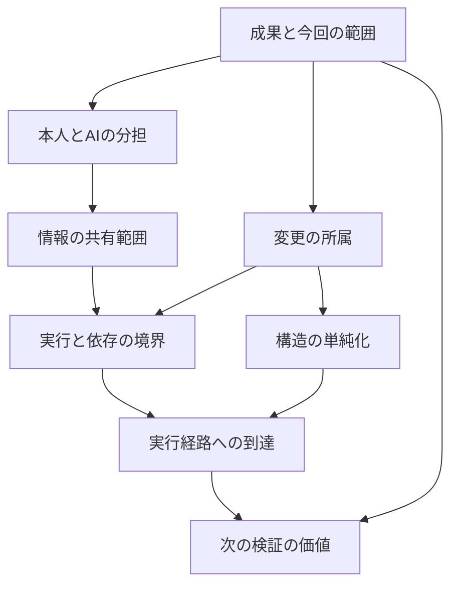

# 専門判断DAGの試作

このDAGは、届ける成果を定め、本人に戻す判断とAIが進める仕事を分けたうえで、変更・情報・実行環境の境界を検討します。その結果を、構造の見直し、実行経路の確認、追加検証の選択に引き継ぎます。

開発者の明示した上位原則と過去の本人の発言・個人知識をもとにした8ノードです。条件分岐と因果仮説は、まだ有用性を検証中の候補です。

| ノード | 判断する問い | 主な分岐 |
| --- | --- | --- |
| `outcome-scope` 成果と今回の範囲 | 今回約束した仕事の成立に必要か？ | 最小成果を定める／今回届ける／拡張を後へ回す。必要な権限管理・情報保護は残す |
| `decision-authority` 本人とAIの分担 | 本人の価値選択が必要か、既存の意思から導けるか？ | 目的・価値・責任・権限の未決事項を本人へ戻す／既存の権限内で進める |
| `change-ownership` 変更の所属 | この変更はどの利用者・契約に適用されるか？ | 所属を調べる／対象側に置く／共有契約への影響を比較する |
| `information-boundary` 情報の共有範囲 | この情報を、この相手へ渡してよいか？ | 所有範囲に留める／明示された相手へ必要な情報だけ共有する案を出す |
| `execution-boundary` 実行と依存の境界 | どこで動き、依存先がないとき何が成立するか？ | 実行構成を調べる／契約を保つ代替経路を比較する／本番データを分ける案を出す |
| `structural-simplification` 構造の単純化 | 局所修正を足し続ける構造自体を見直すべきか？ | 追加修正と削除・統合・再設計を比較する。緊急時は封じ込めを先にする |
| `runtime-reachability` 実行経路への到達 | 入れた実装が、意図した利用経路で動いているか？ | 実装・呼び出し元・設定・観測した効果を照合する |
| `evidence-decision-value` 次の検証の価値 | 次の確認は、どの未解決判断を変えるか？ | 判断に必要な確認をする／独立した必須確認を残す／反復を終える条件を示す |

## 判断のつながり



矢印は、後段の提案を採用する際に確認する前提です。各ノードの局所的な観測結果は独立して返し、前段の不足・未決事項を後段の `upstream_unknowns` に伝えます。本人の判断待ち、変更の所属が不明、共有権限がない、といった「不成立が分かっている前提」も引き継ぎます。

たとえば本人の価値選択が残る場合、情報共有と実行経路の提案は条件付きになります。一方、変更の所属を調べる作業は並行して進められます。前段の未決事項が残る間、末尾のノードは「確認を終えて全体を完了する」という提案を出しません。入力を更新して再実行すると、すべての後段が新しい前段の結果へ結び直されます。

これは助言用DAGです。権限の付与、コマンドの実行、外部共有、承認、マージの制御は行いません。

## 実行する

```sh
node bin/vibepro.js judgment suggest --input examples/expert-judgment/boundary-dag.json --json
```

インストール済みのCLIでは `vibepro judgment suggest --input <観測.json> --json` を使います。ワークスペース初期化やStory登録は不要です。`--json` を省略すると日本語の要約を返します。

サンプルは、今回必要な情報提供を、指定された受信者へ届ける架空の変更です。実行依存先が使えず、同じ契約を保つ代替経路を比較する状況を表します。`structural-simplification.json` は、従来の4観測だけの例です。新しい前段の観測がないため、後段の提案も条件付きになります。

入力スキーマは `0.1.0` のままです。以前の観測を受け付けます。出力スキーマは `schema_version: "0.2.0"` に更新し、`input_schema_version: "0.1.0"`、8ノード、`dag` を返します。出力を読む側は版とノードIDで扱い、旧3ノードの配列位置には依存しないでください。判断則は `rule_version: "2"` です。

```json
{
  "schema_version": "0.1.0",
  "case_id": "example-scope",
  "observations": [
    { "id": "outcome", "kind": "delivery_outcome_defined", "value": true, "source_refs": ["spec:recipient-job-outcome"] },
    { "id": "necessary", "kind": "necessary_for_committed_job", "value": false, "source_refs": ["review:scope-comparison"] },
    { "id": "protection", "kind": "required_protection", "value": true, "source_refs": ["contract:access-control"] }
  ]
}
```

この例では、通常の範囲拡大は後へ回せても、必要な保護を削る提案は出しません。

## 観測の意味

観測の分類は根拠を読める人またはAIが担当します。ノードは自由文のキーワードから事実を推測しません。参照先の取得、真偽・対象範囲・鮮度の照合も呼び出し元が担います。`source_refs` があること自体は、検証成功の証明ではありません。

`value` は `true` / `false` です。未確認は観測を省略するか、根拠なしとして渡します。欠落や根拠なしを `false` に置き換えません。観測IDと種類の重複は入力エラーです。

| ノード | 観測の種類 |
| --- | --- |
| 成果と今回の範囲 | `delivery_outcome_defined`, `necessary_for_committed_job`, `required_protection` |
| 本人とAIの分担 | `owner_value_choice_required`, `existing_authority_covers_action` |
| 変更の所属 | `change_scope_known`, `shared_contract_change` |
| 情報の共有範囲 | `information_boundary_crossed`, `recipient_scope_authorized` |
| 実行と依存の境界 | `execution_topology_known`, `dependency_available`, `fallback_preserves_contract`, `production_data_isolated` |
| 構造の単純化 | `repeated_local_fixes`, `complexity_growing`, `outcome_improving`, `urgent_containment` |
| 実行経路への到達 | `capability_claimed`, `implementation_present`, `intended_path_observed` |
| 次の検証の価値 | `verification_repeating`, `material_unknown_open`, `next_check_changes_decision`, `independently_required_check` |

- 成果の定義には、誰へ・いつ・どの仕事・最低限何を届けるかを含めます。記録があることと、新しい約束を本人が承認したことは区別します。
- 変更の所属は適用範囲と契約から調べます。共有契約への変更でも、必ず共通化すべきとは限りません。
- 情報の共有権限は、対象データと受信者の組み合わせについて確認します。組織をまたぐ共有を一律に禁止・許可する入力ではありません。
- 実行構成は、プロセス、通信、認証、保存、障害、再開地点を含みます。依存先がない場合の代替経路は、機能だけでなく保護と失敗時の契約も比較します。
- `production_data_isolated` は対象環境に必要な本番データの分離が確認できたかを表します。本番データを扱わないケースでは、対象範囲の根拠を付けて充足を明示します。案件の観測から一律のクラスタ分離を要求するものではありません。
- 実行経路が観測できても、受信者の継続利用や価値、説明・確認・修復負担の減少を証明しません。これらは実際の利用結果を別途観測します。
- 追加検証の効果が小さくても、独立した必須確認があれば残します。前段の観測不足や未決事項がある場合も、全体の検証済み宣言へ進めません。

## 結果の読み方

`status` は各ノードの局所判断です。

- `proposed`: 条件に基づく提案。採用済みという意味ではありません。
- `insufficient`: 必要な観測が足りないか矛盾しています。
- `not_applicable`: この観測では提案が適用されません。案件全体の正しさや完了を示しません。

`depends_on` は直前の依存ノード、`upstream_unknowns` は前段から伝わった不足・未決事項です。`context_status: unresolved` のとき、後段の提案は前提が未解決です。`context_requirements` は、確認済みの観測から判明した未成立の前提を表します。

`adoption_status: conditional` は前提や観測の解消を要する候補、`candidate` は既知の条件で比較できる候補、`not_applicable` は対象外です。いずれも権限や実行許可には変換されません。各出力は `advisory: true` / `blocking: false` を保持します。

因果モデル、予測、反証条件、選択肢、根拠、次の確認を合わせて読みます。既存の `judgment prepare` / `input adopt` / `evaluate` へは自動投入しません。

## 出典と検証の限界

上位原則は本人の個人知識にある「意思を少ない認知負荷で成果に変える」「本人は目的・価値・責任・権限を決める」「提供する仕事で開発範囲を制約する」という判断を整理したものです。境界の具体例は、過去の本人の発言を照合しました。因果仮説、観測への変換、分岐、DAGの接続は、その記録をもとに構成した候補です。効果を実証した本人の判断として扱いません。

公開ルールには匿名の `curation:<node-id>@2` を付け、個人知識の識別子・原文・ログ位置との対応は本人用の別ファイルに置きます。個人ログの原文や絶対パスは公開パッケージに含めません。

テストは条件分岐、反例、未確認の伝播、入力更新、CLI実行を確かめます。架空ケースでの分岐成功は、本人の判断の再現性や実案件の成果改善を証明しません。ログの自動収集、自由文の意味抽出、判断則の自動学習は、この版にはありません。
