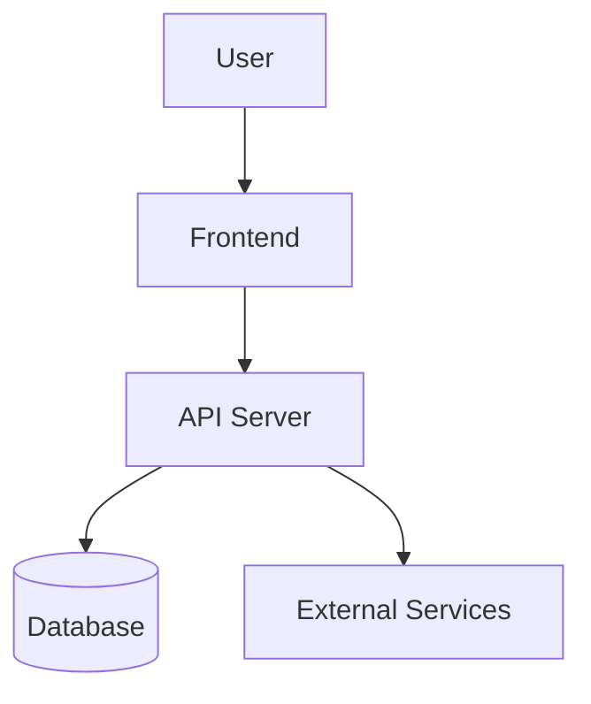

# システム全体設計

## 1. システム概要

このシステムが何をするものかを書きます。

## 2. 主要コンポーネント

| コンポーネント | 役割 |
|---|---|
| Frontend |  |
| Backend / API |  |
| Database |  |
| External Service |  |

## 3. システム構成図

## 4. データの流れ

1.
2.
3.

## 5. 外部サービス連携

| サービス | 用途 | 連携方式 |
|---|---|---|
|  |  |  |

## 6. 技術スタック

| 領域 | 技術 |
|---|---|
| Frontend |  |
| Backend |  |
| Database |  |
| Infrastructure |  |
| Monitoring |  |

## 7. 関連資料

- [DB設計](./02_db_design.md)
- [API設計](./03_api_design.md)
- [ログ・監視設計](./06_logging_monitoring.md)
