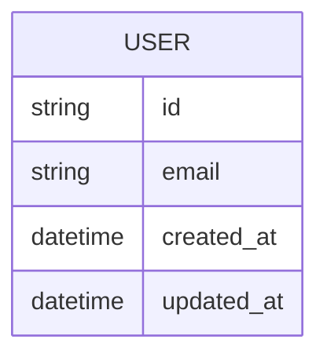

# DB設計

## 1. 基本方針

- テーブル名：
- カラム名：
- 主キー：
- 外部キー：
- timestamp：
- soft delete：

## 2. ER図

## 3. テーブル一覧

| テーブル | 説明 |
|---|---|
| users |  |
| organizations |  |

## 4. テーブル詳細

### users

| カラム | 型 | 必須 | 説明 |
|---|---|---:|---|
| id |  | ○ |  |
| created_at | datetime | ○ | 作成日時 |
| updated_at | datetime | ○ | 更新日時 |

## 5. インデックス

| テーブル | カラム | 用途 |
|---|---|---|
|  |  |  |

## 6. マイグレーション方針

-
-
-

## 7. Seed / 初期データ

-
-
-

## 8. 注意事項

- 機能固有のDB変更は、必ず `features/[feature]/04_technical_delta.md` に差分を書く
- DBスキーマ変更はCTOレビュー必須

## 9. 関連資料
- [各機能の技術差分](../features/)
