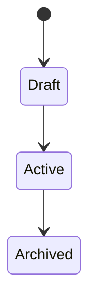

# 機能仕様

## 1. 機能概要

この機能で実現することを簡潔に書きます。

用語は [用語集](../../product/07_glossary.md) に合わせます。

## 2. 機能一覧

| 機能 | 説明 |
|---|---|
|  |  |

## 3. 入力

| 入力項目 | 型 | 必須 | 説明 |
|---|---|---:|---|
|  |  |  |  |

## 4. 出力

| 出力項目 | 型 | 説明 |
|---|---|---|
|  |  |  |

## 5. 業務ルール

-
-
-

## 6. 状態遷移

必要に応じて記載します。

## 7. 権限による機能制限

詳細な権限方針は [認証・権限設計](../../architecture/04_auth_permission.md) を参照。

| 操作 | admin | staff | user |
|---|---:|---:|---:|
|  |  |  |  |

## 8. ユーザーから見えるエラー

共通エラー方針は [エラー設計](../../architecture/05_error_design.md) を参照。

| ケース | 表示文言 | 次の行動 |
|---|---|---|
|  |  |  |

## 9. 関連資料

- [振る舞い仕様](./01_behavior_spec.md)
- [UI/UX仕様](./03_ui_ux_spec.md)
- [技術差分](./04_technical_delta.md)
