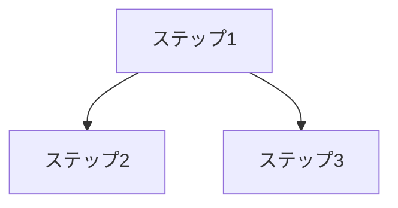

# 実装計画

## 1. 実装開始前チェック

実装を開始する前に、以下を確認します。

- [ ] 振る舞い仕様がある
- [ ] 受け入れ条件がある
- [ ] 機能仕様がある
- [ ] UIがある場合、UI/UX仕様がある
- [ ] 技術差分がある場合、技術差分が明確である
- [ ] 不要なドキュメントは削除、または対象外理由を記載している
- [ ] テスト計画がある
- [ ] 品質ゲートがある
- [ ] 変更してよい範囲が明確である
- [ ] 変更してはいけない範囲が明確である
- [ ] DB変更の有無が明確である
- [ ] 認証・権限への影響が明確である
- [ ] 既存APIレスポンスへの影響が明確である
- [ ] フレームワーク、ライブラリ、外部サービスの公式情報確認が必要か判断している

---

## 2. 実装方針

このfeatureは、1つの実装単位として扱います。

ただし、実装作業は以下の「実装順序」と「実装ステップ」に分けて進めます。
各ステップは、このfeatureを完成させるための作業順序を示すものです。

原則として、以下の流れで進めます。

```text
1. 受け入れ条件を確認する
2. 05_test_plan.md を確認する
3. 実装範囲ごとにテスト条件を確認する
4. TDDで進められるものは、先にテスト観点またはテストコードを用意する
5. テストを通すための最小実装を行う
6. テストが成功している状態を保ちながら、必要に応じて重複をなくし、可読性や構造を整える
7. E2Eまたは手動確認で主要導線を確認する
8. 必要に応じてステップをGitHub Issueへ切り出す
9. PRを作成する、またはPR作成に必要な説明文を用意する
```

### 2.1 基本方針

- 基本的に、TDDで進められるものはTDDで進める
- テストは公開インターフェース越しの振る舞いを確認する
- 重要ロジック、API、権限、バリデーション、状態遷移は、先にテスト観点またはテストコードを用意する
- UI、文言、レイアウトはテスト観点を先に定義し、実装後にE2Eまたは手動確認で検証する
- DB変更がある場合は、先に変更内容と影響範囲を確定する
- 認証・権限に影響する場合は、エンジニアA/Bのレビュー必須とする
- 仕様外の実装をしない
- テストを通すために仕様を変えない
- 既存テストを削除しない
- モックで本質的な問題を隠さない
- 各ステップは、実装、テスト、検証を1回の集中作業で終えられる大きさにする
- 各ステップ完了時に、実行した検証と結果をIssueまたはPRに残す
- 一度成功した検証コマンドは、関連ファイルを変更していない限り、安心のためだけに繰り返し実行しない
- フレームワーク、ライブラリ、外部サービスの実装判断は、必要に応じて公式ドキュメントを確認する

### 2.2 実装順序

このfeatureでは、以下の順番で実装します。

実装順序は、薄い縦スライスとして分けます。
各スライスは、完了時点で単独に確認できる単位にします。

1.
2.
3.
4.
5.

### 2.3 ステップ粒度

各ステップは、できるだけ小さく、検証可能な単位にします。

| サイズ | 目安 | 扱い |
|---|---|---|
| XS | 1ファイル程度 | そのまま実装してよい |
| S | 1〜2ファイル程度 | AI実装に向く |
| M | 3〜5ファイル程度 | 1つの薄い縦スライスとして扱う |
| L | 6〜8ファイル程度 | 可能なら分割する |
| XL | 9ファイル以上、または複数責務を含む | 分割する。AI実行前に人間確認する |

以下に該当する場合は、ステップを分割します。

- 受け入れ条件を3つ以内に説明できない
- UI、API、DB、権限など複数責務を一度に大きく変更する
- 1回の実装で検証まで終えられない
- 依存関係が複雑で、途中の確認ポイントが必要

### 2.4 Issue化方針

このfeatureの実装は、必要に応じてGitHub Issueに切り出します。

`06_tasks.md` は実装計画・変更範囲・禁止事項・完了条件の正本です。
GitHub Issueは、`06_tasks.md` のステップを実行するための作業キューとして扱います。

Issueに切り出す時は、以下を守ります。

- 1 Issue = 1ステップ または 1つの薄い縦スライス
- Issue本文には `対象feature`、`実装計画`、`Step ID`、`Size` を必ず書く
- Issue本文には `06_tasks.md` 全文を複製しない
- Issue本文にはAIが着手するための最低限の抜粋を書く
- 仕様の正本は `docs/features/[feature-name]/` 配下に置く
- AIはIssueだけで完結せず、必ず関連仕様と `06_tasks.md` を読む
- Issue作成後は `triage-issue` でAI実行可能か確認する

### 2.5 ステップ種別

| 種別 | 意味 |
|---|---|
| AFK | AIがIssueを入口に実装できる。人間判断を待たずに進めてよい |
| HITL | 人間判断、設計レビュー、外部確認、DB/認証/権限/課金/セキュリティ判断が必要 |

### 2.6 TDDで進めるもの

基本的に、テスト先行で進められるものはTDDで進めます。

特に以下に該当するものは、先にテスト観点またはテストコードを用意してから実装します。

TDDで進める場合も、まとめて全テストを書かず、1つの振る舞いごとに `RED → GREEN → REFACTOR` を回します。

| 対象 | テスト方法 | 理由 |
|---|---|---|
| 重要ロジック | 単体テスト | 挙動の正しさを機械的に確認するため |
| API | 統合テスト | リクエスト、レスポンス、認証状態、権限状態を確認するため |
| 権限判定 | 単体テスト / 統合テスト | 権限漏れを防ぐため |
| バリデーション | 単体テスト / 統合テスト | 境界値、異常系、入力不備を確認するため |
| 状態遷移 | 単体テスト | 不正な状態変更を防ぐため |
| 金額・日付・集計・計算処理 | 単体テスト | 計算ミスや境界値漏れを防ぐため |
| 外部連携の変換処理 | 単体テスト / 統合テスト | 送受信データの形式崩れを防ぐため |

このfeatureで特にTDDを意識する箇所がある場合は、以下に記載します。

| 対象 | テスト方法 | 理由 |
|---|---|---|
|  |  |  |
|  |  |  |

### 2.7 TDDではなく実装後確認でよいもの

以下は、TDDよりもE2Eまたは手動確認で検証した方が適切な対象です。

ただし、実装前にテスト観点は定義します。

| 対象 | 確認方法 | 理由 |
|---|---|---|
| UIレイアウト | E2E / 手動確認 | 見た目や使いやすさは画面確認が必要なため |
| 文言 | 手動確認 | 業務文脈やユーザーへの伝わり方を確認するため |
| レスポンシブ表示 | E2E / 手動確認 | 端末幅による表示崩れを確認するため |
| ローディング状態 | E2E / 手動確認 | 実際の画面状態として確認する必要があるため |
| 空状態 | E2E / 手動確認 | データがない場合の見え方を確認する必要があるため |
| エラー状態 | E2E / 手動確認 | ユーザーに伝わるエラー表示になっているか確認するため |
| アニメーション・操作感 | 手動確認 | 体感の違和感は人間が確認する必要があるため |

このfeatureで実装後確認とする箇所がある場合は、以下に記載します。

| 対象 | 確認方法 | 理由 |
|---|---|---|
|  | E2E / 手動確認 |  |
|  | E2E / 手動確認 |  |

### 2.8 品質ゲート

`05_test_plan.md` と [品質ゲート](../../testing/06_quality_gates.md) をもとに、該当する観点を実装ステップへ反映します。

| 観点 | このfeatureでの扱い |
|---|---|
| 正しさ |  |
| 設計整合性 |  |
| セキュリティ |  |
| パフォーマンス |  |
| アクセシビリティ |  |
| 運用 |  |

---

## 3. 依存関係

実装順序に影響する依存関係を書きます。



### 3.1 依存関係メモ

| 実装ステップ | 先に必要な作業 | 理由 |
|---|---|---|
|  |  |  |
|  |  |  |

---

## 4. 実装ステップ

このfeatureの実装は、以下のステップ単位で進めます。

AIコーディングツールに依頼する場合も、原則としてこの表のID順に進めます。
このfeatureは1つの実装単位として扱いますが、作業内容・変更範囲・完了条件はステップごとに明確にします。

| ID | 種別 | Size | Issue化 | Issueタイトル | 依存Issue | 作業内容 | 変更範囲 | 完了条件 | 検証 |
|---|---|---|---|---|---|---|---|---|---|
| 001 | AFK / HITL | XS / S / M | yes / no |  | None |  |  |  |  |
| 002 | AFK / HITL | XS / S / M | yes / no |  | 001 |  |  |  |  |
| 003 | AFK / HITL | XS / S / M | yes / no |  | 002 |  |  |  |  |

### 4.1 Issue本文の最小テンプレート

Issueに切り出す場合は、以下の形にします。

```md
## 参照元

- 対象feature: `docs/features/[feature-name]/`
- 実装計画: `docs/features/[feature-name]/06_tasks.md`
- Step ID: `000`
- 種別: AFK / HITL
- Size: XS / S / M

## AIへの指示

このIssueは、上記featureの `06_tasks.md` に定義されたステップを実装するためのものです。

実装前に必ず `01_behavior_spec.md`、`02_functional_spec.md`、`04_technical_delta.md`、`05_test_plan.md`、`06_tasks.md` を読んでください。
UIがある場合は `03_ui_ux_spec.md` も読んでください。

`06_tasks.md` の「変更してよい範囲」「変更禁止」「人間確認・承認が必要な条件」を必ず守ってください。

## 実装内容

[ステップの作業内容]

## 変更してよい範囲

[ステップの変更範囲]

## 受け入れ条件

- [ ]

## テスト

- [ ]

## 検証証跡

| 種別 | コマンド / 確認内容 | 結果 | 備考 |
|---|---|---|---|
| lint |  | pass / fail / skipped |  |
| typecheck |  | pass / fail / skipped |  |
| test |  | pass / fail / skipped |  |
| build |  | pass / fail / skipped |  |
| 手動確認 |  | pass / fail / skipped |  |

## 依存Issue

None / #issue-number
```

---

## 5. AI実装指示

AIコーディングツールは、この `06_tasks.md` と同じfeature配下の関連資料を参照して実装します。

このfeatureの仕様、受け入れ条件、実装順序は事前に整理済みである前提です。
そのため、実装前に詳細なPlanを再作成する必要はありません。

GitHub Issueから依頼された場合は、Issue本文の `対象feature`、`実装計画`、`Step ID`、`Size` を入口にして、該当ステップだけを実装します。
Issue本文と `06_tasks.md` が矛盾する場合は、`06_tasks.md` と関連仕様を優先します。

ただし、実装開始前に以下を簡潔に確認してください。

- このfeatureの目的
- 実装する範囲
- 変更予定ファイル
- 実行するテスト
- 必要な品質ゲート
- 変更禁止範囲に触れないこと
- 公式ドキュメント確認が必要か
- 不明点の有無

問題がなければ、実装順序と実装ステップに沿って作業してください。

### 5.1 参照資料

実装時は、必要に応じて以下を参照します。

- [振る舞い仕様](./01_behavior_spec.md)
- [機能仕様](./02_functional_spec.md)
- [UI/UX仕様](./03_ui_ux_spec.md)
- [技術差分](./04_technical_delta.md)
- [テスト計画](./05_test_plan.md)

### 5.2 目的

このfeatureで達成したいことを書きます。

-

### 5.3 実装内容

このfeatureで実装する内容を書きます。

-
-
-

### 5.4 変更してよい範囲

このfeatureで変更してよいファイル、ディレクトリ、処理範囲を書きます。

原則として、ここに記載する内容は `04_technical_delta.md` の「この機能で追加・変更するディレクトリ / ファイル」と一致させます。


-

### 5.5 変更禁止

このfeatureでは、以下を勝手に変更してはいけません。

- DBスキーマを勝手に変更しない
- 既存migrationを勝手に変更しない
- package.jsonを勝手に変更しない
- 認証方式を変更しない
- 権限方式を変更しない
- 課金処理を変更しない
- セキュリティ設定を変更しない
- 仕様外の機能を追加しない
- 既存APIレスポンスを勝手に変更しない
- 共通コンポーネントを破壊的に変更しない
- 既存テストを削除しない
- テストを通すために仕様を変えない
- モックで本質的な問題を隠さない

### 5.6 受け入れ条件

このfeatureの完了条件を書きます。

-
-
-

### 5.7 テスト条件

#### 単体テスト

-

#### 統合テスト

-

#### E2Eテスト

-

#### 手動確認

-

#### 今回テストしないもの

今回テストしないものがある場合は、理由も書きます。

| 対象 | 理由 |
|---|---|
|  |  |

### 5.8 品質ゲート

#### レビュー観点

| 観点 | 結果 | 備考 |
|---|---|---|
| 正しさ | pass / fail / skipped |  |
| 読みやすさ | pass / fail / skipped |  |
| 設計整合性 | pass / fail / skipped |  |
| スコープ | pass / fail / skipped |  |
| セキュリティ | pass / fail / skipped |  |
| パフォーマンス | pass / fail / skipped |  |
| アクセシビリティ | pass / fail / skipped |  |
| 運用 | pass / fail / skipped |  |

#### 公式情報の確認

| 対象 | 確認した公式情報 | 採用方針 | 未確認事項 |
|---|---|---|---|
|  |  |  |  |

### 5.9 完了条件

- [ ] 実装完了
- [ ] 関連テスト追加・更新
- [ ] lint通過
- [ ] typecheck通過
- [ ] test通過
- [ ] build通過
- [ ] E2Eまたは手動確認が必要な箇所を確認した
- [ ] 必要な品質ゲートを確認した
- [ ] 検証証跡をIssueまたはPRに記載した
- [ ] 仕様外の変更がない
- [ ] 変更禁止範囲を触っていない
- [ ] 既存テストを削除していない
- [ ] モックで本質的な問題を隠していない
- [ ] Issueから実装した場合、該当Issueにテスト結果と残課題を記載
- [ ] PR作成、またはPR作成に必要な説明文を作成
- [ ] PR説明に変更内容、変更していないこと、影響範囲、テスト結果、検証証跡、品質ゲートを記載

---

## 6. 共通指示

AIコーディングツールに実装させる場合は、以下を必ず守らせます。

- このfeatureの仕様書に書かれている範囲のみ実装する
- スコープ外の機能は追加しない
- DBスキーマ変更は人間の承認なしで行わない
- 認証・権限処理は既存実装に合わせる
- package.jsonは勝手に変更しない
- 既存APIレスポンスを勝手に変更しない
- 共通コンポーネントを破壊的に変更しない
- 既存テストを削除しない
- テストを通すために仕様を変えない
- モックで本質的な問題を隠さない
- 不明点がある場合は実装せず質問する

---

## 7. 人間確認・承認が必要な条件

以下に該当する場合は、AI判断だけで実装を進めず、人間に確認します。

- 仕様に書かれていない変更が必要
- 参照資料間で仕様が矛盾している
- 受け入れ条件同士が矛盾している
- `04_technical_delta.md` に記載されていないファイル追加が必要
- `06_tasks.md` の「変更してよい範囲」にないファイル変更が必要
- `04_technical_delta.md` に記載されていない新規ディレクトリ作成が必要
- `09_directory_structure.md` の責務分離方針と異なる配置が必要
- DBスキーマ変更が必要
- 既存migrationの変更が必要
- 認証・権限処理の変更が必要
- 課金処理の変更が必要
- セキュリティ設定の変更が必要
- package.json の変更が必要
- 既存APIレスポンス形式の変更が必要
- 共通コンポーネントの破壊的変更が必要
- 既存テストを変更しないと通らない
- モックで本質的な問題を隠す必要がある
- 必要な品質ゲートを満たせない、または対象外理由が判断できない
- 公式ドキュメントと既存実装が矛盾している
- 実装範囲がこのfeatureを超える
- 想定より影響範囲が大きい
