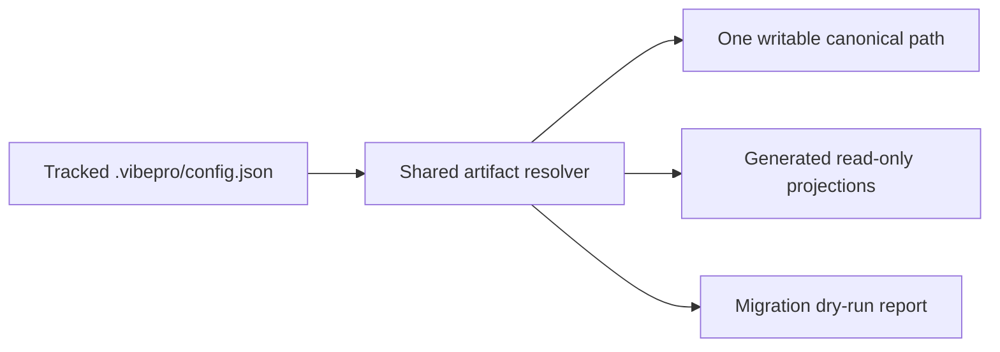
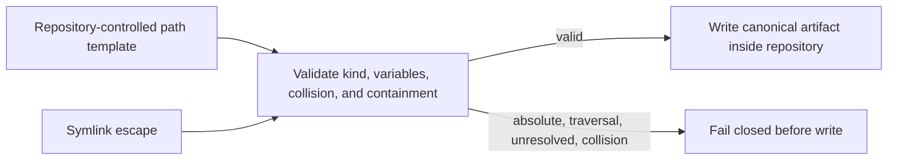

# Artifact output routing contract

## Requirements

- `artifact_routing.artifacts.<kind>.canonical` is the single writable canonical path template for that artifact kind.
- Omitting `artifact_routing` preserves every legacy default path.
- `{story_id}` and `{feature_slug}` are the only supported template variables and resolve deterministically.
- Absolute paths, repository traversal, unresolved variables, canonical collisions, and ambiguous projections fail before a write.
- Projections require an explicit `{ "path": "...", "generated": true }` declaration and never become a second editable canonical.
- Story discovery, Architecture and accepted Spec read/write, Task plan generation, and Graphify/review/Gate/PR story binding consume the shared resolver contract.
- Migration is dry-run only and reports source, destination, existence, collision, and required action without editing files.
- The CLI workflow transitions from configured to resolved to migration-planned without mutating repository files.
- `.vibepro/config.json` is trackable while generated `.vibepro` workspace artifacts remain ignored.

## Verification

- `node --test test/artifact-routing.test.js`
- `node --test --test-name-pattern='^artifacts resolve' test/vibepro-cli.test.js`
- `node --test test/architecture-readiness.test.js test/spec-pipeline.test.js test/playbook-exporter.test.js test/recipe-preflight.test.js`
- `node --test --test-concurrency=2`

## Diagrams

### Flow

### Threat model

