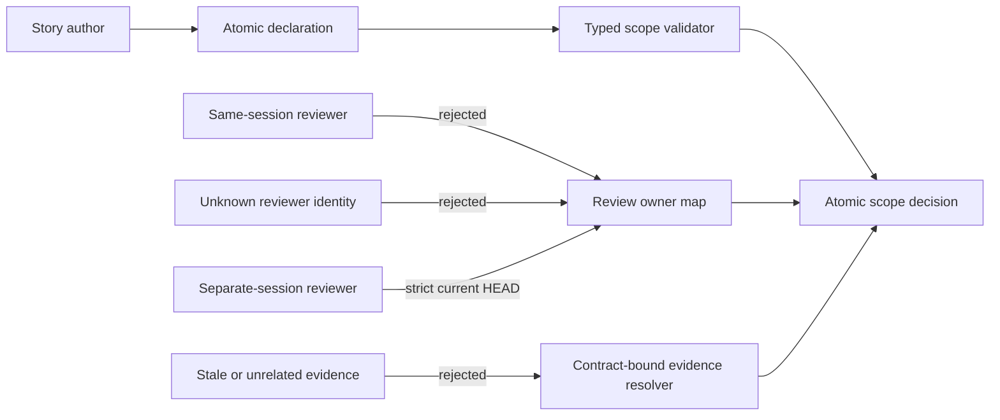

# Atomic Scope Review Contract Specification

## Contract

### ASR-CONTRACT-001: Typed declaration

`parseStoryDoc`は`pr_scope_strategy`、`pr_scope_reason`、`pr_scope_review_facets[]`、`pr_scope_dependency_boundaries[]`を読む。`atomic_single_pr`以外は`not_requested`。要求時はreasonが80文字以上であること、全generated laneがfacetに含まれること、`from->to`の型付き依存辺が既知laneだけからなり全laneを一つの連結グラフにすること、型付きunsafe scope signalがないことを必須とし、不足を`rejection_reasons[]`へ列挙する。自由文のlane名包含は依存境界の判定に使わない。

### ASR-CONTRACT-002: Current-head ownership

構文条件を満たしても、strict current-headへ束縛されたagent review planのrequired/checkpoint-required stage/roleがclose済みartifactとして揃い、各generated facetの全changed pathが少なくとも一つのpassing required roleのinspection surfaceに含まれるowner mapが検証されるまでは`atomic_scope.status = rejected`とする。optional roleは欠落しても拒否理由にせず、passingでも単独のfacet ownerには採用しない。stale HEAD、content-scopedだけのreview、別facetだけを見たreview、required roleのmissing、block verdictはacceptance evidenceにしない。

### ASR-CONTRACT-003: Cumulative validation

accept時も`automatic_recommendation`、`lanes[]`、`merge_order`を保持する。各lane planは`gate_mode = cumulative_atomic_head`、`isolated_checks = []`とし、`cumulative_checks`および`final_validation.commands`へ重複除去した全required verification commandを入れる。

### ASR-CONTRACT-004: Target-bound structured evidence

structured observationはsurface scenario/valueに加え、`targets[]`の和集合が当該rowの`changed_paths[]`を一件ずつすべて包含する場合だけcoverageを満たす。`.`、空target、別file、一部pathだけのtargetはcoverしない。同一surfaceに複数changed pathがある場合はrowへ全pathを保持する。

### ASR-CONTRACT-005: Human-readable decision

human reviewとsplit digestはaccepted reason、rejected reason、自動split案を区別して表示する。acceptedでもlaneを隠さず、reviewerが自動勧告との差を再構成できること。

### ASR-CONTRACT-006: One readiness source

`atomic_scope.status = accepted`のとき、同じprepare内の`gate:pr_scope_judgment`と`gate:split_resolution`をpassへ再調停し、Gate DAGの`summary.needs_evidence_count`、`overall_status`、execution gateを再計算する。自動split推奨が存在して`gate:split_resolution`が未生成の場合は、nodeと`pr_route_classification -> split_resolution -> pr_body_contract` edgeを補完する。split planが`single_pr_ok`である一方、同じscope理由のGate DAG nodeまたはsummary表示がPR作成をblockする状態を禁止する。

### ASR-CONTRACT-007: Inherited authority validation

`src/responsibility-authority.js`の既存fail-closed契約を変更しない。authority未指定、`primary_authority.ref`未指定、または未知の`primary_authority.kind`は引き続きinvalid registry entryとして扱い、本Storyのevidence候補選択変更によって暗黙に受理しない。

### ASR-CONTRACT-008: Contract-bound authority evidence preference

同じrequired evidenceへ複数のcurrent verification commandが一致する場合、resolverは対象responsibilityのcontract clause IDをhaystackに含むcommandを優先する。contract修飾済みcommandが存在するのに、先に並んだscenario語だけのcommandを採用してはならない。contract修飾済み候補がない場合は既存の最初の一致を維持し、authority registry自体のvalidationを緩和しない。

### ASR-CONTRACT-009: Lineage-aware multi-commit scope

baseから複数commitがある場合、commit件数だけではatomic override不能にしない。各commit messageから`story-*`および`STR-*`、`BFD-*`、`BUG-*`、`INC-*`参照を正規化して抽出し、現在のStory ID以外の明示的参照がある場合だけ`multiple_commits_foreign_story_lineage`を`unsafe_for_atomic_override = true`として生成する。別work item参照がなければ`multiple_commits_scope_contamination_risk`は残すがunsafeはfalseとし、strict current-head review owner mapによる明示的確認を要求する。

### ASR-CONTRACT-010: Verifiable reviewer independence

`review record --reviewer-identity separate_session`はrelation文字列や任意IDだけで受理しない。`--implementation-session-id`と`--agent-session-id`または`--agent-thread-id`の双方を必須とし、同一role・agent・agent systemの最新lifecycleがclosedで、そのidentityがrecordと一致し、かつimplementation IDと異なることを要求する。より新しいrunning lifecycleは古いclosed lifecycleを無効化する。timeout/manual shutdownからのrecovery command chainは、旧lifecycleの証跡付きclose、`replacement_for`付きreplacement start、同一replacement agent/thread/sessionのclose、transcript/close evidence付きrecordの順で実行可能にする。atomic owner mapは`lifecycle_agent_binding`付きprovenanceだけを独立reviewとして採用し、ID欠落、同一ID、lifecycle未束縛のCLI自己申告artifactをfail-closedにする。

### ASR-CONTRACT-011: Boundary-accurate failure modes

`atomic_single_pr`、`pr_scope_review_facets[]`、または`pr_scope_dependency_boundaries[]`が存在するStoryは、型付き宣言の欠落、不正なlane参照、切断グラフを拒否するschema/validation境界として扱う。そのrouteではcurrent-bound negative-path evidenceがない`schema_failure`を`not_required`へ落とさない。`auth_denied`はauthentication、authorization、permission、access control、security、credentialまたは明示risk surfaceがある場合だけ候補化し、review `role`やresponsibility authorityという語だけでは候補化しない。

### ASR-CONTRACT-012: Narrow risk-profile compatibility

change-risk classifierは`gate_orchestration`と`review_lifecycle`の両risk surfaceが同じchange setに存在するときだけ、その組合せを理由に`workflow_heavy`へ昇格する。`src/pr-manager.js`だけ、または`src/agent-review.js`だけの変更はこの複合条件を満たさず、他の独立したheavy条件がない限り従来profileを維持する。

### ASR-CONTRACT-013: Executed failure evidence only

failure-mode coverageはcurrent-boundかつpass statusの実行command、recorded structured observation、1件以上のtarget、scenario/value上のmode assertionを同時に要求する。mode IDをtargetやsummaryへ置いただけのkeyword evidence、fail statusのcommand、target未束縛のobservationは`covered`へ昇格しない。

### ASR-CONTRACT-014: Canonical registration is reviewable repo-control

混在repo-controlが`.vibepro/config.json`だけの場合、そのfileは生成artifactではなくStory登録のtracked control-plane sourceとしてcontent bindingとowner-map path coverageへ含め、typed atomic declarationによるreviewを許可する。`.github/*`、`.claude/*`、package/lockfile等の独立repo-controlが一つでも含まれる場合は`mixed_repo_control_surface.unsafe_for_atomic_override = true`を維持する。

### ASR-CONTRACT-015: Topology-bound versioned Story lineage

現在Story IDに`-vN`を付けた参照は、対象commitが2親以上を持ち、sourceが`origin/codex/<story-vN>`、targetが同じ`codex/<story-vN>`、かつsource remote-tracking refがmerge parentへ解決される場合だけcurrent Story lineageとして受理する。受理したlineageは`accepted_current_story_lineage[]`へ`reference`、full `commit_sha`、`parent_count`、`source_ref`、`target_ref`、`remote_tracking_sha`、`basis = merge_topology_canonical_ref_and_title`を保存し、scope reasonとsignalをbounded summary、human review、PR body、split plan、gate DAG、HTML reportへ伝播する。titleだけ、単一親、missing/mismatched refは`multiple_commits_foreign_story_lineage`かつ`unsafe_for_atomic_override = true`とする。

## Threat Model

主な脅威は自己承認、identity未確認reviewの昇格、stale/unrelated evidenceの誤束縛、自由文によるlane接続の偽装、governance語からauth境界を誤生成する分類ノイズである。typed declaration、`separate_session`、strict HEAD、contract-qualified evidence、境界固有のfailure-mode分類でfail-closedにする。

## Acceptance Scenarios

1. atomic review workflowでは、完全な宣言でもlifecycle-bound current-HEAD review owner mapがない限りscope stateは`rejected`かつ`split_recommended`に留まり、全changed pathのownershipが揃ったときだけ`accepted`へtransitionする。
2. 全required current-head reviewをcloseすると、optional reviewがmissingでも同じHEADの再prepareで`accepted`。optional reviewだけがpassingでもowner mapは成立しない。
3. E2Eを含むStoryではunit/typecheck/build/E2Eがfinal commandsに残る。
4. facet不足、短い理由、型付き依存辺の不正・切断、unsafe repo signal、stale reviewのいずれもfail-closed。
5. `docs/reference.md`をtargetにしたCLI surface evidenceは`src/cli.js`をcoverしない。
6. metadataなしStoryの既存split fixtureは従来結果を保つ。
7. accept後はscope judgmentとsplit resolutionがpassとなり、scope gateはunresolved listから消え、`summary.needs_evidence_count`はそのlist件数と一致する。
8. 同じscenario語を持つatomic replayが先に記録されていても、別responsibilityのrequired evidenceには対象contract IDを含むcommandが選ばれる。
9. 同一Storyを明示する複数commitはreview後にatomic scopeをacceptできる一方、別BUGを明示する複数commitはunsafeとしてacceptできない。
10. `separate_session`を任意session IDで自己申告したrecordは拒否され、closed lifecycle agentへ束縛されたreviewer IDと異なるimplementation IDを持つcurrent-head reviewだけがowner mapを満たす。
11. 型付きatomic scopeはevidenceなしで`schema_failure = missing_coverage`となり、review roleだけを含む同じStoryには`auth_denied`候補が生成されない。
12. gateとreview lifecycleの複合変更は`workflow_heavy`となるが、gate-onlyとreview-onlyの隣接負例は`workflow_heavy`にならない。
13. current Storyのversioned branchを実mergeしたcommitはlineage evidence付きで受理され、同じmerge風titleの単一親commitはunsafe foreign lineageになる。永続化したprepare、human review、PR body、split plan、HTML reportから受理理由を再構成できる。

## Verification

`npm run typecheck`で公開entrypointと全`src/*.js`の構文を検証する。`node --test test/verification-evidence-artifact-check.test.js`をunit、`node --test test/gate-outcome-ledger-promotion-integration.test.js`をintegrationとして実行する。`node --test test/vibepro-cli.test.js`でtyped declaration、schema/auth failure-mode分類、required-only owner evidence、cumulative command preservation、target-bound path surface、既存split behaviorを回帰する。`node --test test/risk-adaptive-gate.test.js`で複合surfaceのheavy昇格とgate-only/review-onlyの負例を回帰する。`node --test test/responsibility-authority.test.js test/agent-review-independence.test.js`でcontract-bound authority evidenceの優先とreview identity validationを回帰する。最終的に`node --test --test-force-exit --test-timeout=900000 test/e2e/story-vibepro-atomic-scope-review-contract-main.spec.ts`でrequired E2Eの全契約を公開CLI境界からreplayし、build surfaceは`npm run docs:build`で公開manual生成と整合性を確認する。
