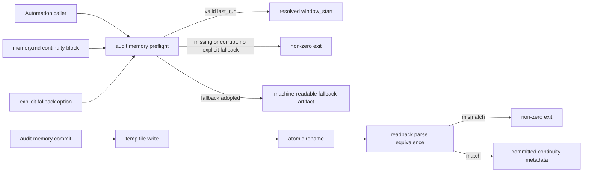

# Spec

## Clauses

### S-001 Valid memory preflight

Audit memory preflight must return a ready result for a valid memory
continuity block and must not write fallback adoption when the memory is
usable.

- Story source: AMG-S-1
- Architecture source: `docs/architecture/vibepro-audit-automation-memory-guard.md`
- Code refs: `src/session-efficiency-audit.js#preflightAuditAutomationMemory`
- Test refs: `test/session-efficiency-audit.test.js`

### S-002 Explicit fallback only

Audit memory preflight must block missing or corrupt memory unless an
explicit fallback window is supplied, and fallback adoption must be
machine-readable.

- Story source: AMG-S-2
- Architecture source: `docs/architecture/vibepro-audit-automation-memory-guard.md`
- Code refs: `src/session-efficiency-audit.js#buildAuditMemoryFallbackPreflight`, `src/cli.js#audit-memory-preflight`
- Test refs: `test/session-efficiency-audit.test.js`

### INV-001 Commit readback equivalence

Audit memory commit must atomically replace only the continuity block,
preserve free-form memory content, and verify parse-equivalent readback
before reporting success.

- Story source: AMG-S-3, AMG-S-4, AMG-S-5
- Architecture source: `docs/architecture/vibepro-audit-automation-memory-guard.md`
- Code refs: `src/session-efficiency-audit.js#commitAuditAutomationMemory`, `src/session-efficiency-audit.js#replaceAuditMemoryBlock`
- Test refs: `test/session-efficiency-audit.test.js`

### INV-002 Additive existing behavior

The new audit memory commands must be additive and must not change existing
`audit session-cost --automation-memory` parsing behavior.

- Story source: AMG-S-6
- Architecture source: `docs/architecture/vibepro-audit-automation-memory-guard.md`
- Code refs: `src/session-efficiency-audit.js#resolveAutomationMemoryWindow`, `src/cli.js#commitAuditAutomationMemory`
- Test refs: `test/session-efficiency-audit.test.js`

### SCN-001 Valid memory resolves without fallback

Given an automation memory file contains a parseable VibePro continuity block
When `vibepro audit memory preflight` is run without an explicit fallback
Then the command exits successfully with `status=ready`, returns `last_run`, and leaves fallback adoption empty.

- Story source: Scenario `valid memory resolves the automation window`
- Code refs: `src/session-efficiency-audit.js#preflightAuditAutomationMemory`
- Test refs: `test/session-efficiency-audit.test.js`

### SCN-002 Missing or corrupt memory blocks unless fallback is explicit

Given the automation memory file is missing or contains an unparsable continuity block
When `vibepro audit memory preflight` is run without fallback options
Then the command exits non-zero and does not mutate the memory file.

- Story source: Scenario `missing or corrupt memory cannot silently continue`
- Code refs: `src/session-efficiency-audit.js#preflightAuditAutomationMemory`, `src/cli.js#audit-memory-preflight`
- Test refs: `test/session-efficiency-audit.test.js`

### SCN-003 Explicit fallback is auditable

Given the automation memory file is missing or corrupt
When `vibepro audit memory preflight` is run with `--fallback-last-run` or `--fallback-hours`
Then the command exits successfully with `status=fallback` and machine-readable fallback adoption metadata.

- Story source: Scenario `explicit fallback is auditable`
- Code refs: `src/session-efficiency-audit.js#buildAuditMemoryFallbackPreflight`
- Test refs: `test/session-efficiency-audit.test.js`

### SCN-004 Commit readback protects continuity

Given an automation memory file already contains free-form notes
When `vibepro audit memory commit` writes continuity values
Then free-form notes are preserved, only the continuity block is replaced, and success requires parsed readback equivalence.

- Story source: Scenario `commit preserves memory and proves readback equivalence`
- Code refs: `src/session-efficiency-audit.js#commitAuditAutomationMemory`, `src/session-efficiency-audit.js#replaceAuditMemoryBlock`
- Test refs: `test/session-efficiency-audit.test.js`

### SCN-005 Session meta entries are attribution context

Given session-cost audit input contains `session_meta` entries
When session efficiency audit aggregation runs
Then `session_meta` entries inform attribution only and do not change explicit session selection behavior.

- Story source: Scenario `session meta entries remain attributed without changing audit selection`
- Code refs: `src/session-efficiency-audit.js#collectSessionEfficiencyAudit`
- Test refs: `test/session-efficiency-audit.test.js`

## Diagrams

### threat_model

The trust boundary is the memory file path supplied by the caller. The guard
does not trust missing, corrupt, or unparsable memory; it either blocks or
records the explicitly supplied fallback source. Commit success is trusted
only after readback parsing matches the requested continuity values.

## Verification

- `npm run typecheck`
- `node --test test/session-efficiency-audit.test.js test/engineering-judgment-activation-precision.test.js`
- `npm test`
