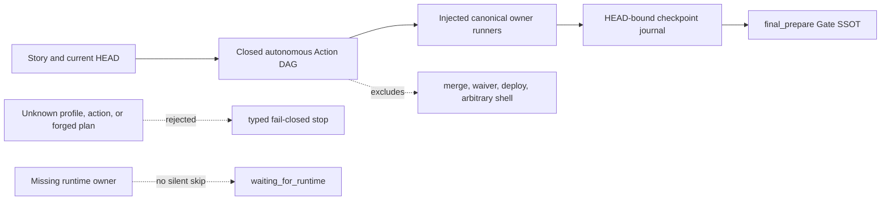

# Autonomous Action DAG Spec

## Threat model

## S-001 Closed profiles

Action profileは`legacy`または`autonomous`のみ。`legacy`は既存2 node、`autonomous`は`diagnose`、`prepare_artifacts`、`implement`、`verify`、`review`、`repair`、`final_prepare`の順序と直接依存を持つ。autonomous Action objectはprofile、node、input HEAD、idempotency keyを含む。legacy Actionは既存shapeをbyte-compatibleに保ち、profile欠落をlegacyとして扱う。

CLIは`execute run --action-profile legacy|autonomous`を公開し、`execute run|resume --disable-autonomous-actions`をfeature-disable境界とする。`--action-profile`のrun以外での利用、disable指定のrun/resume以外での利用、未知profileは型付きエラーでfail closedにする。既存autonomous Runのdisableは`resume --until pr-ready`でAction実行前に適用する。

## S-002 Composition runners

Guarded Run dependencyはcanonical autonomous node名だけを受け付ける閉じたrunner mapを持つ。既存`preparePullRequest`と`safeAutopilotPullRequest`はlegacy runnerのまま維持する。runnerはowner結果のartifact参照をjournalへ受け渡し、欠落時は実行を飛ばさず型付き停止にする。production owner adapterの具体配線は`story-vibepro-production-runtime-connectors`で行う。

## S-003 Resume and HEAD binding

完了checkpointはrun id、profile、action id、input HEADから生成したkeyで照合する。同一HEAD再開では再実行せず、mutationでHEADが変われば後続iterationは新keyで評価する。異なるprofileのjournalは完了根拠に使わない。

## S-004 Result contract

runner結果は`continue`、`pr_ready`、`waiting_for_human`、`waiting_for_runtime`、`blocked`、`failed`だけを受け付ける。artifact参照、summary、output HEADをjournalへ保存する。最終`pr_ready`は`final_prepare` runnerがcurrent HEADのGate SSOTを確認した場合だけ返せる。

## S-005 Safety and compatibility

任意shell、merge、waiver、deploy、未知Actionはcanonical planに入らない。既存Runとprofile未指定呼出しはlegacy挙動を保つ。autonomous profileの無効化は新規・既存Runの双方をlegacyへ明示fallbackし、requested profile、effective profile、typed fallback reasonを永続stateとsummaryへ残してsilent downgradeを行わない。
