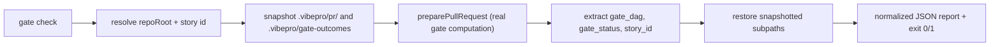
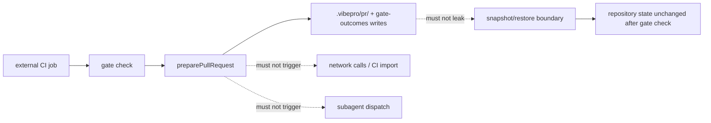

# Spec

## Public Contract

`vibepro gate check` is a new, read-only PR-readiness subcommand. It consumes
the same Gate DAG computation as `pr prepare` but does not change the public
semantics of `pr prepare`, `checkpoint`, or self-dogfood CI.

```text
vibepro gate check <repo> [--story-id <id>] [--base <ref>] [--head <ref>] [--ci] [--json]
```

The command reports `schema_version`, `story_id`, `overall_status`,
`ready_for_pr_create`, a `gates` array, unresolved/critical counts, and
`generated_at`. It never writes to `.vibepro/`.

## Diagrams

### flow



### threat_model



## Contracts

### CGC-CONTRACT-001: Gate check delegates to the real gate computation

`vibepro gate check` MUST evaluate gate readiness by calling the same
`preparePullRequest` computation that `pr prepare` uses. It MUST NOT
reimplement gate resolution, route classification, or scoring logic.

### CGC-CONTRACT-002: Read-only net effect

Running `gate check` MUST NOT change the observable content of
`.vibepro/pr/<story-id>/` or `.vibepro/gate-outcomes/`. If either path did not
exist before the run, it MUST NOT exist after the run. If either path existed
before the run, its file contents MUST be byte-identical after the run.

### CGC-CONTRACT-003: Exit-code contract

`gate check` MUST exit `0` when `ready_for_pr_create` is `true` (no unresolved
required gates). It MUST exit non-zero when required gates remain unresolved
or when the run cannot complete (for example, an unresolvable story id).

### CGC-CONTRACT-004: Normalized JSON report shape

With `--json`, the report MUST include `schema_version`, `story_id`,
`overall_status`, `ready_for_pr_create`, a `gates` array of
`{ id, status, blocking, reason }` entries, `unresolved_gate_count`,
`critical_unresolved_gate_count`, and `generated_at`.

### CGC-CONTRACT-005: Clean error on unresolved story id

If `--story-id` does not resolve to a known story, `gate check` MUST report a
clear, non-crashing error to stderr (or as an `error` field in `--json`
output) and MUST exit non-zero. It MUST NOT emit an uncaught stack trace.

### CGC-CONTRACT-006: No network calls or subagent dispatch

`gate check` MUST NOT perform network calls, import CI evidence, or dispatch
agent review subagents as part of evaluating gate readiness.

## Scenarios

- `CGC-S-1`: Given a story with all required gates satisfied, when
  `gate check --ci --json` runs, then it exits 0 and reports
  `ready_for_pr_create: true` with `unresolved_gate_count: 0`.
- `CGC-S-2`: Given a story with unresolved required gates, when `gate check`
  runs, then it exits 1 and reports the unresolved gate ids and reasons.
- `CGC-S-3`: Given `--json`, when `gate check` runs, then the report includes
  all fields required by CGC-CONTRACT-004.
- `CGC-S-4`: Given `.vibepro/pr/<story-id>/` does not exist before the run,
  when `gate check` runs, then it still does not exist afterward. Given it
  exists with content before the run, its contents are unchanged afterward.
- `CGC-S-5`: Given a `--story-id` that does not resolve to a known story, when
  `gate check` runs, then it reports a clean error and a non-zero exit code
  instead of a stack trace.
- `CGC-S-6`: Given no `--story-id` is passed, when `gate check` runs, then it
  resolves the default story the same way `checkpoint` does.

## Verification

- `test/vibepro-gate-check.test.js` covers the pass path (exit 0), the blocked
  path (exit 1), the `--json` shape, the read-only guarantee for both an
  absent and a pre-existing `.vibepro/pr/<story-id>/`, the default-story
  resolution path, and the clean error path for an unresolvable story id.
- `npm run typecheck` and the full `npm test` suite must pass with no new
  failures introduced by this change.
