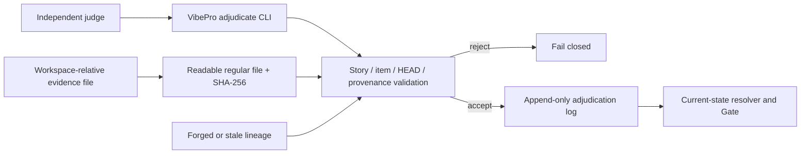

# Classifier Premise Recovery Spec

機械可読の正本は `docs/specs/story-vibepro-classifier-premise-recovery.vibepro.json` と
`vibepro spec write --final` が登録するSpec artifactである。この文書はレビュー用の要約。

## 契約

- 新規 `judged_unsound` は `implementation_unsound` / `classifier_premise_unsound` の原因を必須にする。
- legacyの原因なしunsoundは `implementation_unsound` へ正規化する。
- 元裁定、premise correction、再裁定を同じstory・item・HEADに紐づくappend-only eventとして残す。
- correctionは誤前提、訂正後前提、理由、workspace相対の代替証拠とSHA-256を保持する。symlinkと
  `realpath` 後にworkspace外となるpathは受理しない。
- verdict/correctionの `agent_system` は `codex|claude_code` だけを永続化前に受理する。
- correction後は元judgeとは異なるfresh judgeの紐づく再裁定が必要で、`judged_sound` は自動解決し、`needs_human_judgment` は既存のaccepted decision経路を使う。
- resolverはevent配列順ではなく明示参照を使い、不正な系譜はfail closedにする。
- `implementation_unsound`、既存のhuman judgment経路、critical gate性は従来どおり維持する。

## 検証

- Unit: `test/judgment-adjudication.test.js` の `CPR-S-001`〜`CPR-S-009`
- CLI E2E: `test/e2e/story-vibepro-classifier-premise-recovery-main.spec.ts` の `CPR-E2E-001`
- 互換回帰: 既存 `JADJ-S-*` / `JDA-E2E-*`

## Threat Model

