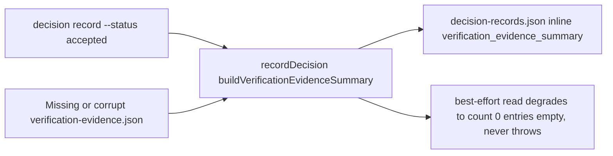

# Design Diagrams

### threat_model

- Trust boundary: `verification-evidence.json` is read read-only and best-effort;
  a missing or corrupt file degrades to an empty summary instead of failing the
  decision record command.
- Spoofing risk: the summary only reflects what `verify record` already wrote
  for the same story id; it does not accept externally-supplied evidence text.
- Tampering risk: non-accepted decisions (`open`/`rejected`/`superseded`) are
  unaffected and get `verification_evidence_summary: null`.
