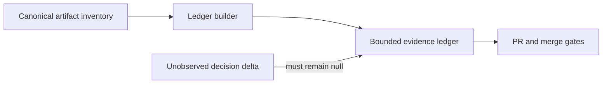

# Evidence decision ledger spec

## EDL-001

Given canonical evidence entries, when the ledger is built, then every entry exposes `decision_id`, `consumer_gate`, and `decision_changed`.

## EDL-002

Given no observed decision delta, when the ledger is summarized, then the delta is counted as unconfirmed rather than unchanged or unused.

## EDL-003

Given legacy consumers, when fields are added, then existing `consumer`, `decision_supported`, and `decision_bound_count` remain unchanged.

## EDL-004

Given optional session evidence, when the ledger is built, then the `sessions.length > 0` branch preserves the existing replay summary without changing canonical artifact decision-use totals, and an empty session set remains valid.

```yaml
inherited_behavior:
  condition: "sessions.length > 0"
  classification: unchanged
  files:
    - src/evidence-reuse.js
```

## Diagrams

### threat_model


