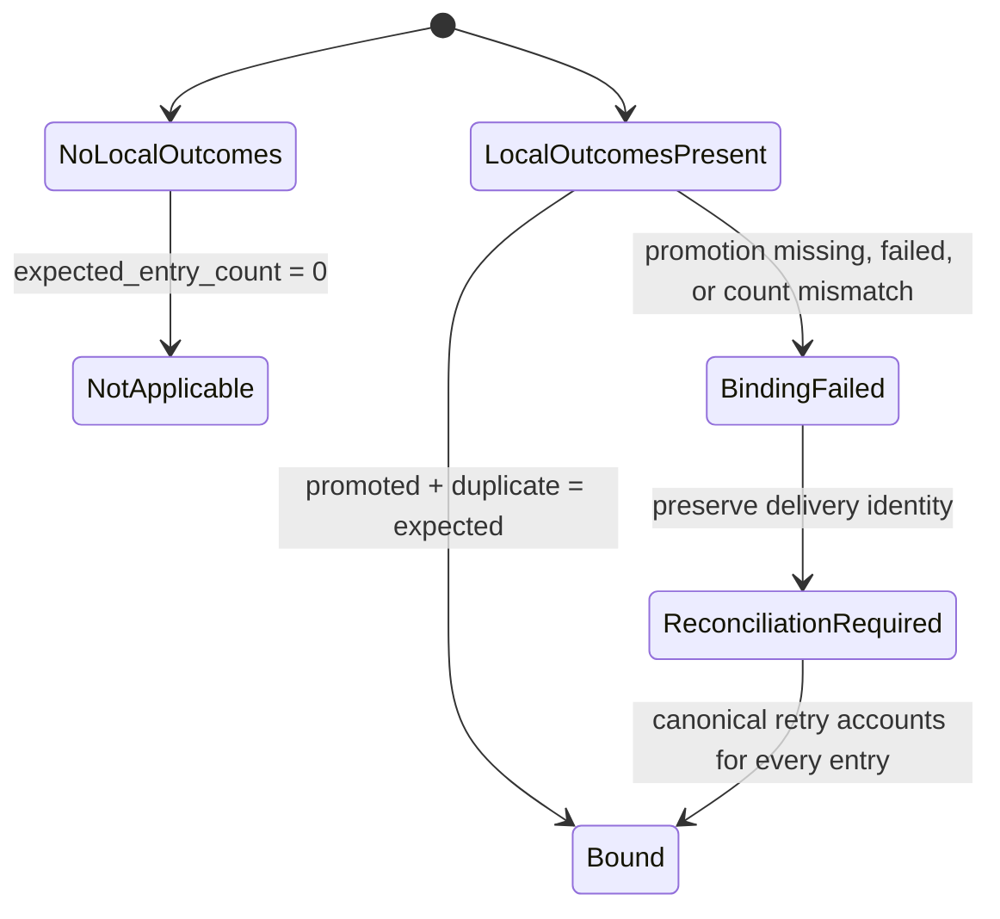
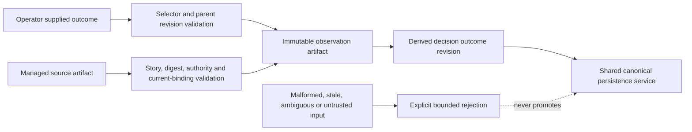

# Gate Decision Outcome Ledger Spec

## Diagrams

### state

### threat_model

Trust boundary: operator input is untrusted until story ID containment, selector, parent revision, producer, managed source path, source digest, story binding and current authority all validate. Refresh repeats selector/parent and managed source bytes/digest/current-authority validation before promotion. Public `--id`、every exported outcome manager entrypoint、およびexported decision-ledger path/read/write helper must require `^story-[a-z0-9][a-z0-9._-]*$` with no `..`, slash, backslash, percent, or encoded variant before any managed-worktree/ledger/observation path lookup or write. Canonical promotion accepts only the derived revision prepared under allowed canonical roots; malformed or ambiguous inputs fail before persistence. Nested canonical shapesもstatus別にfail-closedとし、observed claimは非null valueとprovenance、merged deliveryはPR identityとmerge SHA、observed outcomeは非null value、not_applicableは具体的reason、not_observedは具体的missing_reasonを必須とする。Observation ID and the local manifest provide integrity, not same-user cryptographic authenticity: coordinated modification of observation, manifest and managed source by the same OS user is out of scope without an external signing key or remote attestation. The contract therefore rejects unregistered or inconsistently modified JSON and stale/untrusted source authority, but does not claim to prove that bytes were emitted only by the CLI.

Upgrade compatibility: multiplicityを含む旧`trace_source_ref`と、それを含む旧`parent_revision_fingerprint`で記録済みのobservationは、決定的read aliasを通して現行traceへ解決する。新規summary/recordはmultiplicity非依存の現行selectorだけを生成する。`observation_read_aliases`自体がまだ保存されていないpre-fix ledgerでは、stable-IDとcollision selectorの双方について、保存済みsource identityとdetector metadataから現行selectorが完全一致すると再計算できる場合に限り旧selector/parent pairを復元する。collision groupだけの弱い一致は許可しない。保存済みaliasはselectorの排他的shapeとID/digest形式を厳密に検証し、malformed entryを黙って除外しない。旧値が存在する場合にsilentな`not_observed`へ縮退しないことをalias fieldを持たないpre-fix/upgrade fixtureで検証する。bug-physics分類はdecision-ledger固有句を除外しつつ、実runtimeの日本語「データ競合」「状態を観測できない」をtiming/observabilityとして保持する正負matrixを必須とする。split planは`design-ssot.json`をrequirements SSOT laneに置く。

Normative compatibility correction for GDL-S-9: the strict `^story-` rule above applies to public `--id` and exported outcome-manager entrypoints. Lower-level exported decision-ledger path/read/write helpers retain the repository-wide path-safe opaque tracker-ID contract, accepting `^[A-Za-z0-9][A-Za-z0-9._-]*$` for IDs such as `STR-047` and `US-002` while rejecting `..`, slash, backslash, percent, and encoded separators before path composition. This lower-level compatibility does not relax the public outcome-manager boundary.

## Contracts

### GDL-CONTRACT-001: Stable identity

source非依存の`correlation_key = story_id + normalized_subject_key`がstory内で一意なtraceはtimestamp、配列順、run ID、source kindに依存しない`decision_trace_id`を生成する。keyがないtraceは推測IDを生成せず、`decision_trace_id: null`、`collision_group = "cg_" + sha256(canonical JSON of {story_id, reason: "stable_source_key_missing", source_kind, source_ref, native_id})`、`trace_status: incomplete`、`missing_reason: stable_source_key_missing`を返す。同じnormalized subjectが複数role/stage/source instanceへ現れ、同一実体を証明する明示linkがない入力は個別に保持し、全件を`decision_trace_id: null`、`collision_group = "cg_" + sha256(canonical JSON of {story_id, reason: "ambiguous_subject_instance", normalized_subject_key})`、`missing_reason: ambiguous_subject_instance`とする。source ref/native IDがnullでもcanonical JSONにnullを含め、時刻と配列indexをbasisにしないため、全null-ID traceのcollision groupは再読込で不変となる。各入力は`trace_source_ref = "tsr_" + sha256(canonical JSON of {story_id, normalized_subject_key, source_kind, source_ref, native_id, role, stage, source_instance_digest})`を持つ。source instance digestは生成/記録時刻と配列indexを除いて計算し、reorder・canonical再読込で不変、role/stage違いで異なる。null IDは`collision_group + trace_source_ref`を含むrevision fingerprintでcanonical保存し、ID dedupeで消失させない。

### GDL-CONTRACT-002: Provenance and conflicts

Canonical validationはobserved claimの各provenance entryに非空のsource kind/refと64桁source digestを必須とし、malformed provenanceを正本へ昇格しない。

finding、gate、detector、disposition、behavior、deliveryの各非null主張はsource kind/refへ辿れる。review `findings[].id`/`finding_dispositions[].finding_id`は`finding:`、decision `source`は明示`finding:`/`gate:` prefix、verificationは`commands[].observation.values.decision_trace_key`の明示prefixへ正規化する。review finding/dispositionは`provenance_status: verified_agent`と非null artifact refの両方を必須とし、欠く場合は`claim_authority_invalid`/`claim_provenance_missing`を残して当該provenanceのclaimと派生detectorを`not_observed`にする。authority採否はlinked trace全体ではなくclaim provenance単位で行い、同じsubjectに無効claimが混在しても独立authority-valid claimとそのeligible outcome sourceを抑止しない。gate outcomeの各refは`decision_id`をmanaged decision-records artifactへ再解決し、story一致、現行schemaで到達可能な`type: waiver`、`status: accepted`、source一致、ref/decisionのartifact一致をすべて満たす場合だけauthority-validとする。refにdigest fieldは要求せず、managed artifact bytesのSHA-256を読取時に計算してprovenanceへ付与する。valid refの明示prefixを持つdistinct sourceが1件のときだけ採用し、同一sourceの複数refは1候補へ縮約する。open/superseded/rejected/missing decision、source/artifact不一致はsource error、valid sourceが複数なら`ambiguous_join`とし、valid accepted refがなければ`gate:<gate_id>`のgate-only traceを許容する。同じ文字列でもnamespaceが違えば結合せず、曖昧な候補を推測結合しない。同じ一意keyを持つauthority-valid sourceが矛盾する場合は両refを保持し`conflicting`とする。

### GDL-CONTRACT-003: Behavior delta

`behavior_delta`はmanaged `verification-evidence.json`の`commands[]`を走査する。`content_binding.mode=strict_head`はrecorded/current HEAD一致、`content_surface`は`evaluateContentBinding`相当のsurface current判定を正本とし、docs-only HEAD差だけでは除外しない。`command.observation.values.decision_trace_key`は有効な`finding:`/`gate:` prefixを持つ非null keyだけを同じ非null trace keyへ結合し、欠損・invalid keyをnull-ID traceへ結合しない。同じcommand entryの`behavior_before`、`behavior_after`と`command.observation.targets[]`からのみ明示値を採用する。旧トップレベル`observed.*`は採用しない。`before`、`after`、`change_refs[]`、`verification_refs[]`、`status: observed|partial|not_observed|conflicting`、`missing_reason`を独立保持し、changed fileまたは`source_fix`分類だけからbefore/afterを推定しない。canonical validationでは`observed`に非null before/afterとnull missing_reason、`partial|not_observed`にnull before/afterと具体的missing_reason、`conflicting`にnull before/after、`behavior_delta_conflict`、2件以上の具体的conflictsを必須とする。同一traceにauthority-validな複数の明示behavior deltaがあり値が矛盾する場合は、sourceを捨てず`conflicting`と`behavior_delta_conflict`を保持する。不一致entryは除外理由を残す。

### GDL-CONTRACT-004: Delivery binding

current-head ledgerは`evidence_head_sha`を必須とし、同一story/PRに紐づくPR番号・URL・状態、base branch、merge SHA・状態・merged_atだけを接続する。immutable identityであるPR番号・URL・merge SHAの不一致は`conflicting`とし、PR URLから復元した番号と明示番号も相互検証する。legacy ledgerから補完できるのはcurrent authorityと矛盾しないimmutable identityだけである。PR状態・merge状態・merged_atはcurrent authorityだけから更新し、省略時は旧値を継承せず`null`/`unknown`とする。canonical persistenceのbase branchは検証済みlive PR authorityからのみ導出し、operator指定baseは同値確認にだけ使う。不一致またはauthority側base欠損は永続化前にfail-closedとし、local ledgerを変更しない。

### GDL-CONTRACT-005: Observation authority

downstream outcomeは`vibepro outcome record`またはcanonical provenanceが、完全schema・canonical observation ID・source digest・story・trace selector・authorityを検証したartifactだけを採用する。trace selectorは`{ decision_trace_id }`または`{ collision_group, trace_source_ref }`の排他的one-ofで、parent revision内の厳密に1件へ解決する。verification source authorityはmanaged path、artifactのschema/story、選択した`commands[]` entryのgit/content bindingとobservationを検証し、source artifactのproducer fieldは要求しない。一方、生成するobservation artifactの`producer`はoperator必須入力であり、VibeProが付与するauthorityとは分離する。artifactは`schema_version: 0.1.0`、有効timestamp、bounded producer、安全なrelative source ref、`authority.kind: verification_evidence|decision_record`、64桁SHA-256 source digest、`recorded_by: vibepro`を必須とし、pure resolverとmanifest ingestionが同じvalidatorを使う。artifactは`parent_revision_fingerprint`へ束縛し、`observed`は非null value/null reason、`not_applicable`はnull value/非空reasonを必須とする。outcome statusは`observed|not_observed|not_applicable`に固定する。artifact不在は`not_observed`、`missing_reason: observation_missing`、source errorなし。managed manifestはfile→entryとentry→fileの双方向で照合し、全entryのsafe basename、observation ID、artifact name、digestの一意性と実在を必須とする。登録済みartifactの欠損・unreadable・digest不一致を空配列へ縮退させず`observation_malformed`として拒否する。その他malformedは`observation_malformed`、authority/digest不一致は`observation_untrusted`、story/selector/parent不一致は`observation_binding_mismatch`を`missing_reason`と`source_errors[].code`の両方へ返す。`source_ref`は安全に読める場合だけ保持し、それ以外はnullとする。

### GDL-CONTRACT-006: Bounded summary

summaryは各traceの`finding → decision → behavior_delta → delivery → downstream_outcome`のstatus、stable ID、`collision_group`、`trace_source_ref`、parent revision、path、digestを返し、full artifact本文を埋め込まない。共通projectorは最大20件を`conflicting → incomplete → partial → complete`、次にstable ID（nullは`collision_group + trace_source_ref`）昇順で選び、`total_count`、`returned_count`、`omitted_count`、`truncated`とfull ledger path/digestを返す。review、pr-prepare、usage-reportの3 surfaceは同じselector fieldを必ず露出し、CLI成功JSONも同じresolved selectorを返す。evidence reuseがstaleでもHEAD一致のdecision summaryはreview requestに残し、HEAD不一致時だけ抑止する。artifact budgetのbounded siblingはledger path/digest、evidence HEAD、status counts、最大5 selectorを保持し、full ledgerを生成物inventoryへ登録する。complete、partial、incomplete、conflictingを別集計する。各traceはeligible outcome sourceを最大5件、`kind/ref/digest`順で返し、同じcount/omission metadataを持つ。

### GDL-CONTRACT-007: Compatibility and failure

既存artifact value ledger、gate outcome ledger、decision records、canonical decision index、usage reportの既存fieldを削除・改名しない。legacy、missing、malformed、unreadableをentry消失や空の成功へ変換しない。authoritative local ledgerはsame-directory fsync済みtempからatomic renameし、base write、refresh一時露出/復元/最終確定、delivery bindingのreplacement失敗で旧bytesを保持する。PR作成またはmergeの外部side effect成功後にderived delivery bindingが失敗しても既存lifecycleを失敗へ変換せず、binding statusを`unavailable`、安全なbounded codeと固定message/recoveryをPR/merge artifactへ保存する。parser本文、入力断片、credential-like値、stackを保存しない。derived PR/merge接続でledger自体が存在しない場合は`decision_outcome_delivery.status = not_available`、接続成功時は同fieldを`bound`とする。これとは別に、repo-local gate outcome entryが0件の場合は`decision_outcome_binding.status = not_applicable`とし、両statusを相互変換しない。

### GDL-CONTRACT-008: Canonical revision persistence

`worktree add`の成功flagだけをownership境界にしない。通常nonzero、timeout、indeterminateの全失敗後にrepository worktree registryを有限deadlineでprobeし、登録済みまたはprobe不能なら部分取得として独立cleanup deadlineへ進む。未登録を確認できた場合だけ`not_acquired`とする。

観測を除く`parent_revision_fingerprint`と観測採用後の`revision_fingerprint`を分離する。同一`decision_trace_id + revision_fingerprint`（null IDは`trace_source_ref + revision_fingerprint`）はdedupeし、head・delivery・observation identityが変われば新revisionとして保存する。revision payloadは当該traceから導出される不変情報だけを持ち、別traceの追加・削除で変わるledger-wide digestを含めない。既存targetと生成bytesが完全一致する場合だけdedupeし、同一fingerprintに異なるbytesが存在する場合は上書きせず`decision_outcome_revision_conflict`で拒否する。旧revisionのうち余分な`ledger_digest`だけが相違する既存bytesは互換読取として保持し、書き換えない。canonical生成とbase永続化を分離する。revision writerは`decision_trace_id = dt_<64 hex>`、null-ID用`collision_group = cg_<64 hex>`、`trace_source_ref = tsr_<64 hex>`、`revision_fingerprint = <64 hex>`を必須形式として検証し、全targetをcanonical revision root配下へ解決・containment確認してから最初の書込を行う。不正値は`decision_outcome_revision_invalid`とfieldを返し、directory/fileを部分生成しない。共有persistence serviceは`prepare(baseWorktree)`から`{ files: Map<repo-relative-path, bytes>, metadata }`を受け、許可済みcanonical rootだけへ全fileを書込・stageし、1 commit・1 pushで原子的に永続化する。domain builderがcanonical bundle、central ledger、decision outcome revisionの内容を所有し、serviceは内容を解釈しない。戻り値は共通summaryとdomain metadata（既存caller向け`roi_ledger_promotion`を含む）を返す。全外部commandは非対話環境、段階別deadline、所有process group、`SIGTERM`→`SIGKILL`、bounded/redacted diagnostic、`close`上限を持つmanaged executorを通す。注入runnerにも外側deadlineを適用する。worktree部分取得もcleanup対象とし、cleanupはprimary failureから独立したdeadlineで実行してprimary結果を保持する。push timeoutはremote postconditionを`applied|not_applied|indeterminate`で照合する。prepare/write/stage/commit/push失敗はpartial successにせずcleanupを試行し、canonical bundleとROI ledgerのsame-commit保証を維持する。merge-manager/outcome-managerは同serviceを呼ぶだけとし二重writerを作らない。merge後は`vibepro outcome refresh`だけがcanonical identity確認後に新revisionをpromoteする。

### GDL-CONTRACT-009: Outcome operator CLI

live authorityはconfigured `remote.origin.url`のhostと`owner/repo`をPR URLへ厳密に束縛する。GitHub.com/GitHub EnterpriseのHTTPS・SSH・scp形式を受理し、local path、解析不能remote、host不一致、repository不一致は同一性未証明としてobservation変更前にfail-closedとする。

`outcome record`はstory、一意trace IDまたはnull-ID traceの`collision_group + trace_source_ref`、parent revision、status、必須producer、任意のmanaged sourceとstatus別のvalue/reasonを受ける。selectorは排他的one-ofで、完全一致する一意なledger entryへ解決された場合だけauthority-valid sourceを記録する。source省略時はeligible候補が厳密に1件なら自動解決する。0件は`outcome_source_missing`とcurrent trace-specific verification evidenceまたはaccepted waiverの記録後に`pr prepare`/reportを再実行する復旧手順を返し、複数件は`outcome_source_not_unique`と最大5件の`kind/ref/digest`候補・件数・明示`--source`選択手順を返す。成功JSONはartifact path/digest、解決済みselector、parent revision、producer、resolved sourceを返す。selector 0/複数、source候補0/複数、producer欠損、stale、未merge、untrusted、入力不備は非zeroのbounded JSONを返し、既存artifactを変更しない。record/refreshはlocal merge artifactだけを権威にせず、GitHub live PRの`state=MERGED`、URL、headRefOid、baseRefName、mergeCommit OIDがcreation/merge artifactと一致し、そのmerge commitがcanonical base上にある場合だけ許可する。live GitHub/git authorityと注入runnerは段階別の有限deadlineでfail-closedになり、timeout時は`outcome_authority_timeout`、段階、固定recoveryだけを返してmanaged observation stateを変更しない。merge/squash/rebaseはwhole-tree equalityではなくauthoritative merge commit identityで扱う。`outcome refresh`は同じmerge/canonical identityを検証し、共有canonical persistence service経由で`promoted|already_present`を返す。promotion失敗は公開CLI processでexit 1となる。既定textと`--json`はraw stdout/stderr、command、args、envを再帰的に除外し、primary failure reason/stage/status、push postcondition、cleanup、temporary worktree residual、operator recoveryを返す。`outcome`、`outcome record`、`outcome refresh`のhelpはcommand scope外の長いglobal helpを表示しない。parser/既存command非衝突も回帰契約とする。

### GDO-CONTRACT-001: Recorded outcome delivery binding

`decision_outcome_delivery`はderived decision-outcome read modelを配送identityへ接続するbest-effort処理であり、外部merge成功後の失敗を既存lifecycleへ逆伝播しない。一方、repo-local `.vibepro/gate-outcomes/ledger.json`に実在する判断結果は、共有canonical persistenceの同じcommitでcentral ledgerとcanonical auditへ結合する。後者を`decision_outcome_binding`として独立させ、local entryが1件以上なら`promoted_count + duplicate_count === expected_entry_count`、promotion statusが`promoted`、かつcanonical persistenceのpostconditionが`pushed|already_present`で確定したときだけ`bound`とする。prepare時のpromotion計算だけでは永続化済みと扱わない。promotion未実行、永続化失敗、件数不一致は`failed`とし、immutableな`delivery.status`、PR URL、merge SHAを維持したまま`reconciliation.status: reconciliation_required`、reason/stop reason `decision_outcome_binding_failed`を記録する。local entryが0件なら`not_applicable`とし、架空の欠落を作らない。compact bundle、compressed replay、decision index、automation value auditは同じbounded binding summaryを投影し、canonical正本から復旧対象を再構成できるようにする。

## Release and Operator Contract

Release note: this story adds `outcome record`, `outcome refresh`, compact decision-outcome projections, and strict canonical binding. Existing ledgers remain readable and require no migration or historical rewrite.

Operator action: no release-time action is mandatory. Only an operator who later needs to attach an observation uses the bounded selector and current parent revision to record an authority-valid observation, then refreshes canonical persistence. A zero/multiple candidate, stale authority, unmerged delivery, timeout, or untrusted source must return a bounded recovery and non-zero exit without mutating existing observation state.

Observability evidence: the owner-visible signals are the repo-local gate decision ledger, bounded command JSON, canonical revision, `decision_outcome_binding.status/reason/counts`, and process exit code. Support must distinguish `bound`, `not_applicable`, and `reconciliation_required`; raw command output and credentials are never observability payloads.

Rollback instruction and owner: the VibePro maintainer stops the new operator commands and reverts the feature commit while preserving existing ledgers and immutable delivery identity. A partially promoted revision remains `reconciliation_required` for explicit retry or investigation; rollback never deletes or rewrites historical ledger revisions.

State transition contract: `not_observed -> observed|not_applicable` is allowed only after current authority validation and a successful record. Local canonical binding transitions from `pending` to `bound|not_applicable|reconciliation_required`; refresh, promotion, or postcondition failures remain `reconciliation_required` and never infer success.

## Acceptance Scenarios

### GDL-S-1: stable key有無を正直に表す

Given stable finding keyを持つentry、持たないlegacy entry、異なるrole/stageに同じfinding IDを持つentryがある。When生成する。Then一意な前者は順序・時刻に依存しないIDを持ち、legacyはnull ID、key不足理由、決定的collision groupを持つ。衝突entryは全件null IDと同じcollision groupを持ち、両種のnull-ID entryは異なるstable trace source refでcanonicalに全件残る。

### GDL-S-2: findingと判断の競合を隠さない

Given review dispositionとdecision recordが明示linkから同じcorrelation keyへ結合され値が矛盾する。When結合する。Thenfinding/gate/detector/dispositionと両source refを保持し`conflicting`になる。1:Nまたはlink不一致は推測結合せず`ambiguous_join`になる。

### GDL-S-3: behavior deltaをcurrent headへ束縛する

Given source fix分類、trace keyと明示的before/afterを持つcurrent verification、stale verification、修正を起こしたclose済みhistorical findingが混在する。When生成する。Thenhistorical findingは`detected_head_sha`付き因果入力、明示deltaとcurrent verificationはcurrent behaviorとして採用し、stale verificationは除外理由に残す。

### GDL-S-4: PRとmergeを同一trace revisionへ接続する

Given provisional traceがある。When同一story/PRのcreateとmerge artifactを取り込む。Thentrace IDを維持しdelivery revisionを更新する。異なるPR identityはconflictとして残す。

### GDL-S-5: downstream未確認を価値ゼロへ変換しない

Given観測artifactがない、適用外、authority-valid observed、binding mismatch、未登録の手書きuntrusted、malformedの6入力がある。When生成する。Thenstatusは順に`not_observed`、`not_applicable`、`observed`、`not_observed`、`not_observed`、`not_observed`となり、後三者は具体的missing reason/source errorを持つ。valid artifactはparent revisionへ非循環に束縛され、refresh時にもmanaged source authorityを再検証する。

### GDL-S-6: bounded summaryから正本へ戻れる

Given上限を超える複数traceとsource artifact、およびkey欠損・subject衝突の両方のnull-ID traceがある。Whenreview/pr-prepare/usage-report summaryを生成する。Then3 surfaceは同じ優先順で最大20件を返し、各段階のstatus、path、digest、全null-ID traceの`collision_group`、`trace_source_ref`とtotal/returned/omitted/truncatedが一致し、full本文を複製しない。

### GDL-S-7: legacy・壊れたsourceでも既存consumerを壊さない

Given legacy、missing、malformed、unreadable sourceがあり、PR作成またはmergeの外部side effect後にderived delivery bindingが失敗する。When新旧consumerを実行する。Then新ledgerは不明・errorを明示し、既存ledger/report fieldは従来値を保ち、既存PR/merge lifecycleは成功状態のままbinding `unavailable`と原因warningをartifactへ残す。

### GDL-S-8: canonical promotionをrevision単位でdedupeする

Given同一revisionを2回と、同一fingerprintで異なるbytes、無関係trace追加、旧`ledger_digest`付きrevision、head/merge/observationが異なるrevisionを各1回、path escapeを含む不正revision identifier、終了しないcommand/runner、部分取得worktree、cleanup timeout、結果不明のpushがある。Whenmerge時またはmerge後`outcome refresh`で共有canonical persistence serviceを使う。Then同一revisionは`already_present`、異なるrevisionは別件として残り、無関係trace追加は既存revision bytesを変えない。同一fingerprintの異なるbytesは上書きせずconflict、旧`ledger_digest`だけが余分なrevisionは既存bytesを保持する。不正identifierは全target検証時に`decision_outcome_revision_invalid`となりrevisionを1件も書かない。commandは有限時間内にprocess group終了と`close`を観測し、部分取得も独立deadlineでcleanupする。primary failureはcleanup failureで上書きせず、push timeoutはremote ref照合から`applied|not_applied|indeterminate`を返す。concurrent base updateは再確認され、fetch/push/cleanup失敗、未merge・untrusted・binding mismatchはpromoteせず段階別エラーになる。

### GDL-S-9: outcome CLIを安全に運用する

Given bounded summaryの一意trace、key欠損null-ID trace、subject衝突null-ID trace、parent revision、producer、0件・1件・複数件のeligible authority-valid source候補、malformed observation、credential-like文字列を含むbroken ledger、atomic replacement失敗、raw stderrへsecretを出して失敗するcanonical push、終了しないlive authority runner、live PRと異なるoperator指定base、およびpath traversal/encoded separatorを含むStory IDがある。When一意traceはID、両種のnull-ID traceは`collision_group + trace_source_ref`で`outcome record`して`outcome refresh`する。Then各selectorが厳密に1件へ解決され、sourceが1件だけなら省略sourceを自動解決してartifact path/digestとpromote状態を返す。Story IDはmanaged-worktree state lookupより前とmanager path構築前の両方で検証され、無効IDは`outcome_story_invalid`で拒否される。canonical baseはlive PR authorityからだけ導出し、異なるoperator指定baseは永続化前に`outcome_base_authority_mismatch`で拒否してledgerを変更しない。不完全schemaはobservedへ昇格せず、delivery warningはsecret/parser本文を含まず、base/refresh/bindingの置換失敗は旧ledger bytesを保持する。canonical push失敗は公開CLI processでtext/JSONともexit 1となり、secretを再掲せずbounded persistence diagnosticsと復旧手順を返す。live authority timeoutは有限時間内に段階付き`outcome_authority_timeout`でfail-closedになる。key欠損selectorを含むselector 0件・複数件またはsource 0件・複数件はbounded候補を返し、producer欠損・曖昧・stale・未merge・untrusted入力も非zeroになり、実行前後の既存artifact digestは変わらない。

### GDL-S-9 continued: partial observationとwaiver authorityをtraceへ閉じる

Given複数traceの一件だけに観測があり、review findingとaccepted waiverが明示linkされ、別story・別source・別artifactのwaiverも存在する。When ledgerを生成し`outcome record`する。Then観測対象外traceはsource errorなしの`not_observed`を保ち、linked accepted waiverはmanaged decision artifactのref/digestをeligible `decision_record` sourceとして保つ。direct/linked waiverはstory、normalized source、artifactが一致する場合だけauthority-validであり、mutation時にも選択traceへ再束縛して不一致を`outcome_source_untrusted`で拒否する。

### GDO-S-1..5: 記録済み判断を配送revisionへ厳密に結合する

Given immutableなmerge deliveryと、0件・全件promoted・一部duplicate・件数不一致・promotion失敗・push失敗のlocal gate outcomeがある。When canonical persistenceを実行してremote postconditionを確認する。Then0件は`not_applicable`、全件がpromotedまたはduplicateとして説明でき、かつ永続化が`pushed|already_present`で確定した場合だけ`bound`になり、prepare計算後のpush失敗を含むその他は配送identityを消さず`reconciliation_required`になる。`decision_outcome_delivery`のbest-effort失敗とは別field・別判断としてartifactに残り、central ledgerとbinding済みcanonical auditは同じcommitへstageされる。

Verification anchors: `GDL-S-2 direct waiver authority is story-bound and survives an explicit finding join`、`GDL-S-2 invalid linked claims do not suppress independent authoritative claims`、`GDL-S-5 observing one trace leaves unrelated traces explicitly not observed`、`GDL-S-9 observation resolution rejects incomplete authority envelopes instead of promoting their value`、`GDL-S-9 outcome refresh rejects a manifest-registered observation with an incomplete schema`、`GDL-S-9 best-effort delivery binding never exposes malformed-ledger parser details or secrets`、`GDL-S-9 base ledger write preserves prior bytes when atomic replacement fails`、`GDL-S-9 refresh finalization preserves prior ledger bytes when atomic replacement fails`、`GDL-S-9 delivery binding preserves prior ledger bytes when atomic replacement fails`、`GDL-S-9 permanent canonical rollback failure exposes a recovery snapshot`、`GDL-S-9 permanent canonical rollback failure preserves bounded push diagnostics`、`GDL-S-9 permanent rollback failure after local ledger restore preserves recovery evidence`、`outcome restore failure diagnostics redact credential-like values in text and JSON`、`GDL-S-9 outcome record rejects an accepted waiver for a different trace`、`GDL-S-9 direct delivery binding rejects traversal story IDs without mutating escaped state`、`GDL-S-9 manager record and refresh reject traversal IDs before ledger lookup`、`GDL-S-9 canonical persistence rejects traversal story IDs before constructing a worktree path`、`GDL-S-9 build-time waiver authority fails closed across story and artifact boundaries`。

## Verification Matrix

| Surface | Pre-fix failing fixture/assertion |
|---|---|
| pure builder | source非依存stable ID、source別namespace、同名異namespace、stable key欠損でnull ID/決定的collision group/trace source ref、同一artifact内の異なるrole/stageの同一finding ID衝突でnull ID/collision group/異なるtrace source ref/全件保持、source配列reorderとcanonical再読込で両種null-IDのselector不変、gate-only trace、historical finding/current verification分離、tri-state、malformed source、parent/result revision非循環 |
| verification freshness | 実`commands[].observation.values/targets` entryをidentity/deltaで共有、旧`observed.*`非採用、docs-only HEAD進行でcontent-surface current、bound source変更でstale、strict-head進行でstale |
| gate outcome normalization | accepted waiver decisionのstory/type/status/source/artifact再検証、managed decision artifact digest算出、open/superseded/rejected/missing、同一source複数ref縮約、source欠損、prefixなし、異なる複数valid source、ref mismatch/conflict、valid accepted ref 0件のgate-only fallback |
| outcome record / refresh CLI | verification/decision digest authority、refresh時source bytes/current authority再検証、producer必須、trace selector one-of、一意trace ID・key欠損null-ID・subject衝突null-IDのcollision group/source refによる0/1/複数解決、引数/help/JSON、未登録または不整合な手書きJSON拒否、eligible source 0/1/複数とbounded候補、自動解決、未merge拒否、missing/malformed/untrusted/binding mismatchの固定status/reason/error/source_ref、live authority/注入runner timeoutの有限fail-closed、失敗時digest不変、post-merge canonical revision追加/already-present、concurrent base update、公開processでのfetch/push/cleanup失敗exit 1、text/JSON診断、raw command output非露出 |
| pr-manager / review / pr-prepare | provisional ledgerとevidence-reuse preferred order上のpath/digestに加え、`src/agent-review.js`がreview plan/requestへ投影する最大20件bounded summary本体を検証する。key欠損・subject衝突を含む全null-IDのcollision group/trace source ref、status、parent revision、path/digest/counts、current binding、full本文非複製、3 surface selector一致をpre-fix failing fixtureでassertする |
| pr-create / merge-manager | PR identity、merge SHA/state、異なるidentity conflict、外部side effect成功後のderived binding failureを`unavailable` warningとして保存し既存lifecycleを継続 |
| recorded outcome delivery binding | local entry 0件の`not_applicable`、promoted+duplicateの全件一致、promotion missing/failedと件数不一致の`failed`、delivery identity不変、reconciliation-required、compact/replay/index/automation auditへの投影、central ledgerとのsame-commit staging |
| canonical-audit | prepare callbackのfile map/path制限、revision identifier固定形式、全targetと本文由来`.vibepro/`参照の事前containment検証、path escape拒否時にworkspace外をread/writeしないこと、directory収集のfile数・総byte数・depth上限、staged rollbackと置換失敗時の現行bytes保持、復旧失敗時のsnapshot保持、canonical bundle・ROI ledger・decision outcome revisionのsingle commit staging、domain metadata/roi promotion返却、same revision byte dedupe、same fingerprint/different bytes conflict、無関係trace変更で既存bytes不変、旧`ledger_digest`付きrevision保持、new revision preservation、legacy/unreadable retention、各段階deadline、実process groupのTERM/KILL/close、注入runner outer deadline、部分worktree cleanup、primary/cleanup分離、push timeout postcondition三値、各段階失敗時partial pushなし |
| usage-report | bounded trace count/status/path/digest/collision group/trace source refと既存field不変、review/pr-prepareとのselector一致 |
| existing ledgers | `test/gate-outcome-ledger.test.js`と`test/evidence-summary-reuse.test.js`の回帰 |

実行対象は`test/decision-outcome-ledger.test.js`、PR/merge/canonical/usage-reportの該当integration tests、および既存ledger regression testsとする。

## Inherited Behavior

- `GDO-INHERITED-3`: `src/evidence-reuse.js` の session-backed evidence reuse は、明示的に帰属した session が1件以上ある場合（`sessions.length > 0`）にだけ有効化する。decision outcome binding の追加後もこの境界は変更しない。
