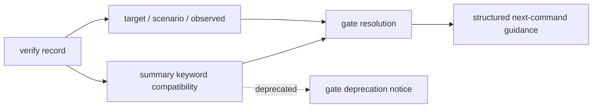
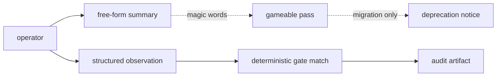
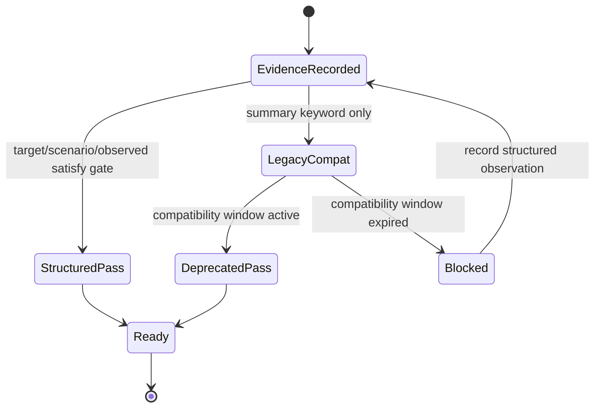

# Spec

## Public Contract

VibePro gates that previously accepted free-form summary keywords as a
resolution signal MUST prefer structured evidence. The supported structured
inputs are:

- verification observation fields recorded by `vibepro verify record`:
  `--target`, `--scenario`, and `--observed`
- inferred/spec clause declarations for inherited behavior:
  `inherited_behavior: { condition, classification, files }`

Legacy keyword matching remains compatible for at least one month from
2026-07-05, but every legacy resolution MUST be marked with a deprecation notice
in machine-readable gate details.

## Diagrams

### flow



### threat_model



### state



## Keyword Resolution Inventory

| Gate | Legacy resolution signal | Structured replacement | Deprecation detail |
|------|--------------------------|------------------------|--------------------|
| `gate:common_judgment_spine` and `gate:judgment_axis_*` | verification command, summary, or artifact text includes generic-proof / review / artifact / architecture / story / test words | `verify record --target <path> --scenario "<axis>:<case>" --observed "<axis>=true"` | matched evidence includes `resolution_source: legacy_summary_keyword` and `deprecation` |
| `gate:path_surface_matrix` | verification command, summary, or artifact text includes surface words such as `review_surface`, `artifact_surface`, `report_surface`, or related labels | `verify record --target "<changed path>" --scenario "path_surface:<surface>" --observed "surface=<surface>"` | gate rows and `deprecation_notices` include the migration notice |
| `gate:requirement` | Story/Spec/Architecture text contains inherited-behavior words such as `inherited`, `existing`, `unchanged`, `remain`, `continue`, `既存`, `維持`, or `そのまま` plus branch condition tokens | inferred/spec clause has `inherited_behavior: { condition, classification: "existing|unchanged|inherited", files }` | `legacy_keyword_resolution_deprecations` records file, condition, source, and replacement |

## Contracts

### KGM-CONTRACT-001: Structured observations are primary gate input

When a verification record has `observation_check.status = recorded`, gate
matching MUST use the canonical target/scenario/observed text before any
free-form summary or command text.

### KGM-CONTRACT-002: Bland summaries pass with structured evidence

If the required target, scenario, and observed fields satisfy a gate condition,
the gate MUST pass even when `summary` is generic or bland. Matching evidence
SHOULD expose `resolution_source: structured_observation` so audits can
distinguish structured records from legacy keyword compatibility.

### KGM-CONTRACT-003: Legacy keyword compatibility is explicit

If a gate is resolved through free-form keyword matching during the migration
window, the matching evidence or gate detail MUST include
`resolution_source: legacy_summary_keyword` and a `deprecation` object with the
replacement field shape and removal date.

### KGM-CONTRACT-004: Blocked gates show structured field guidance

When a migrated gate blocks, feedback MUST show accepted structured fields and a
command or declaration shape that can be executed or copied into a spec artifact.

### KGM-CONTRACT-005: Requirement inherited behavior is a declaration

Requirement gap coverage for intended existing behavior MUST be satisfied by
`inherited_behavior.condition`, `inherited_behavior.classification`, and
`inherited_behavior.files` on the owning inferred/spec clause. Free-form
inherited/existing/unchanged prose is compatibility only.

### KGM-INHERITED-AUTHORITY-FALLBACK: Authority absence is an inherited fallback

```yaml
inherited_behavior:
  condition: "!authority"
  classification: existing
  files:
    - src/requirement-consistency.js
```

When responsibility authority context has not been generated,
`summarizeResponsibilityAuthority` keeps that absence explicit as zero matched
responsibility evidence. This is existing fallback behavior, not a new product
branch.

## Scenarios

- `KGM-S-1`: Given migrated gate inventory is requested, then the spec exposes
  the legacy signal, structured replacement, and deprecation detail for each
  mandatory gate family.
- `KGM-S-2`: Given a verification record with bland summary and structured
  target/scenario/observed fields, then the matching migrated gate passes.
- `KGM-S-3`: Given a migrated gate blocks, then gate feedback exposes accepted
  structured fields and a concrete command or declaration shape.
- `KGM-S-4`: Given legacy keyword evidence during the migration window, then the
  gate still passes and records a deprecation notice.
- `KGM-S-5`: Given a requirement REQ-GAP branch is intended existing behavior,
  then an inferred/spec clause with structured `inherited_behavior` resolves the
  gap without inherited/existing/unchanged prose.
- `KGM-S-6`: Given regression tests run, then structured resolution, legacy
  compatibility with notice, and feedback guidance remain fixed.

## Anti-patterns

- Do not require a specific phrase in `summary` as the only way to pass a gate.
- Do not hide legacy keyword compatibility behind a normal pass with no
  migration notice.
- Do not make requirement inherited behavior depend on English-only prose.

## Verification

- CLI tests cover path-surface structured observation with bland summary.
- CLI tests cover path-surface legacy keyword compatibility plus deprecation.
- CLI tests cover requirement structured inherited behavior declaration resolving
  a REQ-GAP.
- CLI tests cover requirement legacy keyword compatibility plus deprecation.
- Syntax checks cover `src/pr-manager.js`, `src/requirement-consistency.js`, and
  `test/vibepro-cli.test.js`.
