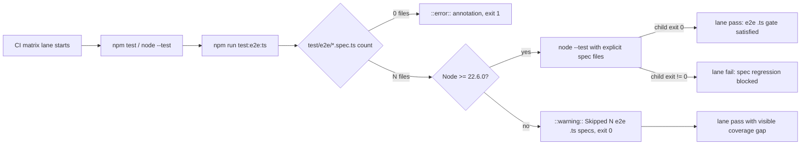
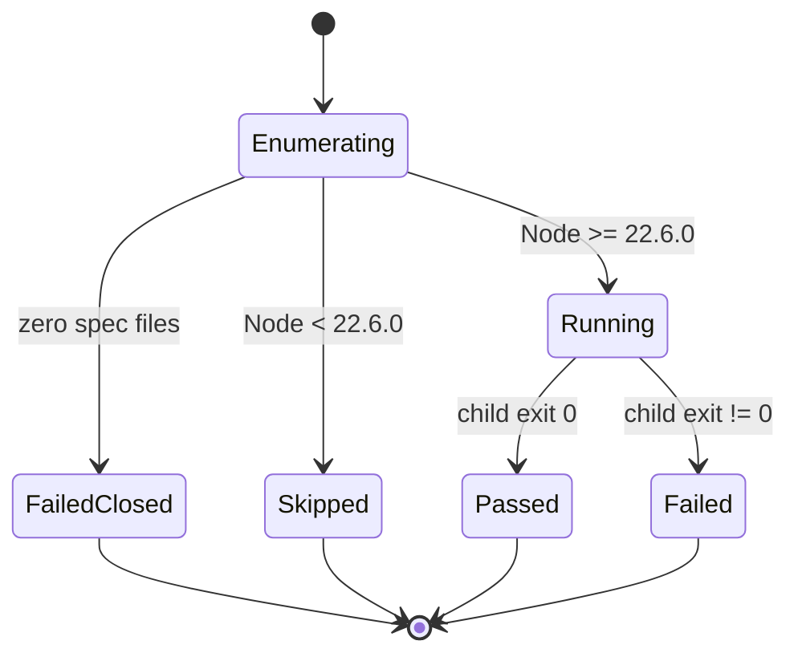

# Spec: Node 20 CIレーンのe2e .ts spec偽passを可視化しNode 22+必須ゲートで実行する

機械可読の正本は `.vibepro/spec/story-vibepro-node20-e2e-ts-ci-visibility/spec.json`。本書はそのhuman-readableミラー。

## Clauses

- **S-001 (invariant / AC-1)**: `scripts/run-e2e-ts-specs.mjs` は `test/e2e/*.spec.ts` を決定的（sorted）に列挙し、0件なら `::error::` annotationを出してexit 1する。silent no-opは禁止。
- **S-002 (contract / AC-2)**: 実行NodeがType Stripping対応（>= 22.6.0）の場合、列挙した全specファイルを `node --test` へ明示的に渡し、子プロセスのexit statusを伝播する。これによりNode 22 CIレーンがe2e .ts specの必須ゲートになる。
- **S-003 (contract / AC-3)**: Type Stripping非対応（< 22.6.0）の場合、偽装実行しない。スキップ件数入りの `::warning::` annotationを出してexit 0し、`node --test` をspawnせず、`ERR_UNKNOWN_FILE_EXTENSION` を発生させない。
- **S-004 (contract / AC-4)**: `package.json` の `test:e2e:ts` script と `.github/workflows/ci.yml` の全matrixレーンでの `npm run test:e2e:ts` step 配線。
- **S-005 (scenario / AC-5)**: 両レーンで実行される `.js` 回帰テストが、runner状態機械（Enumerating / Running / Passed / Failed / Skipped / FailedClosed）・22.6.0境界・プロセスレベル再現・CI配線を固定する。

## Diagrams

### CI lane flow

### Runner state machine

## Rollback

`.github/workflows/ci.yml` の `npm run test:e2e:ts` step、`package.json` の `test:e2e:ts` script、`scripts/run-e2e-ts-specs.mjs`、`test/node20-e2e-ts-ci-visibility.test.js` を削除すれば従来挙動（Node 20レーンの黙殺スキップ）へ戻る。
