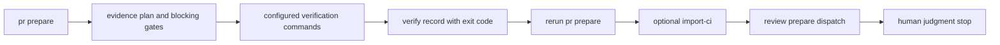
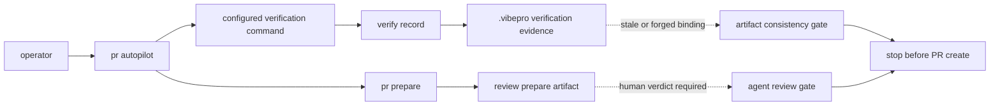

# Spec

## Public Contract

`vibepro pr autopilot` is a new PR lifecycle subcommand. It may collect
deterministic evidence for the current Story, but it does not change the public
semantics of `pr prepare`, `verify record`, `verify import-ci`, `review
prepare`, `pr create`, or `execute merge`.

```text
vibepro pr autopilot <repo> --story-id <id> --base <ref> [--verify <kind=command>]... [--pr <number>] [--import-ci] [--check <name=kind>]... [--dry-run]
```

The command reports executed operations, final gate status, stop reason, and
next commands. It stops before waiver, split, or review-verdict decisions.

## Diagrams

### flow



### threat_model



## Contracts

### EAP-CONTRACT-001: Autopilot is an orchestration command

`vibepro pr autopilot` MUST consume the current `pr prepare` state and automate
only evidence-gathering steps that have deterministic inputs: configured
verification commands, optional CI import, review dispatch preparation, and gate
reevaluation after each step.

### EAP-CONTRACT-002: Verification results preserve exit-code truth

When a configured verification command exits successfully, autopilot MUST record
passing verification evidence. When it exits non-zero, autopilot MUST record a
failing verification result and stop without converting it to pass or retrying it
as a passing record.

### EAP-CONTRACT-003: Human judgment is not automated

Autopilot MUST stop at waiver, split, missing-command, and review-verdict
decision points. It MUST report the remaining human judgment and executable next
commands, but MUST NOT write waiver or split decisions on behalf of the operator.

### EAP-CONTRACT-004: Passing evidence is not overwritten

If a current passing verification record for a kind already exists, autopilot
MUST skip that kind rather than overwriting the existing command, summary, or
artifact.

### EAP-CONTRACT-005: Dry run is side-effect free

`--dry-run` MUST render the planned steps and stop points without running
verification commands, writing verification evidence, importing CI, preparing
reviews, or mutating `.vibepro` artifacts.

### EAP-CONTRACT-006: Repeated execution converges

Running autopilot repeatedly against the same unchanged repository state MUST
skip already-satisfied steps and converge to the same terminal status and
remaining human judgment list.

### EAP-CONTRACT-007: Summary-depth evidence reuse omits skipped full artifacts

When `pr prepare` runs with summary-depth evidence, skipped full artifacts MUST
not be resurrected in downstream reuse references, review input preferred order,
or artifact value ledger entries. Session attribution is included only when
session records are present; otherwise it remains explicitly not collected.

## Scenarios

- `EAP-S-1`: Given configured passing verification commands, when autopilot runs,
  then verification evidence is recorded and verification gates can be resolved
  without a manual `verify record`.
- `EAP-S-2`: Given a failing verification command, when autopilot runs, then the
  failure is recorded and the command is reported as the stop reason.
- `EAP-S-3`: Given waiver or split judgment is required, when autopilot reaches
  that gate, then it stops with next commands and records no waiver.
- `EAP-S-4`: Given an existing current passing record for a kind, when autopilot
  runs, then that record is preserved and the step is skipped.
- `EAP-S-5`: Given `--dry-run`, when autopilot runs, then no verification or
  review artifact is written.
- `EAP-S-6`: Given a second autopilot run over the same state, then satisfied
  evidence steps are skipped and the final status is unchanged.
- `EAP-S-7`: Given the regression suite, then pass, fail, human-judgment,
  dry-run, and idempotent skip branches are covered.
- `EAP-S-8`: Given summary-depth evidence omits full gate DAG artifacts, then
  evidence reuse, review input, and artifact ledger references omit the skipped
  artifact instead of pointing to a missing file.
- `EAP-S-9`: Given no session attribution records are present, then evidence
  reuse reports session attribution as not collected; given sessions are present,
  only then are those sessions normalized into the attribution ledger.

## Verification

- Unit/CLI coverage exercises passing verification recording, failing
  verification stop behavior, dry-run side-effect freedom, human-judgment stop
  behavior, and existing passing-record preservation.
- Syntax checks cover the CLI entrypoint, PR manager implementation, and the
  focused autopilot test file.
- A live VibePro autopilot run records typecheck and unit verification artifacts
  under `.vibepro/pr/<story>/autopilot/` and leaves waiver/split/review verdicts
  for explicit human or agent review records.
