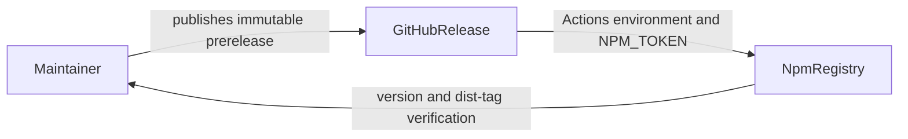

# Spec: VibePro 0.2.0 beta release

## Invariants

- `REL-020-001`: The package manifest, lockfile root package, CLI version output,
  GitHub tag, and npm package version identify `0.2.0-beta.0`.
- `REL-020-002`: Publishing is not triggered by an ordinary push to `main`.
- `REL-020-003`: The publish workflow runs typecheck, the full test suite, and
  npm package dry-run before `npm publish`.
- `REL-020-004`: The npm tarball contains only the allowlisted package surface.

## Release scenario

Given the version commit has passed VibePro PR gates and merged to `main`, when
GitHub prerelease `v0.2.0-beta.0` is published for that commit, then the npm
publish workflow must publish `vibepro@0.2.0-beta.0` from the same checkout,
promote `beta` to that immutable version, and fail unless both `beta` and
`latest` resolve to the exact published version.

The pre-merge gate verifies that `.github/workflows/npm-publish.yml` uses the
GitHub Release `published` event, publishes from its checked-out commit, and
contains the required validation steps. The post-release operator then records
the Release target commit, Actions checkout SHA, npm `gitHead`, and `beta` /
`latest` dist-tags. These post-release observations are completion evidence,
not fabricated pre-merge evidence.

## Threat model

No user data or runtime persistence is introduced by this metadata-only
release. The security boundary is the existing GitHub Actions `npm`
environment and its `NPM_TOKEN` secret, which is passed only to the publish
step. This release does not add a new credential path or expose the secret.

## Release operations evidence

- release_note: `CHANGELOG.md` contains the owner-visible 0.2.0-beta.0 notes.
- rollout_plan: merge the focused version commit, publish GitHub prerelease
  `v0.2.0-beta.0`, then let the release workflow publish npm, run `npm dist-tag
  add vibepro@0.2.0-beta.0 beta`, and verify both `beta` and `latest` are exact.
- rollback_instruction: restore `latest` and `beta` to the previous known-good
  version and deprecate the bad immutable version; never overwrite it.
- observability_evidence: GitHub Actions conclusion, npm version metadata,
  dist-tags, and npm `gitHead` must all be checked after publication.
- failure_modes: a failure before `npm publish` leaves npm unchanged. A failure
  after publish can leave the immutable version and `latest`, and after beta
  promotion can also leave `beta`, partially updated even though the workflow
  concludes failed. The operator must inspect both tags, restore each changed
  tag to its previous known-good version, deprecate the bad immutable version,
  and fix forward under a new prerelease rather than reuse the tag.
- done_evidence: GitHub release commit, successful publish workflow, npm
  version metadata, dist-tags, and matching `gitHead` close the release.

## Rollback

If post-publication promotion or verification fails, treat the registry as
partially updated: the immutable version exists, `latest` may already point to
it, and `beta` may be either old or new depending on the failed step. Do not
reuse or overwrite the version. Inspect both tags, restore every changed tag to
its previous known-good version, deprecate the bad immutable version, fix
forward under a new prerelease version, and preserve the failed release evidence.
