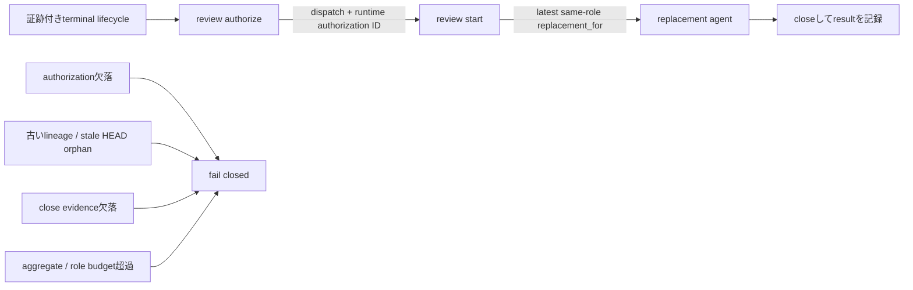

# Agent Review Replacement Recovery Spec

## Contracts

### VRR-CONTRACT-001: completed result collection

`closed` lifecycleのclose reasonが`completed`でresult artifact自体がない場合、
dispatch判定へ渡すstatusは`result_uncollected`であり、再authorizationは
`await_result`になる。`needs_changes`または`block` result artifactを持つ
completed lifecycleは回収待ちへ変換せず、修正後の再reviewをauthorizeできる。

### VRR-CONTRACT-002: terminal replacement authorization

`timeout`、`replaced`、`manual_shutdown`として正当にcloseされたlifecycleは、
result artifactがなくても`result_uncollected`へ正規化せず、同じbindingの
replacement authorizationを取得できる。
ただし、予算、role上限、bindingなど他のauthorization条件をすべて満たす場合に限る。

### VRR-CONTRACT-003: replacement lineage

replacement startは`replacement_for`で最新の同一role lifecycleへ束縛し、
無指定、古いlineage、証跡不足のlifecycleを拒否する。`manual_shutdown`と
`replaced`の非空`close_evidence`は、coordinatorが旧agentの実停止完了を確認した
正本証跡として扱い、同一HEAD用の独立cancellation flagは追加しない。

### VRR-CONTRACT-004: duplicate suppression compatibility

`running`は`await_result`、pass result artifactを持つcompleted lifecycleは
`reuse`を維持し、policy budgetとrole別dispatch上限を緩和しない。
`result_status: pass`でもartifact欠落なら`reuse`しない。
`needs_changes`または`block` result後の修正reviewは再authorizeで得たIDを
`--dispatch-authorization`へ渡し、`--replacement-for`なしでstartする。

### VRR-CONTRACT-005: unknown close reason

close reasonが欠落または既知の`completed`・terminal replacement reasonでない
closed lifecycleは、結果artifactの有無やstatusにかかわらず
`result_uncollected`としてfail closedに扱う。

### VRR-CONTRACT-006: executable operator recovery

status next action、review repair、PR recovery、英日両方の
`parallel-dispatch.md` coordinator手順は、`review authorize`を先に案内し、
そこで返却されたauthorization IDを`--dispatch-authorization`と
`--replacement-for`を持つ`review start`へ渡す順序付き手順を生成する。
実行時IDを固定値として生成してはならず、authorizationが`dispatch`を返した場合
だけreplacement agentを起動するよう案内する。

```yaml
inherited_behavior:
  condition: "!supplied && !runAuthority"
  classification: unchanged
  files:
    - src/agent-review.js
```

### VRR-CONTRACT-007: stale HEAD cancellation boundary

stale HEADの`orphaned_agent`は同一HEADのterminal replacement reasonとして
扱わず、既存の`--cancellation-confirmed`とcancellation evidenceがない限り
replacementを許可しない。

### VRR-CONTRACT-008: latest-role status recovery

statusは履歴を保持して表示できるが、replacement復旧actionは
Story・stage・roleごとの最新lifecycleだけを対象にする。同一roleの新しい
lifecycleが存在する場合、古いterminal entry向けのauthorize/startを生成しない。

## Verification Mapping

| Contract | Code | Test |
|---|---|---|
| VRR-CONTRACT-001 | `normalizeLifecycleForDispatch`、`startAgentReviewLifecycle`既存契約 | completed結果未回収の再authorize拒否、completed non-pass result後に再authorizeしたIDを`--dispatch-authorization`へ渡し`--replacement-for`なしでstart成功 |
| VRR-CONTRACT-002 | `normalizeLifecycleForDispatch`、`authorizeAgentReviewDispatch` | terminal reason別の再authorize成功・aggregate/role別budget exceeded拒否 |
| VRR-CONTRACT-003 | `startAgentReviewLifecycle`既存契約 | `replacement_for`付きstart成功・不正lineage拒否 |
| VRR-CONTRACT-004 | `normalizeLifecycleForDispatch`、`buildReviewDispatchDecision`、`startAgentReviewLifecycle`既存契約 | running / completed pass artifact / pass artifact欠落 / completed non-pass correction authorize-to-startの回帰 |
| VRR-CONTRACT-005 | `normalizeLifecycleForDispatch` | unknown/missing reason × artifactなし / pass / needs_changes / blockの全組み合わせが`result_uncollected` |
| VRR-CONTRACT-006 | status action、`repairAgentReviews`、PR recovery生成、英日`parallel-dispatch.md`生成 | authorize-first、authorization placeholder、replacement binding、dispatch時だけspawnするCLI回帰 |
| VRR-CONTRACT-007 | status action、`authorizeAgentReviewDispatch`既存契約 | stale HEAD orphanがcancellation confirmation/evidenceなしでfail closed |
| VRR-CONTRACT-008 | `buildLifecycleNextActions` | 古い同一role terminal entryと新lifecycleの併存時に旧entry向け復旧actionを生成しない |

## Threat Model



この境界は、停止確認できない旧agentとの二重実行、古いlifecycleへの誤束縛、
予算外dispatch、stale HEADの無確認再実行を防ぐ。`manual_shutdown`と`replaced`は
非空のclose evidence、replacementは実行時authorization IDと最新同一roleの
`replacement_for`を必須とし、いずれかを満たさない場合は起動しない。

## Non-goals

- terminal closeへ結果を後付けしない。
- productのdelivery efficiency既定budget、role policy、review provenanceを
  緩和しない。本Story専用overrideはユーザー承認済みの有限なreview実行予算であり、
  product contract、budget計算、超過時のfail-closedを変更しない。
- VibeProからagent runtimeを直接spawnしない。
