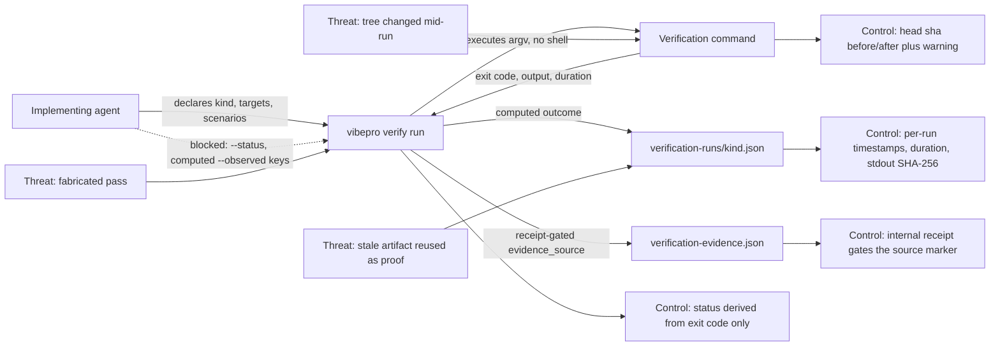

# Runner-direct verification evidence contract

## Requirements

- `vibepro verify run [repo] --id <story-id> --kind <unit|integration|e2e|typecheck|build> [options] -- <command...>` executes the command itself as argv, without a shell, and records the outcome it observed.
- The recorded status is derived from the observed exit code (`0` and no signal means pass). `--status` is rejected: the outcome is not an input.
- The recorded observation carries the execution exhaust — exit code, test counts parsed from the command's real output, duration, started/finished timestamps, head sha before and after the run, the SHA-256 of stdout, and the output byte count — none of which pass through agent input.
- An agent-supplied `--observed` value for a computed key is not recorded. The computed value wins and the discarded input is retained as an `observation_overrides` entry (`key`, `agent_value`, `computed_value`) with a `verification_observation_overridden` warning. `--observed` keys the runner does not compute are recorded unchanged.
- `evidence_source` is decided by the recording path: `runner_direct` for `verify run`, `ci_import` for `verify import-ci`, `self_reported` for `verify record`. Only a caller holding the internal receipt may record a computed source, and no CLI flag sets it. Records written before this field existed read as self-reported.
- A tree that moves during the run (head sha before ≠ after) is recorded with both shas and a `verification_tree_mutated_during_run` warning. A passing command that printed nothing is recorded with a `verification_run_produced_no_output` warning.
- Harness markers that would make a nested runner report to a foreign harness (`NODE_TEST_CONTEXT`) are removed from the child environment and the removal is recorded in the run artifact.
- The command must still match the declared kind; `verify run` exits non-zero when the executed command fails, and records the failing run.
- `vibepro verify record` keeps its existing input handling, validation, and record shape. Existing recorded evidence stays valid.

## Verification

- `node --test test/verification-runner.test.js test/verification-observation.test.js test/verification-evidence-artifact-check.test.js test/ci-evidence-import.test.js test/cli-reference-docs.test.js`
- `node --test test/e2e/story-vibepro-runner-direct-evidence-acceptance.spec.js`
- `node --test test/integration/verification-runner-evidence-consumers.test.js`
- `node --test --test-concurrency=2`

## Operations

- **Release note**: the new `verify run` subcommand and the additive `evidence_source` / `computed_observation` / `observation_overrides` fields are user-visible; the PR body's Release Notes section is the source `scripts/post-merge-release.mjs` renders from.
- **Rollout**: additive and opt-in. No migration, no configuration change, no data backfill. Existing `verify record` and `verify import-ci` callers keep working unchanged.
- **Rollback**: revert the two commits. Records already written keep their extra fields as inert JSON, and every consumer reads them as ordinary optional fields.
- **Observability**: each run leaves `.vibepro/pr/<story-id>/verification-runs/<kind>.json` and `<kind>.log`; failures, timeouts, mid-run tree changes, silent successes, and discarded agent observations surface as named warnings on the evidence record.

## Diagrams

### Threat model

