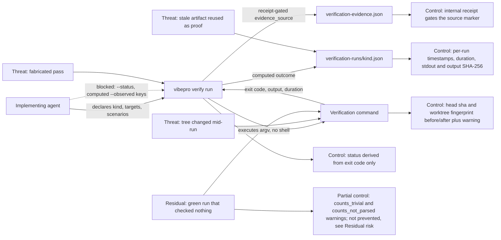

# Runner-direct verification evidence contract

## Requirements

- `vibepro verify run [repo] --id <story-id> --kind <unit|integration|e2e|typecheck|build> [options] -- <command...>` executes the command itself as argv, without a shell, and records the outcome it observed.
- The recorded status is derived from the observed exit code (`0` and no signal means pass). `--status` is rejected: the outcome is not an input.
- The recorded observation carries the execution exhaust — exit code, test counts parsed from the command's real output, duration, started/finished timestamps, head sha and working-tree fingerprint before and after the run, the SHA-256 of stdout, the SHA-256 of the full stdout+stderr stream, the output byte count, and whether the retained log was truncated — none of which pass through agent input.
- `output_sha256` covers exactly the stream the retained `<kind>.log` is written from, so the log is re-derivable from the record whenever `log_truncated` is false. `stdout_sha256` covers stdout alone and the two differ whenever the command wrote to stderr.
- An agent-supplied `--summary` is appended to the computed summary sentence, never substituted for it.
- An agent-supplied `--observed` value for a computed key is not recorded. The computed value wins and the discarded input is retained as an `observation_overrides` entry (`key`, `agent_value`, `computed_value`) with a `verification_observation_overridden` warning. `--observed` keys the runner does not compute are recorded unchanged.
- `evidence_source` is decided by the recording path: `runner_direct` for `verify run`, `autopilot_run` for `pr autopilot` (which executes a configured shell command and derives status from its exit code, without argv execution, parsed counts, tree sampling, or an output hash), `ci_import` for `verify import-ci`, and `self_reported` for `verify record` and every other caller. Only a caller holding the internal receipt may record a computed source, and no CLI flag sets it. Records written before this field existed read as self-reported.
- A tree that moves during the run is recorded with a `verification_tree_mutated_during_run` warning that names which part moved: HEAD (`head_moved_during_run`, both shas recorded) or the working tree with HEAD unchanged (`worktree_changed_during_run`, both fingerprints recorded).
- The working-tree sample is compared per component: the `git status` component always, the `git diff` component only when both samples captured it. A sample that fell back to status lines alone hashes differently from a complete one, so comparing combined fingerprints would report a change that did not happen. `worktree_sampled` records whether both samples exist and `worktree_sampling_complete` whether both captured the diff; a partial sample carries `verification_worktree_sampling_partial` regardless of the verdict, and no sample at all carries `verification_worktree_not_sampled`.
- Every fact the runner computes passes through a single object that is asserted, at construction, to be entirely inside the protected key set — including the ones that do not read like observations (`tree_mutated_during_run`, `head_moved_during_run`, `worktree_changed_during_run`, `run_artifact`, `run_log`, `timed_out`, `output_limit_exceeded`, `output_metrics`, `timeout_ms`, `max_output_bytes`, `harness_env_removed`) and the two that reach the record by other parameters (`status`, `evidence_source`). Adding a computed fact without protecting it fails the run rather than quietly making it agent-writable. The declared limits are recorded whether or not they were hit.
- `observation.values` has a second producer — the extractor that lifts values back out of the written run artifact — and the assert above cannot see it. That direction is asserted separately: the keys the extractor can lift from a runner-written artifact's top level are derived by running the extractor over a probe, not by restating a list, and are checked against the same protected key set before every run. Protection is therefore a property of the key set rather than of the enumerated call sites, so a key added to either producer fails the run instead of becoming agent-writable in silence.
- `--observed evidence_source=<value>` is rejected on every recording path. It is the field a reader uses to decide how much the rest of the record is worth, so it is written by the recording path and never by its caller. The other computed keys stay writable on the self-reported path, where an agent recording a run it performed by hand legitimately supplies its counts; on the runner path they are discarded into `observation_overrides` as before.
- The adjudication request states how each record was produced, not only what it observed: `evidence_source`, the computed-observation producer and its computed keys, the discarded-input diff, and the record's own warnings are rendered alongside `observation.values`. Without them an observation value claiming a trust level the record lacks would reach the judge uncontradicted, and the warnings that qualify a thin pass would not reach it at all.
- The `typecheck` npm script checks every file rather than only the head of its glob. `node --check` treats one positional as the entry point and ignores the rest, so `node --check bin/vibepro.js && node --check src/*.js` checked two files out of 143 and none of the ones this Story changes; the recorded typecheck evidence proved a command exited 0, not that the changed code parses. The script is now a per-file loop, and the regression test executes the script string itself against a fixture tree with a broken file in a non-first position.
- The working-tree verdict is recomputable from the record: the component hashes it is derived from (`worktree_status_sha256_before/after`, `worktree_diff_sha256_before/after`) are recorded alongside the combined fingerprints, so a reader can check the conclusion instead of trusting it.
- If the log write, the artifact write, or the record fails, the previous run's artifact and log are restored — every file is attempted before reporting, so a restore never leaves a half-restored pair on disk — and a restore that itself fails is reported alongside the original error rather than swallowed. The restore is idempotent across those three steps; it does not detect a commit, so the narrow window where recording throws after the evidence file is written would still roll the run files back under a committed record. A read failure while taking the snapshot, before anything is written, aborts the run with that error and records nothing.
- A passing run whose evidential value is limited is named on the record rather than left to the reader: `verification_run_produced_no_output` (exit 0, nothing printed), `verification_run_counts_not_parsed` (exit 0, output present, no counts parseable), `verification_run_counts_trivial` (exit 0 with at most one reported test).
- A killed run distinguishes its cause: `verification_run_timed_out` for the timeout and `verification_run_output_limit_exceeded` for an output-buffer kill, which Node reports with the same killed+signal shape.
- Harness markers that would make a nested runner report to a foreign harness (`NODE_TEST_CONTEXT`) are removed from the child environment and the removal is recorded in the run artifact.
- The declared kind is checked against the command **before** the command runs, against the same rule the record path applies, so a rejected command never executes and never replaces the previous run's artifact or log. Because the runner's own artifact always parses as `generic_status`, a bare runner invocation (`node --test` with no file or `--test-name-pattern`) is refused: name the test files or pass a pattern. The check applies to every run, including one that would have failed, so a kind-mismatched command is rejected rather than recorded as a failure.
- `verify run` exits non-zero when the executed command fails, and records the failing run. If recording does not commit for any reason, the previous run's artifact and log are restored so the surviving evidence record never points at an unrecorded run.
- `--max-output-bytes` bounds the captured output; exceeding it kills the run and is reported as an output-limit kill, not a timeout.
- `vibepro verify record` keeps its existing input handling, validation, and record shape. Existing recorded evidence stays valid.

## Workflow states

The recording workflow has fixed states and every transition is decided by observed execution, not by declaration:

`declared` (kind, targets, scenarios accepted; `--status` rejected) → `tree sampled before` → `executed` → `tree sampled after` → `outcome computed` (status from the exit code; counts parsed or explicitly absent) → `artifact and log written` → `recorded`.

The record carries the warning states the run entered: tree moved (HEAD or worktree), counts unparsed, counts trivial, no output, timeout, output limit exceeded, observations overridden. A failing or killed run follows the same transitions and is recorded rather than skipped, and the CLI process status mirrors the computed outcome so a caller's control flow cannot diverge from the record.

## Verification

- `node --test test/verification-runner.test.js test/verification-observation.test.js test/verification-evidence-artifact-check.test.js test/ci-evidence-import.test.js test/cli-reference-docs.test.js test/session-efficiency-audit.test.js test/session-efficiency-run-lineage.test.js test/evidence-cost-budget.test.js`
- `node --test test/e2e/story-vibepro-runner-direct-evidence-acceptance.spec.js`
- `node --test test/integration/verification-runner-evidence-consumers.test.js`
- `npm run typecheck`
- `node --test --test-name-pattern "pr autopilot records (passing|failed) verification" test/vibepro-cli.test.js`

Four runner-direct runs are recorded at the current head: unit, integration, e2e and `npm run typecheck`. The typecheck run produces no parseable counts and carries its own `verification_run_counts_not_parsed` warning, so it proves the command did not fail rather than how much it checked. The full `node --test --test-concurrency=2` suite is not recorded as passing evidence for this Story: on this host it reports three pre-existing failures unrelated to this change (`test/post-merge-release.test.js`, `test/e2e/story-vibepro-pr-driven-continuous-release-main.test.js`, `test/e2e/story-vibepro-release-note-link-normalization-acceptance.spec.js`), each of which reproduces on a clean checkout of the base commit.

## Operations

- **Release note**: the new `verify run` subcommand and the additive `evidence_source` / `computed_observation` / `observation_overrides` fields are user-visible; the PR body's Release Notes section is the source `scripts/post-merge-release.mjs` renders from.
- **Rollout**: additive and backward-compatible — not opt-in for every path. `verify run` is opt-in, but `verify import-ci` and `pr autopilot` start writing `evidence_source` and `computed_observation` on the next release with no flag and no user choice. No migration, no configuration change, no data backfill; no consumer in this repo rejects unknown fields.
- **Rollback**: revert the commits on this branch **as a set**. `RUNNER_EVIDENCE_RECEIPT` is exported by the first commit and imported by `src/verification-runner.js`, `src/ci-evidence.js` and (from a later commit) `src/pr-manager.js`, so reverting the feature commit alone leaves a dangling import that fails at module load and takes the whole CLI down. After a full revert, records already written keep their extra fields as inert JSON: nothing on the read path validates `evidence_source`.
- **Trust marker scope**: `evidence_source` is recorded but not yet consumed — no gate, strength calculation, evidence-reuse or senior-gap logic distinguishes `runner_direct` from `self_reported` in this change. A maintainer should not assume gates now prefer computed evidence.
- **Observability**: each run leaves `.vibepro/pr/<story-id>/verification-runs/<kind>.json` and `<kind>.log`; failures, timeouts, mid-run tree changes, silent successes, and discarded agent observations surface as named warnings on the evidence record.

## Residual risk

- **Exit code 0 is not proof that a check ran.** `node --test` on a file that defines no tests reports `tests 1 / pass 1` and exits 0. The runner cannot distinguish that from a real one-test suite, so it names it (`verification_run_counts_trivial`) instead of claiming to prevent it. Choosing a command that exercises nothing remains possible; what the record no longer permits is presenting it as a large verified run.
- **Counts are parsed, not instrumented.** Only the TAP and node spec summary formats are recognized. Any other runner records `output_metrics: none` with a `verification_run_counts_not_parsed` warning; the record then proves the command did not fail, not how much it checked.
- **A killed run may leave grandchildren.** The kill signals the direct child only, so a runner that spawns per-file processes can leave orphans that outlive the kill and keep writing after the "after" sample was taken. The record is already `fail` with a named kill warning, but `tree_mutated_during_run` on such a run describes the tree as sampled, not as finally settled.
- **The working-tree fingerprint has blind spots.** It is built from `git status --porcelain` plus `git diff`, so it does not see gitignored paths (which in this repo includes `.vibepro/` itself), a staged-content-only change, or a mutate-then-restore inside the run. When it cannot be computed at all the record says `worktree_sampled: false` and carries `verification_worktree_not_sampled` rather than reporting an unchanged tree.
- **The declaration surface is still the agent's.** Kind, targets, scenarios and the appended summary are agent prose. The runner constrains the outcome, not the description of what was aimed at.

## Diagrams

### Threat model

