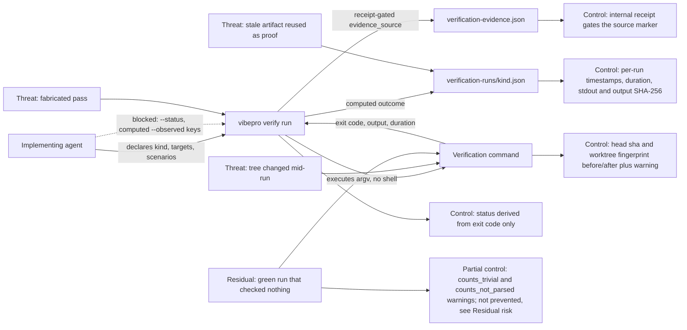

# Runner-direct verification evidence contract

## Requirements

- `vibepro verify run [repo] --id <story-id> --kind <unit|integration|e2e|typecheck|build> [options] -- <command...>` executes the command itself as argv, without a shell, and records the outcome it observed.
- The recorded status is derived from the observed exit code (`0` and no signal means pass). `--status` is rejected: the outcome is not an input.
- The recorded observation carries the execution exhaust — exit code, test counts parsed from the command's real output, duration, started/finished timestamps, head sha and working-tree fingerprint before and after the run, the SHA-256 of stdout, the SHA-256 of the full stdout+stderr stream, the output byte count, and whether the retained log was truncated — none of which pass through agent input.
- `output_sha256` covers exactly the stream the retained `<kind>.log` is written from, so the log is re-derivable from the record whenever `log_truncated` is false. `stdout_sha256` covers stdout alone and the two differ whenever the command wrote to stderr.
- An agent-supplied `--summary` is appended to the computed summary sentence, never substituted for it.
- An agent-supplied `--observed` value for a computed key is not recorded. The computed value wins and the discarded input is retained as an `observation_overrides` entry (`key`, `agent_value`, `computed_value`) with a `verification_observation_overridden` warning. `--observed` keys the runner does not compute are recorded unchanged.
- `evidence_source` is decided by the recording path: `runner_direct` for `verify run`, `autopilot_run` for `pr autopilot` (which executes a configured shell command and derives status from its exit code, without argv execution, parsed counts, tree sampling, or an output hash), `ci_import` for `verify import-ci`, and `self_reported` for `verify record` and every other caller. Only a caller holding the internal receipt may record a computed source, and no CLI flag sets it. Records written before this field existed read as self-reported.
- A tree that moves during the run is recorded with a `verification_tree_mutated_during_run` warning that names which part moved: HEAD (`head_moved_during_run`, both shas recorded) or the working tree with HEAD unchanged (`worktree_changed_during_run`, both fingerprints recorded).
- A passing run whose evidential value is limited is named on the record rather than left to the reader: `verification_run_produced_no_output` (exit 0, nothing printed), `verification_run_counts_not_parsed` (exit 0, output present, no counts parseable), `verification_run_counts_trivial` (exit 0 with at most one reported test).
- A killed run distinguishes its cause: `verification_run_timed_out` for the timeout and `verification_run_output_limit_exceeded` for an output-buffer kill, which Node reports with the same killed+signal shape.
- Harness markers that would make a nested runner report to a foreign harness (`NODE_TEST_CONTEXT`) are removed from the child environment and the removal is recorded in the run artifact.
- The command must still match the declared kind; `verify run` exits non-zero when the executed command fails, and records the failing run.
- `vibepro verify record` keeps its existing input handling, validation, and record shape. Existing recorded evidence stays valid.

## Verification

- `node --test test/verification-runner.test.js test/verification-observation.test.js test/verification-evidence-artifact-check.test.js test/ci-evidence-import.test.js test/cli-reference-docs.test.js test/session-efficiency-audit.test.js test/session-efficiency-run-lineage.test.js test/evidence-cost-budget.test.js`
- `node --test test/e2e/story-vibepro-runner-direct-evidence-acceptance.spec.js`
- `node --test test/integration/verification-runner-evidence-consumers.test.js`

The recorded runs are the three commands above. The full `node --test --test-concurrency=2` suite is not recorded as passing evidence for this Story: on this host it reports three pre-existing failures unrelated to this change (`test/post-merge-release.test.js`, `test/e2e/story-vibepro-pr-driven-continuous-release-main.test.js`, `test/e2e/story-vibepro-release-note-link-normalization-acceptance.spec.js`), each of which reproduces on a clean checkout of the base commit.

## Operations

- **Release note**: the new `verify run` subcommand and the additive `evidence_source` / `computed_observation` / `observation_overrides` fields are user-visible; the PR body's Release Notes section is the source `scripts/post-merge-release.mjs` renders from.
- **Rollout**: additive and opt-in. No migration, no configuration change, no data backfill. Existing `verify record` and `verify import-ci` callers keep working unchanged.
- **Rollback**: revert the commits on this branch. Records already written keep their extra fields as inert JSON, and every consumer reads them as ordinary optional fields.
- **Observability**: each run leaves `.vibepro/pr/<story-id>/verification-runs/<kind>.json` and `<kind>.log`; failures, timeouts, mid-run tree changes, silent successes, and discarded agent observations surface as named warnings on the evidence record.

## Residual risk

- **Exit code 0 is not proof that a check ran.** `node --test` on a file that defines no tests reports `tests 1 / pass 1` and exits 0. The runner cannot distinguish that from a real one-test suite, so it names it (`verification_run_counts_trivial`) instead of claiming to prevent it. Choosing a command that exercises nothing remains possible; what the record no longer permits is presenting it as a large verified run.
- **Counts are parsed, not instrumented.** Only the TAP and node spec summary formats are recognized. Any other runner records `output_metrics: none` with a `verification_run_counts_not_parsed` warning; the record then proves the command did not fail, not how much it checked.
- **The declaration surface is still the agent's.** Kind, targets, scenarios and the appended summary are agent prose. The runner constrains the outcome, not the description of what was aimed at.

## Diagrams

### Threat model

