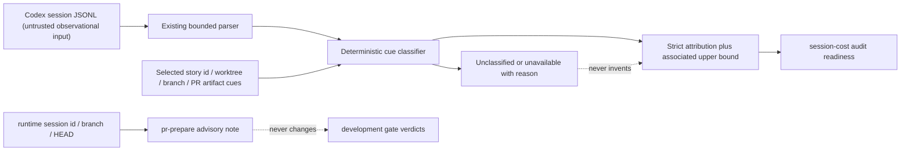

# Contracts

- `SAB-CONTRACT-001`: strict story cues are the primary attribution boundary.
- `SAB-CONTRACT-002`: strict plus worktree-associated events are exposed only as an upper bound.
- `SAB-CONTRACT-003`: mixed-parent attribution must degrade audit readiness and name the blocker.
- `SAB-CONTRACT-004`: event categories remain mutually exclusive and exhaustive.
- `SAB-CONTRACT-005`: attribution risk follows the declared strict/associated threshold; mixed-parent readiness is an independent signal.
- `SAB-CONTRACT-006`: missing session selection remains explicit as unavailable, and PR preparation only records a non-blocking runtime boundary advisory.
- `SAB-CONTRACT-007`: unreadable JSONL fails attribution closed as unavailable. A malformed selected row is retained as unclassified exposure; valid rows may remain available only with explicit partial parse coverage and an audit-readiness blocker.

# Verification

The synthetic fixtures assert primary and upper-bound counts, accounting non-regression,
exhaustive categories, threshold risk, explicit unavailable/read-failure and partial-parse output,
and the non-blocking PR preparation advisory with unchanged gate outputs.

## Inherited Behavior

- `SAB-INHERITED-3`: JSONL parser は `entry.type === 'session_meta'` の entry から canonical session id と cwd を確立し続ける。attribution boundary の追加後も、この metadata authority は変更しない。

## Diagrams

### threat_model

The trust boundary is observational: transcript text can contain arbitrary paths or Story-like
strings, so it is never promoted into delivery authority or used to mutate session state. Missing
or unreadable inputs remain explicit, and a mixed-parent signal degrades only audit confidence.
