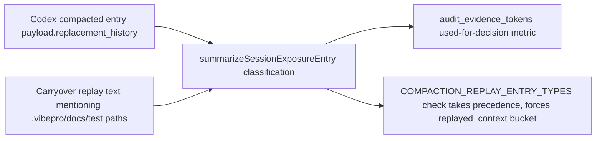

# Design Diagrams

### threat_model

- Trust boundary: text extracted from a `compacted` entry's `replacement_history`
  is treated as carryover, not fresh evidence, regardless of its content.
- Spoofing risk: none introduced; the bucket routing is keyed on the JSONL
  entry's own `type` field, not on freeform text content.
- Tampering risk: non-compaction entries keep their existing pattern-based
  classification unchanged.
