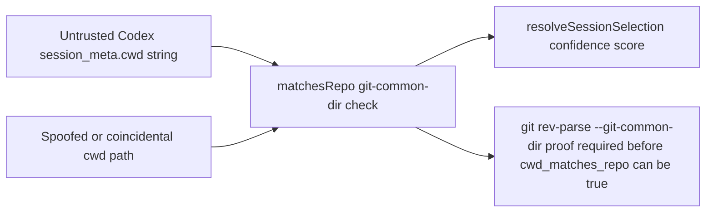

# Design Diagrams

### threat_model

- Trust boundary: a session's `cwd` string in JSONL is untrusted; only
  `matchesRepo()`'s real `git rev-parse --git-common-dir` comparison (executed
  against the filesystem/git binary, not string matching) proves repo identity.
- Spoofing risk: raising the `cwd_matches_repo` weight from 45 to 50 does not
  change what `matchesRepo()` accepts as a match — a session cwd claiming to be
  a worktree of the repo without a real shared git-common-dir still scores 0
  for this component (see `SCATTR-SCENARIO-006`).
- Tampering risk: none introduced; this change only reweights an existing,
  already-proven signal inside `resolveSessionSelection()`'s confidence
  threshold.
