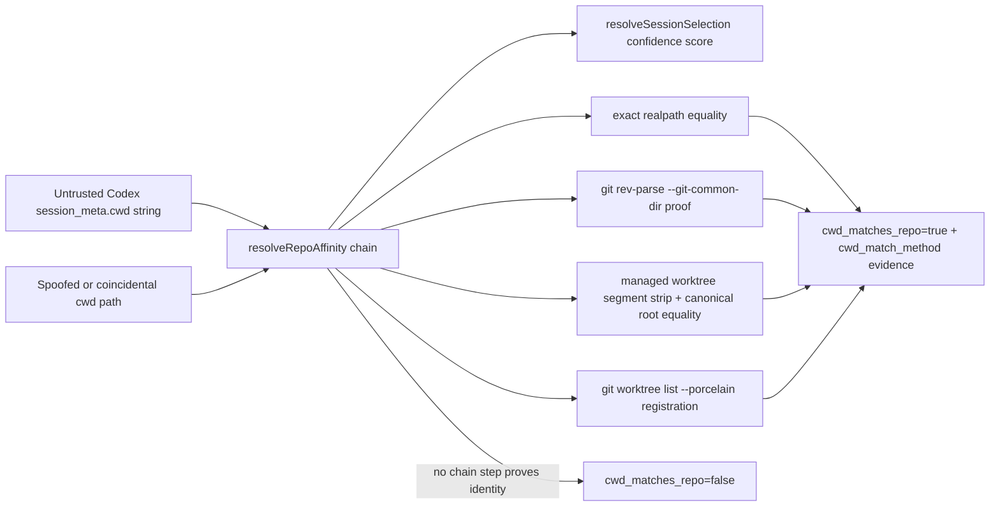

# Design Diagrams

### threat_model

- Trust boundary: a session's `cwd` string in JSONL is untrusted; only
  `matchesRepo()`'s real `git rev-parse --git-common-dir` comparison (executed
  against the filesystem/git binary, not string matching) proves repo identity.
- Spoofing risk: raising the `cwd_matches_repo` weight from 45 to 50 does not
  change what the affinity chain accepts as a match — a session cwd claiming to
  be a worktree of the repo without a real shared git-common-dir, without a
  registration in the target repo's `git worktree list`, and without an equal
  stripped canonical root still scores 0 for this component (see
  `SCATTR-SCENARIO-006`, `SCWN-SCENARIO-003`).
- Deleted-path risk: paths that no longer exist are canonicalized via their
  longest existing ancestor; only registry entries of the target repo or a
  managed-worktree segment under the target repo's own canonical root can
  prove identity for a gone path — never name similarity.
- Tampering risk: none introduced; this change only reweights an existing,
  already-proven signal inside `resolveSessionSelection()`'s confidence
  threshold.
