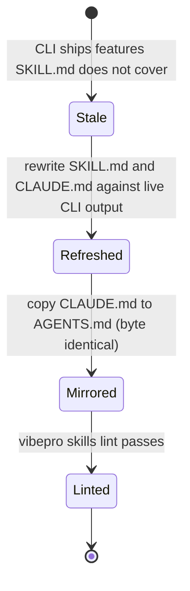
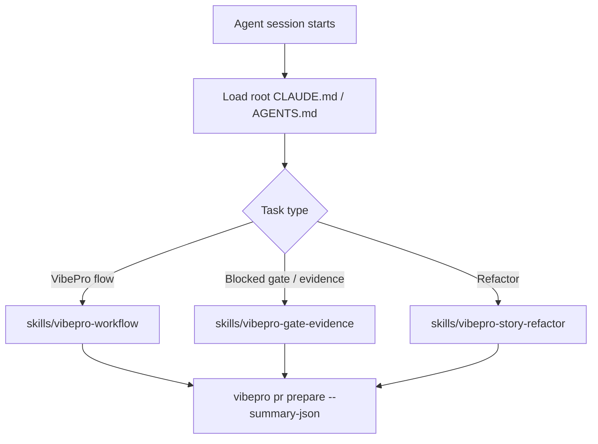

---
parent_design:
  - vibepro-agent-guidance-ssot
---

# Spec: story-vibepro-skills-claude-md-refresh

Human-readable mirror of the registered final spec (`vibepro spec write --final`, 6 clauses). The machine-validated source of truth is the VibePro spec artifact; this document exists for reviewer traceability.

## Clauses

- **S-001 (invariant)** — `skills/vibepro-workflow/SKILL.md` and `skills/vibepro-story-refactor/SKILL.md` present `vibepro execute start` as the canonical managed worktree execution path and contain no claim that managed worktree execution is unimplemented.
- **S-002 (contract)** — `skills/vibepro-workflow/SKILL.md` references the uiux intake/map/evidence/prepare flow, `verify import-ci`, `gate check`, `checkpoint`, `audit replay`, `audit session-cost`, `trace`, `usage report --subagent-roi --gate-roi`, and the `pr prepare --summary-json` / `--view` projections.
- **S-003 (contract)** — `skills/vibepro-gate-evidence/SKILL.md` codifies the commit ordering rule (finalize tree → verification evidence → agent review), `verify record` kind overwrite and structured observations, evidence strength via status artifacts, the review lifecycle (prepare → start → close → record with `--agent-closed` / `--inspection-input`), `review repair`, spec write validator behavior, and fast lane conditions.
- **S-004 (invariant)** — `CLAUDE.md` exists at the repository root and `AGENTS.md` is byte-for-byte identical (`cmp -s CLAUDE.md AGENTS.md`).
- **S-005 (contract)** — `agent-instructions/codex/AGENTS.vibepro.md` lists the current check pack registry (including agent-harness, public-discovery, self-dogfood, oss-readiness, regression-risk, all) and routes to `vibepro execute start`, uiux, audit, and the `vibepro-gate-evidence` Skill.
- **S-006 (scenario)** — `vibepro skills lint .` over the bundled skills, including `vibepro-gate-evidence`, reports pass for every skill with zero errors. Existing skills directory scanning behavior is unchanged.

## Diagrams

### Skill guidance lifecycle (state)

### Agent guidance consumption flow (flow)

